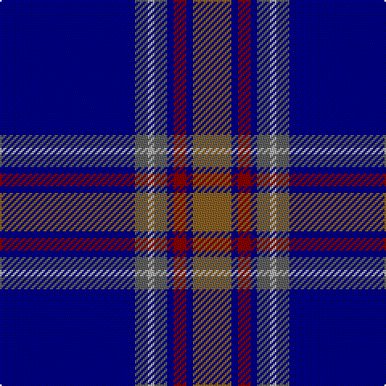

In pattern [BBYBBRBR](/patterns/bbybbrbr/).

This was sourced from tartans-authority.  It is a [8 stripes tartan](/stripes/stripes8/).

Original link http://www.tartansauthority.com/tartan-ferret/display/3709/

## Thread count
DB/84 N8 Na4 N8 DB4 DR8 DB4 LT/24

## Palette
Each colour and its ΔE from the base-6 reference it is a variant of.

| Colour | Shade | Base | ΔE (OKLab) |
|---|---|---|---|
| DB | <code style="background-color:#000088;">#000088</code> `#000088` | B <code style="background-color:#2A418A;">#2A418A</code> | 0.14 |
| DR | <code style="background-color:#880000;">#880000</code> `#880000` | R <code style="background-color:#CC0000;">#CC0000</code> | 0.15 |
| LT | <code style="background-color:#886024;">#886024</code> `#886024` | R <code style="background-color:#CC0000;">#CC0000</code> | 0.17 |
| N | <code style="background-color:#606060;">#606060</code> `#606060` | B <code style="background-color:#2A418A;">#2A418A</code> | 0.15 |
| Na | <code style="background-color:#ACACAC;">#ACACAC</code> `#ACACAC` | Y <code style="background-color:#F2BF00;">#F2BF00</code> | 0.19 |

# Sample pattern

## Nearest tartans

The nearest existing variants by ΔTartan distance.

1. [Blue Rust](/setts/s8/b84ba8w4ba8b4r8b4ra24-b000088-ba606060-r880000-ra886024-wffffff/) — ΔT 0.43
1. [MacLaurin of Broich (Clan)](/setts/s7/b72k16g6r6g12k2y4-b200088-g006818-k101010-r880000-yd09800/) — ΔT 1.04
1. [Fife Flyers](/setts/s8/b4w4b86ba10bb8k16bb4w4-b003c64-ba1474b4-bb202060-k000000-wfcfcfc/) — ΔT 1.15
1. [British Caledonian Airways #3](/setts/s12/b68r5k9r3k3w3k3ba20b9k3b5w4-b1c0070-ba5c5c5c-k101010-r98481c-wc0c0c0/) — ΔT 1.16
1. [Royal Agricultural Winter Fair](/setts/s8/b128w4b4y8b4r4b16g64-b00008c-g003014-r8c0000-wc8c8c8-yc88c00/) — ΔT 1.20
1. [Nocken (Personal)](/setts/s9/w6k12wa4k12b4k4b64k4ba2-b202060-ba5c5c5c-k101010-w98c8e8-wae8ccb8/) — ΔT 1.23
1. [Pagus Wasia](/setts/s9/r4b8ba4bb12ba76b12y4b8y4-b00008c-ba14283c-bb000048-r960028-yffe600/) — ΔT 1.25
1. [Wcwm 9275-1395](/setts/s7/b6ba3b56k24g6r6g6-b1c0070-ba440044-g006818-k101010-re87878/) — ΔT 1.32
1. [Warren Wilson College (Corporate)](/setts/s8/g40y12b40ya6b96r12b8r12-b1c0070-g006818-r880000-ya0a0a0-yae8c000/) — ΔT 1.33
1. [Pagus Wasia District Tartan Tartan Number: 10962. Earliest known date: 2012 Pagus (shire) Wasia (wetland) is a rural district in Belgium. The tartan was created by the founding members of the new Pagus Wasia Pipes & Drums, based on the colours of the District Coat of Arms. The district is associated with the Belgian surname, Waas. Registration was authorised by Marc Van de Vijver, Mayor of the city of Beveren. See products available Copyright © Blair Urquhart, Comrie, 2015](/setts/s9/r4b8ba4bb12ba76b12y4b8y4-b040470-ba444878-bb1c2448-r9c2430-ycccc08/) — ΔT 1.34

## Neighbour map

Every grey dot is one of 15726 variants placed by the first two principal components of the ΔTartan feature space (44% of its variance). Red is this tartan; blue dots are its nearest — click one to open its page.

<svg viewBox="0 0 640 380" role="img" style="max-width:100%;height:auto;border:1px solid #e0e0e0;border-radius:4px;display:block" xmlns="http://www.w3.org/2000/svg"><image href="/nn/cloud.v1.png" width="640" height="380"/><a href="/setts/s8/b84ba8w4ba8b4r8b4ra24-b000088-ba606060-r880000-ra886024-wffffff/"><circle cx="378.5" cy="129.8" r="4" fill="#3465a4"><title>Blue Rust</title></circle></a><a href="/setts/s7/b72k16g6r6g12k2y4-b200088-g006818-k101010-r880000-yd09800/"><circle cx="394.6" cy="127.4" r="4" fill="#3465a4"><title>MacLaurin of Broich (Clan)</title></circle></a><a href="/setts/s8/b4w4b86ba10bb8k16bb4w4-b003c64-ba1474b4-bb202060-k000000-wfcfcfc/"><circle cx="391.0" cy="125.1" r="4" fill="#3465a4"><title>Fife Flyers</title></circle></a><a href="/setts/s12/b68r5k9r3k3w3k3ba20b9k3b5w4-b1c0070-ba5c5c5c-k101010-r98481c-wc0c0c0/"><circle cx="374.5" cy="109.2" r="4" fill="#3465a4"><title>British Caledonian Airways #3</title></circle></a><a href="/setts/s8/b128w4b4y8b4r4b16g64-b00008c-g003014-r8c0000-wc8c8c8-yc88c00/"><circle cx="444.2" cy="133.6" r="4" fill="#3465a4"><title>Royal Agricultural Winter Fair</title></circle></a><a href="/setts/s9/w6k12wa4k12b4k4b64k4ba2-b202060-ba5c5c5c-k101010-w98c8e8-wae8ccb8/"><circle cx="401.9" cy="115.4" r="4" fill="#3465a4"><title>Nocken (Personal)</title></circle></a><a href="/setts/s9/r4b8ba4bb12ba76b12y4b8y4-b00008c-ba14283c-bb000048-r960028-yffe600/"><circle cx="370.0" cy="135.9" r="4" fill="#3465a4"><title>Pagus Wasia</title></circle></a><a href="/setts/s7/b6ba3b56k24g6r6g6-b1c0070-ba440044-g006818-k101010-re87878/"><circle cx="353.7" cy="165.3" r="4" fill="#3465a4"><title>Wcwm 9275-1395</title></circle></a><a href="/setts/s8/g40y12b40ya6b96r12b8r12-b1c0070-g006818-r880000-ya0a0a0-yae8c000/"><circle cx="347.5" cy="162.4" r="4" fill="#3465a4"><title>Warren Wilson College (Corporate)</title></circle></a><a href="/setts/s9/r4b8ba4bb12ba76b12y4b8y4-b040470-ba444878-bb1c2448-r9c2430-ycccc08/"><circle cx="393.0" cy="139.3" r="4" fill="#3465a4"><title>Pagus Wasia District Tartan Tartan Number: 10962. Earliest known date: 2012 Pagus (shire) Wasia (wetland) is a rural district in Belgium. The tartan was created by the founding members of the new Pagus Wasia Pipes &amp; Drums, based on the colours of the District Coat of Arms. The district is associated with the Belgian surname, Waas. Registration was authorised by Marc Van de Vijver, Mayor of the city of Beveren. See products available Copyright © Blair Urquhart, Comrie, 2015</title></circle></a><circle cx="391.2" cy="135.5" r="5" fill="#c00000"/></svg>

ID: /setts/s8/b84ba8y4ba8b4r8b4ra24-b000088-ba606060-r880000-ra886024-yacacac/
