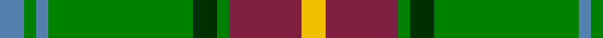
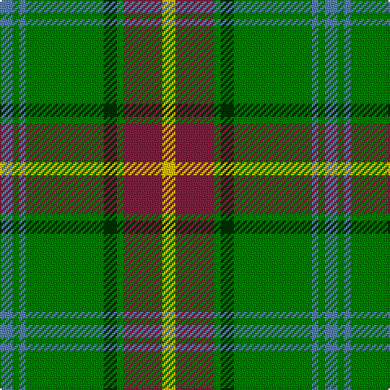

In pattern [BGBGGGRY](/patterns/bgbgggry/).

This was sourced from weddslist.  It is a [8 stripes tartan](/stripes/stripes8/).

Original link http://www.weddslist.com/cgi-bin/tartans/pg.pl?source=sts

## Thread count
B/8 G4 B4 G48 DG8 G4 DR24 Y/8

## Palette
Each colour and its ΔE from the base-6 reference it is a variant of.

| Colour | Shade | Base | ΔE (OKLab) |
|---|---|---|---|
| B | <code style="background-color:#5480B0;">#5480B0</code> `#5480B0` | B <code style="background-color:#2A418A;">#2A418A</code> | 0.19 |
| DG | <code style="background-color:#003000;">#003000</code> `#003000` | G <code style="background-color:#006100;">#006100</code> | 0.17 |
| DR | <code style="background-color:#802040;">#802040</code> `#802040` | R <code style="background-color:#CC0000;">#CC0000</code> | 0.17 |
| G | <code style="background-color:#008000;">#008000</code> `#008000` | G <code style="background-color:#006100;">#006100</code> | 0.10 |
| Y | <code style="background-color:#F0C000;">#F0C000</code> `#F0C000` | Y <code style="background-color:#F2BF00;">#F2BF00</code> | 0.00 |

# Sample pattern

## Nearest tartans

The nearest existing variants by ΔTartan distance.

1. [Manitoba District Tartan Tartan Number: 144. Earliest known date: 1962 The official recording of the sett shows the letter G for the dark green stripe. In heraldic terms this means 'Gules' - red. The designer, Hugh Kirkwood Rankine, clearly intended dark green and this is reproduced here.It was given Royal Assent in 1962. See products available Copyright © Blair Urquhart, Comrie, 2015](/setts/s8/b8g4b4g48ga8g4r24y8-b5c8ca8-g006818-ga003820-r901c38-ye8c000/) — ΔT 0.56
1. [O'Neill (Name)](/setts/s8/w12g10r10g90k8y48k8g10-g006818-k101010-ra00024-we0e0e0-ya08858/) — ΔT 0.59
1. [Manitoba](/setts/s8/b4g2b2g24r4g2ra12y4-b5480b0-g008000-rc00000-ra900030-yf0c000/) — ΔT 0.61
1. [Boucherville (Tartan de..) District Tartan Tartan Number: 2119. Earliest known date: 1990 From the notes accompanying the petition for accreditation. "Les symboles ont cette remarquable propriete de reunir en une expression imagee des notions diverses. Ils refletent l'histoire, les croyances, les idealogies et les aspirations de groupes humains habitant un territoire precis. Les tisserands, c'est nous tous....!" See products available Copyright © Blair Urquhart, Comrie, 2015](/setts/s9/g40y4r10w8g4r4g4r4b12-b2c2c80-g006818-r888888-we0e0e0-ye8c000/) — ΔT 0.88
1. [Manitoba District Tartan Tartan Number: 146. Earliest known date: 1962 The tartan as it would appear with red in place of green, the 'G' of green having been interpreted as 'Gules'. The designer, Hugh Kirkwood Rankine, clearly intended a green stripe. This version can be found in the shops. See products available Copyright © Blair Urquhart, Comrie, 2015](/setts/s8/b4g2b2g24r4g2ra12y4-b5c8ca8-g006818-rc80000-raa00048-ye8c000/) — ΔT 0.89
1. [O'Neill](/setts/s8/w12g10r10g90k8ra48k8g10-g008000-k000000-rc00020-ra906030-we0e0e0/) — ΔT 0.91
1. [Alberta District Tartan Tartan Number: 2055. Earliest known date: 1961 Designed for the Edmonton Rehabilitation Society as a project for handloom weaving by disabled students. The Provincial Legislative of Alberta gave formal approval for the Alberta tartan in 1961. See products available Copyright © Blair Urquhart, Comrie, 2015](/setts/s7/g24k2r2k2b4k2y8-b5c8ca8-g006818-k101010-rd05054-ye8c000/) — ΔT 0.94
1. [Alberta (District)](/setts/s7/g96k8r8k8b16k8y32-b2474e8-g006818-k101010-re87878-yd8b000/) — ΔT 0.94
1. [Tennessee](/setts/s10/r4b20w2ra2g2r2g12ra2g20w2-b304080-g008000-rc00000-ra802040-we0e0e0/) — ΔT 0.94
1. [New World Irish (Fashion)](/setts/s8/w18g4ga4w6ga36k4g66y4-g005834-ga006818-k101010-we0e0e0-yd87c00/) — ΔT 1.00

## Neighbour map

Every grey dot is one of 15726 variants placed by the first two principal components of the ΔTartan feature space (44% of its variance). Red is this tartan; blue dots are its nearest — click one to open its page.

<svg viewBox="0 0 640 380" role="img" style="max-width:100%;height:auto;border:1px solid #e0e0e0;border-radius:4px;display:block" xmlns="http://www.w3.org/2000/svg"><image href="/nn/cloud.v1.png" width="640" height="380"/><a href="/setts/s8/b8g4b4g48ga8g4r24y8-b5c8ca8-g006818-ga003820-r901c38-ye8c000/"><circle cx="277.3" cy="169.3" r="4" fill="#3465a4"><title>Manitoba District Tartan Tartan Number: 144. Earliest known date: 1962 The official recording of the sett shows the letter G for the dark green stripe. In heraldic terms this means 'Gules' - red. The designer, Hugh Kirkwood Rankine, clearly intended dark green and this is reproduced here.It was given Royal Assent in 1962. See products available Copyright © Blair Urquhart, Comrie, 2015</title></circle></a><a href="/setts/s8/w12g10r10g90k8y48k8g10-g006818-k101010-ra00024-we0e0e0-ya08858/"><circle cx="296.6" cy="164.5" r="4" fill="#3465a4"><title>O'Neill (Name)</title></circle></a><a href="/setts/s8/b4g2b2g24r4g2ra12y4-b5480b0-g008000-rc00000-ra900030-yf0c000/"><circle cx="266.2" cy="159.6" r="4" fill="#3465a4"><title>Manitoba</title></circle></a><a href="/setts/s9/g40y4r10w8g4r4g4r4b12-b2c2c80-g006818-r888888-we0e0e0-ye8c000/"><circle cx="254.7" cy="161.2" r="4" fill="#3465a4"><title>Boucherville (Tartan de..) District Tartan Tartan Number: 2119. Earliest known date: 1990 From the notes accompanying the petition for accreditation. &quot;Les symboles ont cette remarquable propriete de reunir en une expression imagee des notions diverses. Ils refletent l'histoire, les croyances, les idealogies et les aspirations de groupes humains habitant un territoire precis. Les tisserands, c'est nous tous....!&quot; See products available Copyright © Blair Urquhart, Comrie, 2015</title></circle></a><a href="/setts/s8/b4g2b2g24r4g2ra12y4-b5c8ca8-g006818-rc80000-raa00048-ye8c000/"><circle cx="271.6" cy="161.0" r="4" fill="#3465a4"><title>Manitoba District Tartan Tartan Number: 146. Earliest known date: 1962 The tartan as it would appear with red in place of green, the 'G' of green having been interpreted as 'Gules'. The designer, Hugh Kirkwood Rankine, clearly intended a green stripe. This version can be found in the shops. See products available Copyright © Blair Urquhart, Comrie, 2015</title></circle></a><a href="/setts/s8/w12g10r10g90k8ra48k8g10-g008000-k000000-rc00020-ra906030-we0e0e0/"><circle cx="280.7" cy="157.8" r="4" fill="#3465a4"><title>O'Neill</title></circle></a><a href="/setts/s7/g24k2r2k2b4k2y8-b5c8ca8-g006818-k101010-rd05054-ye8c000/"><circle cx="267.3" cy="154.1" r="4" fill="#3465a4"><title>Alberta District Tartan Tartan Number: 2055. Earliest known date: 1961 Designed for the Edmonton Rehabilitation Society as a project for handloom weaving by disabled students. The Provincial Legislative of Alberta gave formal approval for the Alberta tartan in 1961. See products available Copyright © Blair Urquhart, Comrie, 2015</title></circle></a><a href="/setts/s7/g96k8r8k8b16k8y32-b2474e8-g006818-k101010-re87878-yd8b000/"><circle cx="267.4" cy="155.1" r="4" fill="#3465a4"><title>Alberta (District)</title></circle></a><a href="/setts/s10/r4b20w2ra2g2r2g12ra2g20w2-b304080-g008000-rc00000-ra802040-we0e0e0/"><circle cx="243.5" cy="159.9" r="4" fill="#3465a4"><title>Tennessee</title></circle></a><a href="/setts/s8/w18g4ga4w6ga36k4g66y4-g005834-ga006818-k101010-we0e0e0-yd87c00/"><circle cx="265.8" cy="146.5" r="4" fill="#3465a4"><title>New World Irish (Fashion)</title></circle></a><circle cx="264.1" cy="164.2" r="5" fill="#c00000"/></svg>

ID: /setts/s8/b8g4b4g48ga8g4r24y8-b5480b0-g008000-ga003000-r802040-yf0c000/
