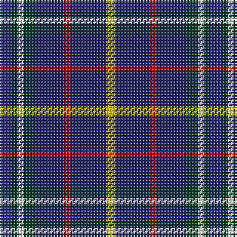

In pattern [BGWGBRBY](/patterns/bgwgbrby/).

This was sourced from house-of-tartan.  It is a [8 stripes tartan](/stripes/stripes8/).

Original link http://www.house-of-tartan.scotland.net/house/TartanViewjs.asp?colr=Def&tnam=2097

## Thread count
DB/8 DG4 LN4 DG8 DBa20 R4 DBa24 Y/6

## Palette
Each colour and its ΔE from the base-6 reference it is a variant of.

| Colour | Shade | Base | ΔE (OKLab) |
|---|---|---|---|
| DB | <code style="background-color:#2C2C80;">#2C2C80</code> `#2C2C80` | B <code style="background-color:#2C4084;">#2C4084</code> | 0.05 |
| DBa | <code style="background-color:#202060;">#202060</code> `#202060` | B <code style="background-color:#2C4084;">#2C4084</code> | 0.11 |
| DG | <code style="background-color:#003820;">#003820</code> `#003820` | G <code style="background-color:#006400;">#006400</code> | 0.16 |
| LN | <code style="background-color:#E0E0E0;">#E0E0E0</code> `#E0E0E0` | W <code style="background-color:#F4F4F0;">#F4F4F0</code> | 0.06 |
| R | <code style="background-color:#C80000;">#C80000</code> `#C80000` | R <code style="background-color:#C80000;">#C80000</code> | 0.00 |
| Y | <code style="background-color:#E8C000;">#E8C000</code> `#E8C000` | Y <code style="background-color:#E8C000;">#E8C000</code> | 0.00 |

# Sample pattern

## Nearest tartans

The nearest existing variants by ΔTartan distance.

1. [United Services, Planning Association](/setts/s8/b8g4w4g8ba20r4ba24y6-b304080-ba000050-g003000-rc00000-we0e0e0-yf0c000/) — ΔT 0.85
1. [Côté-Haché (Personal)](/setts/s8/b12g40b20y4b40k4r16w4-b2c2c80-g003c14-k101010-r880000-wffffff-yffe600/) — ΔT 1.04
1. [Edinburgh Bus Tours](/setts/s12/w6b20y5b5y5b20r14b4k18b30ya4b4-b202060-k101010-r880000-wc0c0c0-y48a4c0-yafccc00/) — ΔT 1.17
1. [Grainger (Name)](/setts/s7/b72r8b12g36b30k36w8-b2c2c80-g006818-k101010-rc80000-wfcfcfc/) — ΔT 1.20
1. [Cot-Hach (Personal)l)](/setts/s8/b12g40b20y4b40k4r16w4-b2c2c80-g003820-k101010-r880000-wfcfcfc-ye8c000/) — ΔT 1.20
1. [Ayrshire Tourist Board](/setts/s9/k20b6ba8b6k14bb6g16k34y4-b800080-ba304080-bb8080d0-g008000-k000030-yf0c000/) — ΔT 1.21
1. [Tupper, John Charles (Personal)](/setts/s10/r4w4g16ga4g4b40ba16ga4b30w4-b1c1c50-ba5f749c-g003820-ga649848-r800028-wffffff/) — ΔT 1.21
1. [Edinburgh Bus Tours](/setts/s12/w6b20ba5b5ba5b20r14b4k18b30y4b4-b003c64-ba0596fa-k101010-ra00000-we0e0e0-ye0a126/) — ΔT 1.22
1. [Quinn](/setts/s9/r6b48k24g6g24g6k24b48y6-b606080-g407050-k000000-r800000-yf0c000/) — ΔT 1.25
1. [Tupper, John Charles (Personal)](/setts/s10/r4w4g16ga4g4b40ba16ga4b30w4-b202060-ba5c8ca8-g003820-ga289c18-r880000-wfcfcfc/) — ΔT 1.28

## Neighbour map

Every grey dot is one of 15726 variants placed by the first two principal components of the ΔTartan feature space (44% of its variance). Red is this tartan; blue dots are its nearest — click one to open its page.

<svg viewBox="0 0 640 380" role="img" style="max-width:100%;height:auto;border:1px solid #e0e0e0;border-radius:4px;display:block" xmlns="http://www.w3.org/2000/svg"><image href="/nn/cloud.v1.png" width="640" height="380"/><a href="/setts/s8/b8g4w4g8ba20r4ba24y6-b304080-ba000050-g003000-rc00000-we0e0e0-yf0c000/"><circle cx="193.5" cy="192.9" r="4" fill="#3465a4"><title>United Services, Planning Association</title></circle></a><a href="/setts/s8/b12g40b20y4b40k4r16w4-b2c2c80-g003c14-k101010-r880000-wffffff-yffe600/"><circle cx="231.3" cy="179.2" r="4" fill="#3465a4"><title>Côté-Haché (Personal)</title></circle></a><a href="/setts/s12/w6b20y5b5y5b20r14b4k18b30ya4b4-b202060-k101010-r880000-wc0c0c0-y48a4c0-yafccc00/"><circle cx="254.7" cy="175.0" r="4" fill="#3465a4"><title>Edinburgh Bus Tours</title></circle></a><a href="/setts/s7/b72r8b12g36b30k36w8-b2c2c80-g006818-k101010-rc80000-wfcfcfc/"><circle cx="261.0" cy="210.6" r="4" fill="#3465a4"><title>Grainger (Name)</title></circle></a><a href="/setts/s8/b12g40b20y4b40k4r16w4-b2c2c80-g003820-k101010-r880000-wfcfcfc-ye8c000/"><circle cx="241.0" cy="183.5" r="4" fill="#3465a4"><title>Cot-Hach (Personal)l)</title></circle></a><a href="/setts/s9/k20b6ba8b6k14bb6g16k34y4-b800080-ba304080-bb8080d0-g008000-k000030-yf0c000/"><circle cx="231.4" cy="183.5" r="4" fill="#3465a4"><title>Ayrshire Tourist Board</title></circle></a><a href="/setts/s10/r4w4g16ga4g4b40ba16ga4b30w4-b1c1c50-ba5f749c-g003820-ga649848-r800028-wffffff/"><circle cx="235.2" cy="149.9" r="4" fill="#3465a4"><title>Tupper, John Charles (Personal)</title></circle></a><a href="/setts/s12/w6b20ba5b5ba5b20r14b4k18b30y4b4-b003c64-ba0596fa-k101010-ra00000-we0e0e0-ye0a126/"><circle cx="251.4" cy="175.9" r="4" fill="#3465a4"><title>Edinburgh Bus Tours</title></circle></a><a href="/setts/s9/r6b48k24g6g24g6k24b48y6-b606080-g407050-k000000-r800000-yf0c000/"><circle cx="176.9" cy="172.5" r="4" fill="#3465a4"><title>Quinn</title></circle></a><a href="/setts/s10/r4w4g16ga4g4b40ba16ga4b30w4-b202060-ba5c8ca8-g003820-ga289c18-r880000-wfcfcfc/"><circle cx="230.7" cy="148.4" r="4" fill="#3465a4"><title>Tupper, John Charles (Personal)</title></circle></a><circle cx="210.7" cy="195.5" r="5" fill="#c00000"/></svg>

ID: /setts/s8/b8g4w4g8ba20r4ba24y6-b2c2c80-ba202060-g003820-rc80000-we0e0e0-ye8c000/
