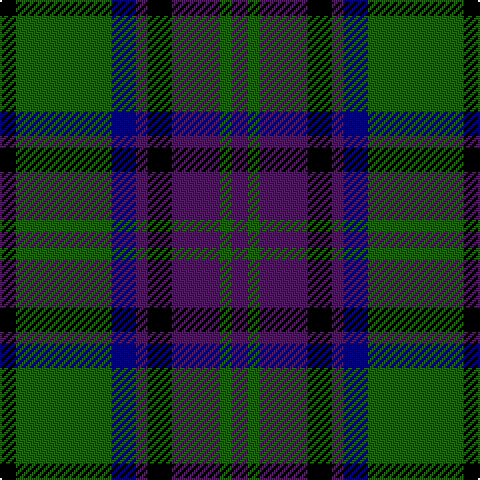

In pattern [BGBKBBGK](/patterns/bgbkbbgk/).

This was sourced from tartans-authority.  It is a [8 stripes tartan](/stripes/stripes8/).

Original link http://www.tartansauthority.com/tartan-ferret/display/4189/

## Attestations

This cloth appears in 2 source records; the oldest owns this page.

- 1992 — Gary/Garry (Name) (tartans-authority, [record](http://www.tartansauthority.com/tartan-ferret/display/4189/))
- 01/01/2002 — Gary/Garry (Personal) (register-of-tartans, [record](https://www.tartanregister.gov.uk/tartanDetails.aspx?ref=1315))

## Thread count
K/8 G48 DB12 P6 K12 P24 G6 P/8

## Palette
Each colour and its ΔE from the base-6 reference it is a variant of.

| Colour | Shade | Base | ΔE (OKLab) |
|---|---|---|---|
| DB | <code style="background-color:#00008C;">#00008C</code> `#00008C` | B <code style="background-color:#2C4084;">#2C4084</code> | 0.13 |
| G | <code style="background-color:#146400;">#146400</code> `#146400` | G <code style="background-color:#006400;">#006400</code> | 0.01 |
| K | <code style="background-color:#000000;">#000000</code> `#000000` | K <code style="background-color:#000000;">#000000</code> | 0.00 |
| P | <code style="background-color:#501464;">#501464</code> `#501464` | B <code style="background-color:#2C4084;">#2C4084</code> | 0.12 |

# Sample pattern

## Nearest tartans

The nearest existing variants by ΔTartan distance.

1. [Brabender](/setts/s8/g6b42k6b6k24r6g24k6-b304080-g008000-k000000-rc00000/) — ΔT 0.74
1. [Gammell](/setts/s8/b64ba6b6ba6b6ba20g48r6-b000050-ba401000-g008000-r802040/) — ΔT 0.89
1. [Gammell (1978) (Personal)](/setts/s7/b6r4b44k22g44r4g6-b1c0070-g006818-k101010-rc80000/) — ΔT 0.91
1. [Urquhart Broad Red Clan Tartan Tartan Number: 1086. Earliest known date: 1810-15 Registered with Lord Lyon on 14th October, 1991. Lord Lyon also registered the 'Urquhart White Line' in the same entry. The proportions of the count given here are taken from the sample in the Cockburn Collection in the Mitchell Library in Glasgow. The sett also appears in the work of W and A Smith (1850) who claim that their sample was collected in the Highlands around 1822, possibly by George Hunter, the Army clothier. See products available Copyright © Blair Urquhart, Comrie, 2015](/setts/s9/r18b22k6b6k6b6k40g40k6-b2c2c80-g006818-k101010-rc80000/) — ΔT 0.92
1. [Guthrie (Name)](/setts/s9/k4g48k48r4k4r4k48b48r4-b1474b4-g408060-k101010-rc80000/) — ΔT 0.92
1. [Bijral](/setts/s11/b4k4b10k4b4k4b8k20g20r2k4-b2888c4-g285800-k101010-rc80000/) — ΔT 0.93
1. [Triad Highland Games Proposed](/setts/s7/r4b32k32r4k32g32r4-b2888c4-g006818-k101010-re87878/) — ΔT 0.96
1. [Newlands of Lauriston](/setts/s10/b18k18b18r4k40g26r4g8r4g8-b1474b4-g006818-k101010-rc80000/) — ΔT 0.96
1. [Flower of Scotland](/setts/s6/b3g28b3k16b28r3-b304080-g008000-k000000-rc00000/) — ΔT 0.99
1. [Swallow Hotels (Corporate)](/setts/s9/k8g42k20r4k20b42k8b8k8-b2c2c80-g408060-k101010-rc80000/) — ΔT 1.03

## Neighbour map

Every grey dot is one of 15726 variants placed by the first two principal components of the ΔTartan feature space (44% of its variance). Red is this tartan; blue dots are its nearest — click one to open its page.

<svg viewBox="0 0 640 380" role="img" style="max-width:100%;height:auto;border:1px solid #e0e0e0;border-radius:4px;display:block" xmlns="http://www.w3.org/2000/svg"><image href="/nn/cloud.v1.png" width="640" height="380"/><a href="/setts/s8/g6b42k6b6k24r6g24k6-b304080-g008000-k000000-rc00000/"><circle cx="172.0" cy="209.0" r="4" fill="#3465a4"><title>Brabender</title></circle></a><a href="/setts/s8/b64ba6b6ba6b6ba20g48r6-b000050-ba401000-g008000-r802040/"><circle cx="258.1" cy="190.1" r="4" fill="#3465a4"><title>Gammell</title></circle></a><a href="/setts/s7/b6r4b44k22g44r4g6-b1c0070-g006818-k101010-rc80000/"><circle cx="227.3" cy="206.4" r="4" fill="#3465a4"><title>Gammell (1978) (Personal)</title></circle></a><a href="/setts/s9/r18b22k6b6k6b6k40g40k6-b2c2c80-g006818-k101010-rc80000/"><circle cx="186.3" cy="218.0" r="4" fill="#3465a4"><title>Urquhart Broad Red Clan Tartan Tartan Number: 1086. Earliest known date: 1810-15 Registered with Lord Lyon on 14th October, 1991. Lord Lyon also registered the 'Urquhart White Line' in the same entry. The proportions of the count given here are taken from the sample in the Cockburn Collection in the Mitchell Library in Glasgow. The sett also appears in the work of W and A Smith (1850) who claim that their sample was collected in the Highlands around 1822, possibly by George Hunter, the Army clothier. See products available Copyright © Blair Urquhart, Comrie, 2015</title></circle></a><a href="/setts/s9/k4g48k48r4k4r4k48b48r4-b1474b4-g408060-k101010-rc80000/"><circle cx="252.6" cy="184.2" r="4" fill="#3465a4"><title>Guthrie (Name)</title></circle></a><a href="/setts/s11/b4k4b10k4b4k4b8k20g20r2k4-b2888c4-g285800-k101010-rc80000/"><circle cx="205.6" cy="191.8" r="4" fill="#3465a4"><title>Bijral</title></circle></a><a href="/setts/s7/r4b32k32r4k32g32r4-b2888c4-g006818-k101010-re87878/"><circle cx="192.2" cy="224.0" r="4" fill="#3465a4"><title>Triad Highland Games Proposed</title></circle></a><a href="/setts/s10/b18k18b18r4k40g26r4g8r4g8-b1474b4-g006818-k101010-rc80000/"><circle cx="183.7" cy="201.8" r="4" fill="#3465a4"><title>Newlands of Lauriston</title></circle></a><a href="/setts/s6/b3g28b3k16b28r3-b304080-g008000-k000000-rc00000/"><circle cx="203.7" cy="214.4" r="4" fill="#3465a4"><title>Flower of Scotland</title></circle></a><a href="/setts/s9/k8g42k20r4k20b42k8b8k8-b2c2c80-g408060-k101010-rc80000/"><circle cx="220.7" cy="209.5" r="4" fill="#3465a4"><title>Swallow Hotels (Corporate)</title></circle></a><circle cx="210.2" cy="209.8" r="5" fill="#c00000"/></svg>

ID: /setts/s8/b8g6b24k12b6ba12g48k8-b501464-ba00008c-g146400-k000000/
