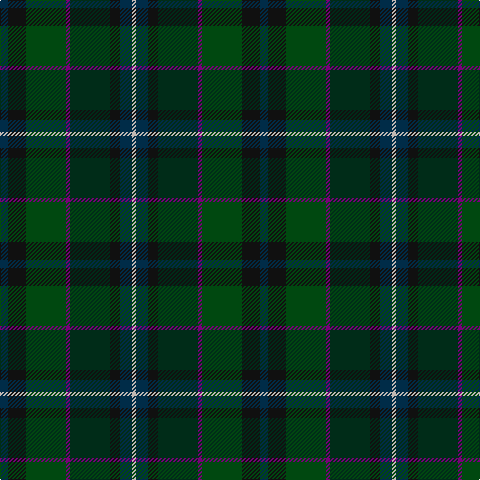

In pattern [BKGBGKBY](/patterns/bkgbgkby/).

This was sourced from house-of-tartan.  It is a [8 stripes tartan](/stripes/stripes8/).

Original link http://www.house-of-tartan.scotland.net/house/TartanViewjs.asp?colr=Def&tnam=5772

## Thread count
DN/8 K18 DGa40 P4 DG40 K10 DN12 N/4

## Palette
Each colour and its ΔE from the base-6 reference it is a variant of.

| Colour | Shade | Base | ΔE (OKLab) |
|---|---|---|---|
| DG | <code style="background-color:#002C18;">#002C18</code> `#002C18` | G <code style="background-color:#006400;">#006400</code> | 0.20 |
| DGa | <code style="background-color:#004810;">#004810</code> `#004810` | G <code style="background-color:#006400;">#006400</code> | 0.10 |
| DN | <code style="background-color:#002C48;">#002C48</code> `#002C48` | B <code style="background-color:#2C4084;">#2C4084</code> | 0.13 |
| G | <code style="background-color:#408060;">#408060</code> `#408060` | G <code style="background-color:#006400;">#006400</code> | 0.13 |
| Ga | <code style="background-color:#00643C;">#00643C</code> `#00643C` | G <code style="background-color:#006400;">#006400</code> | 0.06 |
| Gb | <code style="background-color:#289C18;">#289C18</code> `#289C18` | G <code style="background-color:#006400;">#006400</code> | 0.18 |
| K | <code style="background-color:#101010;">#101010</code> `#101010` | K <code style="background-color:#000000;">#000000</code> | 0.17 |
| N | <code style="background-color:#C0B8B4;">#C0B8B4</code> `#C0B8B4` | Y <code style="background-color:#E8C000;">#E8C000</code> | 0.16 |
| P | <code style="background-color:#780078;">#780078</code> `#780078` | B <code style="background-color:#2C4084;">#2C4084</code> | 0.16 |

# Sample pattern

ID: /setts/s8/b8k18g40ba4ga40k10b12y4-b002c48-ba780078-g004810-ga002c18-k101010-yc0b8b4/
