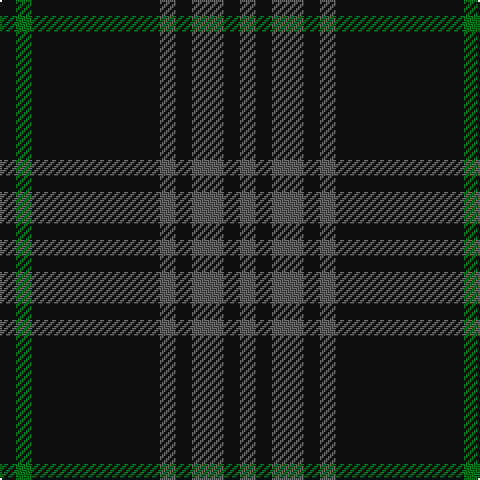

In pattern [BKBKBKGK](/patterns/bkbkbkgk/).

This was sourced from tartans-authority.  It is a [8 stripes tartan](/stripes/stripes8/).

Original link http://www.tartansauthority.com/tartan-ferret/display/7796/

## Attestations

This cloth appears in 2 source records; the oldest owns this page.

- pre 2008 — Nightstalker (Corporate) (tartans-authority, [record](http://www.tartansauthority.com/tartan-ferret/display/7796/))
- undated — Nightstalker (register-of-tartans, [record](https://www.tartanregister.gov.uk/tartanDetails.aspx?ref=5760))

## Thread count
K/8 G8 K64 N8 K8 N16 K8 N/8

## Palette
Each colour and its ΔE from the base-6 reference it is a variant of.

| Colour | Shade | Base | ΔE (OKLab) |
|---|---|---|---|
| G | <code style="background-color:#006818;">#006818</code> `#006818` | G <code style="background-color:#006400;">#006400</code> | 0.02 |
| K | <code style="background-color:#101010;">#101010</code> `#101010` | K <code style="background-color:#000000;">#000000</code> | 0.17 |
| N | <code style="background-color:#5C5C5C;">#5C5C5C</code> `#5C5C5C` | B <code style="background-color:#2C4084;">#2C4084</code> | 0.14 |

# Sample pattern

ID: /setts/s8/b8k8b16k8b8k64g8k8-b5c5c5c-g006818-k101010/
