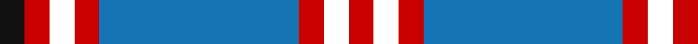

**Bands:** [KRKRBRKR](/stripes/krkrbrkr/) · **Stripes:** [K R K R B R K R](/stripes/stripes8/) K R K R B R K R

This was sourced from house-of-tartan.  It is a [8 band tartan](/bands/bands8/).

Original link http://www.house-of-tartan.scotland.net/house/TartanViewjs.asp?colr=Def&tnam=2544

## Thread count
K/8 Ra8 CW8 Ra8 B64 Ra8 CW8 Ra/8

## Palette
Each colour and its ΔE from the base-6 reference it is a variant of.

| Colour | Shade | Base | ΔE (OKLab) |
|---|---|---|---|
| B | <code style="background-color:#1474B4;">#1474B4</code> `#1474B4` | B <code style="background-color:#2A418A;">#2A418A</code> | 0.15 |
| DG | <code style="background-color:#003820;">#003820</code> `#003820` | G <code style="background-color:#006100;">#006100</code> | 0.15 |
| DY | <code style="background-color:#D09000;">#D09000</code> `#D09000` | Y <code style="background-color:#F2BF00;">#F2BF00</code> | 0.13 |
| K | <code style="background-color:#101010;">#101010</code> `#101010` | K <code style="background-color:#000000;">#000000</code> | 0.17 |
| R | <code style="background-color:#B03000;">#B03000</code> `#B03000` | R <code style="background-color:#CC0000;">#CC0000</code> | 0.06 |
| Ra | <code style="background-color:#C80000;">#C80000</code> `#C80000` | R <code style="background-color:#CC0000;">#CC0000</code> | 0.01 |
| Y | <code style="background-color:#E8C000;">#E8C000</code> `#E8C000` | Y <code style="background-color:#F2BF00;">#F2BF00</code> | 0.02 |

# Sample pattern

## Nearest tartans

The nearest existing variants by ΔTartan distance.

1. [Laing of Archiestown](/setts/s8/db8r1w1r1k1~x8/) — ΔT 0.91
1. [Yudo (Corporate)](/setts/s9/k2r9w2db2w4db2w2db20w2~x4/) — ΔT 1.13
1. [St Andrews University Corporate Tartan Tartan Number: 2398. Earliest known date: pre 1998 Originally named St. Andrews International. Apparently a Gordon Paton MD, bought the company from North East Fife Enterprise Trust in 1997, the aim being to brand quality Scottish products for export worldwide. The company intended to set up a membership scheme but the company went into liquidation. The intended venue belonged to St Andrews University and it appears that the ownership of the tartan has fallen to the University and its name has been changed from 'International' to 'University' (Deirdre Kinloch Anderson, Aug 2004).No thread count given so this entry is based on an estimate from a small computer graphic. Has since been corrected to conform to the SRT (Scottish Register of Tartans) See products available Copyright © Blair Urquhart, Comrie, 2015](/setts/s10/k3db2ly3k2ly5db18g3k3g2db3~x2/) — ΔT 1.14
1. [Tweedside Hunting](/setts/s9/db18g2k2g5w2g2w2g2k2~x4/) — ΔT 1.19
1. [Wolverines (Corporate)](/setts/s6/lo8w3db40k12w3lo3~x2/) — ΔT 1.23
1. [Rutherford](/setts/s8/k8r1k1r1k4b11ly1b2~x6/) — ΔT 1.26
1. [Scottish Knights Templar MTS (Corp)](/setts/s10/lb4r2db20k6lb5k4lb3k2r2db2~x2/) — ΔT 1.26
1. [Highlands School (North Carolina)](/setts/s8/lo12db2lo2db30dt2db2dt13lb4~x2/) — ΔT 1.27
1. [Highlands School (N. Carolina) Corporate Tartan Tartan Number: 2109. Earliest known date: 1990 Highlands in North Carolina is the home of the Scottish Tartans Society's Museum Extension. The school tartan was designed by Bob Martin who is a 'Fellow of the Society'. Blue and Gold are the school colours. See products available Copyright © Blair Urquhart, Comrie, 2015](/setts/s8/ly12db2ly2db30db3db2db13w4~x2/) — ΔT 1.27
1. [Australian Police](/setts/s8/k5w5k5t11k3y17k30t3~x2/) — ΔT 1.32

## Neighbour map

Every grey dot is one of 14299 variants placed by the first two principal components of the ΔTartan feature space (44% of its variance). Red is this tartan; blue dots are its nearest — click one to open its page.

<svg viewBox="0 0 640 380" role="img" style="max-width:100%;height:auto;border:1px solid #e0e0e0;border-radius:4px;display:block" xmlns="http://www.w3.org/2000/svg"><image href="/nn/cloud.v1.png" width="640" height="380"/><a href="/setts/s8/db8r1w1r1k1~x8/"><circle cx="270.2" cy="159.4" r="4" fill="#3465a4"><title>Laing of Archiestown</title></circle></a><a href="/setts/s9/k2r9w2db2w4db2w2db20w2~x4/"><circle cx="259.3" cy="147.0" r="4" fill="#3465a4"><title>Yudo (Corporate)</title></circle></a><a href="/setts/s10/k3db2ly3k2ly5db18g3k3g2db3~x2/"><circle cx="246.7" cy="172.6" r="4" fill="#3465a4"><title>St Andrews University Corporate Tartan Tartan Number: 2398. Earliest known date: pre 1998 Originally named St. Andrews International. Apparently a Gordon Paton MD, bought the company from North East Fife Enterprise Trust in 1997, the aim being to brand quality Scottish products for export worldwide. The company intended to set up a membership scheme but the company went into liquidation. The intended venue belonged to St Andrews University and it appears that the ownership of the tartan has fallen to the University and its name has been changed from 'International' to 'University' (Deirdre Kinloch Anderson, Aug 2004).No thread count given so this entry is based on an estimate from a small computer graphic. Has since been corrected to conform to the SRT (Scottish Register of Tartans) See products available Copyright © Blair Urquhart, Comrie, 2015</title></circle></a><a href="/setts/s9/db18g2k2g5w2g2w2g2k2~x4/"><circle cx="243.9" cy="167.9" r="4" fill="#3465a4"><title>Tweedside Hunting</title></circle></a><a href="/setts/s6/lo8w3db40k12w3lo3~x2/"><circle cx="306.9" cy="166.6" r="4" fill="#3465a4"><title>Wolverines (Corporate)</title></circle></a><a href="/setts/s8/k8r1k1r1k4b11ly1b2~x6/"><circle cx="261.8" cy="180.2" r="4" fill="#3465a4"><title>Rutherford</title></circle></a><a href="/setts/s10/lb4r2db20k6lb5k4lb3k2r2db2~x2/"><circle cx="208.9" cy="161.7" r="4" fill="#3465a4"><title>Scottish Knights Templar MTS (Corp)</title></circle></a><a href="/setts/s8/lo12db2lo2db30dt2db2dt13lb4~x2/"><circle cx="273.2" cy="160.4" r="4" fill="#3465a4"><title>Highlands School (North Carolina)</title></circle></a><a href="/setts/s8/ly12db2ly2db30db3db2db13w4~x2/"><circle cx="260.4" cy="155.7" r="4" fill="#3465a4"><title>Highlands School (N. Carolina) Corporate Tartan Tartan Number: 2109. Earliest known date: 1990 Highlands in North Carolina is the home of the Scottish Tartans Society's Museum Extension. The school tartan was designed by Bob Martin who is a 'Fellow of the Society'. Blue and Gold are the school colours. See products available Copyright © Blair Urquhart, Comrie, 2015</title></circle></a><a href="/setts/s8/k5w5k5t11k3y17k30t3~x2/"><circle cx="258.0" cy="188.9" r="4" fill="#3465a4"><title>Australian Police</title></circle></a><circle cx="273.1" cy="168.6" r="5" fill="#c00000"/></svg>

ID: /setts/s8/b8r1k1r1k1~x8/
