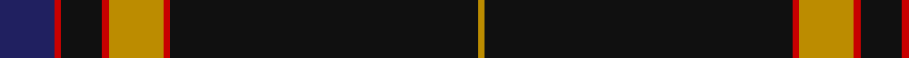

In pattern [BRKRYRKY](/patterns/brkryrky/).

This was sourced from tartans-authority.  It is a [8 stripes tartan](/stripes/stripes8/).

Original link http://www.tartansauthority.com/tartan-ferret/display/10635/

## Thread count
DB/16 R2 K12 R2 DY16 R2 K90 DY/2

## Palette
Each colour and its ΔE from the base-6 reference it is a variant of.

| Colour | Shade | Base | ΔE (OKLab) |
|---|---|---|---|
| DB | <code style="background-color:#202060;">#202060</code> `#202060` | B <code style="background-color:#2A418A;">#2A418A</code> | 0.11 |
| DY | <code style="background-color:#BC8C00;">#BC8C00</code> `#BC8C00` | Y <code style="background-color:#F2BF00;">#F2BF00</code> | 0.16 |
| K | <code style="background-color:#101010;">#101010</code> `#101010` | K <code style="background-color:#000000;">#000000</code> | 0.17 |
| R | <code style="background-color:#C80000;">#C80000</code> `#C80000` | R <code style="background-color:#CC0000;">#CC0000</code> | 0.01 |

# Sample pattern

## Nearest tartans

The nearest existing variants by ΔTartan distance.

1. [degli Uberti, Baron of Cartsburn (Personal)](/setts/s8/b8r1k6r1y8r1k45y1x2~b000080-k101010-rbe3d3d-ybc933d/) — ΔT 0.37
1. [American Heritage](/setts/s11/w5k2b14k4r8k4b4k80r6k4r4~b244470-k101010-r880000-wf8f4d0/) — ΔT 0.88
1. [Grassi (Personal)](/setts/s9/b3ba2r2k60ba2k3ba12k1r3x2~b780078-ba5c5c5c-k101010-r888888/) — ΔT 1.04
1. [Marine Harvest Scotland (Corporate)](/setts/s8/b10w2k2b1k6w1k45y2x2~b1474b4-k101010-wc0c0c0-yd87c00/) — ΔT 1.08
1. [Midnight Glen (Fashion)](/setts/s9/b3k40y3b6k10b10k3y1r3x2~b542050-k101010-rb45c6c-yd0c4b4/) — ΔT 1.11
1. [Harley Davidson (Corporate)](/setts/s6/r4b6k4ra8k49r2~b5c5c5c-k101010-r888888-rab84c00/) — ΔT 1.18
1. [Brooks Brothers Signature (Corporate](/setts/s9/k5y1g7r1k45r5y3k4y3x2~g003820-k00002c-r880000-ybc8c00/) — ΔT 1.24
1. [MacGregor, Black (Personal)](/setts/s6/k72g23k7g8r1w3x2~g006818-k101010-rc80000-we0e0e0/) — ΔT 1.27
1. [Dellen](/setts/s6/k80r6g3r12k2w2x2~g006818-k101010-rcc4438-wfcfcfc/) — ΔT 1.29
1. [Capco](/setts/s8/k31w1k2w2b3k2ba4w2x4~b14283c-ba5f749c-k1c1714-wf8f8f8/) — ΔT 1.30

## Neighbour map

Every grey dot is one of 15726 variants placed by the first two principal components of the ΔTartan feature space (44% of its variance). Red is this tartan; blue dots are its nearest — click one to open its page.

<svg viewBox="0 0 640 380" role="img" style="max-width:100%;height:auto;border:1px solid #e0e0e0;border-radius:4px;display:block" xmlns="http://www.w3.org/2000/svg"><image href="/nn/cloud.v1.png" width="640" height="380"/><a href="/setts/s8/b8r1k6r1y8r1k45y1x2~b000080-k101010-rbe3d3d-ybc933d/"><circle cx="497.7" cy="120.8" r="4" fill="#3465a4"><title>degli Uberti, Baron of Cartsburn (Personal)</title></circle></a><a href="/setts/s11/w5k2b14k4r8k4b4k80r6k4r4~b244470-k101010-r880000-wf8f4d0/"><circle cx="493.7" cy="107.8" r="4" fill="#3465a4"><title>American Heritage</title></circle></a><a href="/setts/s9/b3ba2r2k60ba2k3ba12k1r3x2~b780078-ba5c5c5c-k101010-r888888/"><circle cx="550.7" cy="114.8" r="4" fill="#3465a4"><title>Grassi (Personal)</title></circle></a><a href="/setts/s8/b10w2k2b1k6w1k45y2x2~b1474b4-k101010-wc0c0c0-yd87c00/"><circle cx="537.4" cy="121.6" r="4" fill="#3465a4"><title>Marine Harvest Scotland (Corporate)</title></circle></a><a href="/setts/s9/b3k40y3b6k10b10k3y1r3x2~b542050-k101010-rb45c6c-yd0c4b4/"><circle cx="475.0" cy="138.5" r="4" fill="#3465a4"><title>Midnight Glen (Fashion)</title></circle></a><a href="/setts/s6/r4b6k4ra8k49r2~b5c5c5c-k101010-r888888-rab84c00/"><circle cx="488.0" cy="166.8" r="4" fill="#3465a4"><title>Harley Davidson (Corporate)</title></circle></a><a href="/setts/s9/k5y1g7r1k45r5y3k4y3x2~g003820-k00002c-r880000-ybc8c00/"><circle cx="507.0" cy="121.2" r="4" fill="#3465a4"><title>Brooks Brothers Signature (Corporate</title></circle></a><a href="/setts/s6/k72g23k7g8r1w3x2~g006818-k101010-rc80000-we0e0e0/"><circle cx="498.2" cy="150.2" r="4" fill="#3465a4"><title>MacGregor, Black (Personal)</title></circle></a><a href="/setts/s6/k80r6g3r12k2w2x2~g006818-k101010-rcc4438-wfcfcfc/"><circle cx="556.3" cy="136.6" r="4" fill="#3465a4"><title>Dellen</title></circle></a><a href="/setts/s8/k31w1k2w2b3k2ba4w2x4~b14283c-ba5f749c-k1c1714-wf8f8f8/"><circle cx="482.0" cy="122.3" r="4" fill="#3465a4"><title>Capco</title></circle></a><circle cx="505.3" cy="122.6" r="5" fill="#c00000"/></svg>

ID: /setts/s8/b8r1k6r1y8r1k45y1x2~b202060-k101010-rc80000-ybc8c00/
