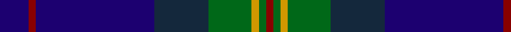

In pattern [BRBBGYGR](/patterns/brbbgygr/).

This was sourced from register-of-tartans.  It is a [8 stripes tartan](/stripes/stripes8/).

Original link https://www.tartanregister.gov.uk/tartanDetails.aspx?ref=3007

## Attestations

This cloth appears in 2 source records; the oldest owns this page.

- 01/10/1998 — Moray Council (register-of-tartans, [record](https://www.tartanregister.gov.uk/tartanDetails.aspx?ref=3007))
- 1998 — Moray Council (Corporate) (tartans-authority, [record](http://www.tartansauthority.com/tartan-ferret/display/2494/))

## Thread count
DB/16 DR4 DB66 DN30 G24 DY4 G4 DR/4

## Palette
Each colour and its ΔE from the base-6 reference it is a variant of.

| Colour | Shade | Base | ΔE (OKLab) |
|---|---|---|---|
| DB | <code style="background-color:#1C0070;">#1C0070</code> `#1C0070` | B <code style="background-color:#2A418A;">#2A418A</code> | 0.14 |
| DN | <code style="background-color:#14283C;">#14283C</code> `#14283C` | B <code style="background-color:#2A418A;">#2A418A</code> | 0.15 |
| DR | <code style="background-color:#880000;">#880000</code> `#880000` | R <code style="background-color:#CC0000;">#CC0000</code> | 0.15 |
| DY | <code style="background-color:#D09800;">#D09800</code> `#D09800` | Y <code style="background-color:#F2BF00;">#F2BF00</code> | 0.12 |
| G | <code style="background-color:#006818;">#006818</code> `#006818` | G <code style="background-color:#006100;">#006100</code> | 0.02 |

# Sample pattern

## Nearest tartans

The nearest existing variants by ΔTartan distance.

1. [Burt Family](/setts/s9/b2g13ba8g3ba33ga3ba8ga13r2~b551a8b-ba000080-g006400-ga5c4033-rdc0000~x2/) — ΔT 0.83
1. [Wcwm 9275-1395](/setts/s7/b6ba3b56k24g6r6g6~b1c0070-ba440044-g006818-k101010-re87878/) — ΔT 0.89
1. [Edinburgh Crystal Corporate Tartan Tartan Number: 2307. Earliest known date: pre 1997 Designed by Sandra Campbell an employee of Edinburgh Crystal. See products available Copyright © Blair Urquhart, Comrie, 2015](/setts/s8/b30w2k6ba3r3ba3k6w2~b14283c-ba2c2c80-k101010-rc80000-wc0c0c0~x4/) — ΔT 1.10
1. [Stewmann (2009) (Personal)](/setts/s9/g24b4g3ba11bb8ba37k3ba2y4~b5ea0f4-ba00137c-bb6a1058-g003807-k101010-yd7a0b5~x2/) — ΔT 1.10
1. [Weir Clan Tartan Tartan Number: 327. Earliest known date: pre 2003 This sample comes from the MacGregor-Hastie collection which forms the basis of the cloth archive of the Scottish Tartans Society. Some of the samples, including this one, were unmarked. One can assume that the sample dates between 1930 and 1950. See products available Copyright © Blair Urquhart, Comrie, 2015](/setts/s8/k8y1k1b28k12g2k1ba2~b2c2c80-ba5c8ca8-g006818-k101010-ye8c000~x2/) — ΔT 1.17
1. [Hope-Weir/Weir](/setts/s8/k8y1k1b28k12g2k1ba2~b2c4084-ba3c82af-g005020-k101010-ye8c000~x2/) — ΔT 1.18
1. [Spirit of Alva](/setts/s10/b6ba10bb4ba12g19bb4g8k20ba50b4~b3c82af-ba3c0096-bb280032-g002814-k101010/) — ΔT 1.19
1. [Auckland (Fashion)](/setts/s8/g3k3b2k16b2k2b24w2~b2c2c80-g003820-k101010-wc0c0c0~x2/) — ΔT 1.21
1. [Royal Highland Yacht Club (Corporate](/setts/s11/b26ba3b1r2b1ba3b3ba12g14b2w2~b1c1c50-ba2c2c80-g006818-ra800a8-we0e0e0~x2/) — ΔT 1.21
1. [Peter of Lee (Chief) (Personal)](/setts/s8/r4g4k2g29b21k3b3y3~b2c2c80-g003820-k101010-rc80000-ye8c000~x2/) — ΔT 1.23

## Neighbour map

Every grey dot is one of 15726 variants placed by the first two principal components of the ΔTartan feature space (44% of its variance). Red is this tartan; blue dots are its nearest — click one to open its page.

<svg viewBox="0 0 640 380" role="img" style="max-width:100%;height:auto;border:1px solid #e0e0e0;border-radius:4px;display:block" xmlns="http://www.w3.org/2000/svg"><image href="/nn/cloud.v1.png" width="640" height="380"/><a href="/setts/s9/b2g13ba8g3ba33ga3ba8ga13r2~b551a8b-ba000080-g006400-ga5c4033-rdc0000~x2/"><circle cx="331.9" cy="173.8" r="4" fill="#3465a4"><title>Burt Family</title></circle></a><a href="/setts/s7/b6ba3b56k24g6r6g6~b1c0070-ba440044-g006818-k101010-re87878/"><circle cx="355.6" cy="166.7" r="4" fill="#3465a4"><title>Wcwm 9275-1395</title></circle></a><a href="/setts/s8/b30w2k6ba3r3ba3k6w2~b14283c-ba2c2c80-k101010-rc80000-wc0c0c0~x4/"><circle cx="328.4" cy="159.6" r="4" fill="#3465a4"><title>Edinburgh Crystal Corporate Tartan Tartan Number: 2307. Earliest known date: pre 1997 Designed by Sandra Campbell an employee of Edinburgh Crystal. See products available Copyright © Blair Urquhart, Comrie, 2015</title></circle></a><a href="/setts/s9/g24b4g3ba11bb8ba37k3ba2y4~b5ea0f4-ba00137c-bb6a1058-g003807-k101010-yd7a0b5~x2/"><circle cx="284.5" cy="144.1" r="4" fill="#3465a4"><title>Stewmann (2009) (Personal)</title></circle></a><a href="/setts/s8/k8y1k1b28k12g2k1ba2~b2c2c80-ba5c8ca8-g006818-k101010-ye8c000~x2/"><circle cx="368.8" cy="144.1" r="4" fill="#3465a4"><title>Weir Clan Tartan Tartan Number: 327. Earliest known date: pre 2003 This sample comes from the MacGregor-Hastie collection which forms the basis of the cloth archive of the Scottish Tartans Society. Some of the samples, including this one, were unmarked. One can assume that the sample dates between 1930 and 1950. See products available Copyright © Blair Urquhart, Comrie, 2015</title></circle></a><a href="/setts/s8/k8y1k1b28k12g2k1ba2~b2c4084-ba3c82af-g005020-k101010-ye8c000~x2/"><circle cx="367.9" cy="144.0" r="4" fill="#3465a4"><title>Hope-Weir/Weir</title></circle></a><a href="/setts/s10/b6ba10bb4ba12g19bb4g8k20ba50b4~b3c82af-ba3c0096-bb280032-g002814-k101010/"><circle cx="304.1" cy="182.6" r="4" fill="#3465a4"><title>Spirit of Alva</title></circle></a><a href="/setts/s8/g3k3b2k16b2k2b24w2~b2c2c80-g003820-k101010-wc0c0c0~x2/"><circle cx="359.4" cy="199.3" r="4" fill="#3465a4"><title>Auckland (Fashion)</title></circle></a><a href="/setts/s11/b26ba3b1r2b1ba3b3ba12g14b2w2~b1c1c50-ba2c2c80-g006818-ra800a8-we0e0e0~x2/"><circle cx="312.8" cy="134.1" r="4" fill="#3465a4"><title>Royal Highland Yacht Club (Corporate</title></circle></a><a href="/setts/s8/r4g4k2g29b21k3b3y3~b2c2c80-g003820-k101010-rc80000-ye8c000~x2/"><circle cx="294.9" cy="170.5" r="4" fill="#3465a4"><title>Peter of Lee (Chief) (Personal)</title></circle></a><circle cx="324.0" cy="174.3" r="5" fill="#c00000"/></svg>

ID: /setts/s8/b8r2b33ba15g12y2g2r2~b1c0070-ba14283c-g006818-r880000-yd09800~x2/
