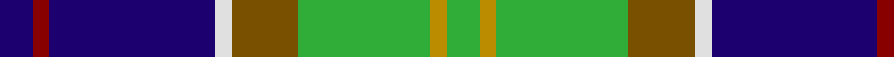

In pattern [BRBWGGYG](/patterns/brbwggyg/).

This was sourced from tartans-authority.  It is a [8 stripes tartan](/stripes/stripes8/).

Original link http://www.tartansauthority.com/tartan-ferret/display/436/

## Thread count
DB/8 DR4 DB40 LN4 T16 G32 DY4 G/8

## Palette
Each colour and its ΔE from the base-6 reference it is a variant of.

| Colour | Shade | Base | ΔE (OKLab) |
|---|---|---|---|
| DB | <code style="background-color:#1C0070;">#1C0070</code> `#1C0070` | B <code style="background-color:#2A418A;">#2A418A</code> | 0.14 |
| DR | <code style="background-color:#880000;">#880000</code> `#880000` | R <code style="background-color:#CC0000;">#CC0000</code> | 0.15 |
| DY | <code style="background-color:#BC8C00;">#BC8C00</code> `#BC8C00` | Y <code style="background-color:#F2BF00;">#F2BF00</code> | 0.16 |
| G | <code style="background-color:#30AC38;">#30AC38</code> `#30AC38` | G <code style="background-color:#006100;">#006100</code> | 0.23 |
| LN | <code style="background-color:#E0E0E0;">#E0E0E0</code> `#E0E0E0` | W <code style="background-color:#F7F7F7;">#F7F7F7</code> | 0.07 |
| T | <code style="background-color:#785000;">#785000</code> `#785000` | G <code style="background-color:#006100;">#006100</code> | 0.14 |

# Sample pattern

## Nearest tartans

The nearest existing variants by ΔTartan distance.

1. [Federated Women's Institutes of](/setts/s9/r8k4y8g12y16g12b48k4w8-b003478-g007800-k000000-r8c0000-wc8c8c8-yc88c00/) — ΔT 0.82
1. [Crofters (Corporate?)](/setts/s7/b40r4g18w12y8k4g16-b2c2c80-g009420-k101010-rc80000-wf8f8f8-ye8c000/) — ΔT 0.84
1. [Turnbull of Thornton (Personal)](/setts/s6/k12r6g60y20b60w6-b2c2c80-g006818-k101010-rc80000-wfcfcfc-yd8b000/) — ΔT 0.86
1. [Ayrshire](/setts/s8/b8r4b40w4g16ga32ga4ga8-b1c0070-g785000-ga30ac38-r880000-we0e0e0/) — ΔT 0.88
1. [McCuaig (2010) (Name)](/setts/s9/k20y6k4b40k20g30k4r6w6-b1474b4-g006818-k101010-rc8002c-we0e0e0-ye8c000/) — ΔT 0.88
1. [Souza Nery](/setts/s7/y8g44r6k34r6b74w6-b304080-g008000-k000000-rc00020-we0e0e0-yf0c000/) — ΔT 0.88
1. [Sirens & Swords](/setts/s6/b72g40ga12w24k12r6-b0c4252-g789484-ga003c14-k1c1714-r960028-wffffff/) — ΔT 0.89
1. [Carleton College Rugby](/setts/s6/r10b60w6g30y16ra8-b003c64-g004c00-rb07430-rac80000-wf8f8f8-yfccc00/) — ΔT 0.94
1. [Vipont](/setts/s7/r8g28k6w6g24b72wa8-b304080-g008000-k000000-rc00000-wc0a0e0-wae0e0e0/) — ΔT 0.99
1. [Greene](/setts/s10/b12r8b48w6k12g36y8g4y4g8-b00008c-g007800-k000000-r8c0000-wc8c8c8-yc88c00/) — ΔT 1.00

## Neighbour map

Every grey dot is one of 15726 variants placed by the first two principal components of the ΔTartan feature space (44% of its variance). Red is this tartan; blue dots are its nearest — click one to open its page.

<svg viewBox="0 0 640 380" role="img" style="max-width:100%;height:auto;border:1px solid #e0e0e0;border-radius:4px;display:block" xmlns="http://www.w3.org/2000/svg"><image href="/nn/cloud.v1.png" width="640" height="380"/><a href="/setts/s9/r8k4y8g12y16g12b48k4w8-b003478-g007800-k000000-r8c0000-wc8c8c8-yc88c00/"><circle cx="137.0" cy="135.6" r="4" fill="#3465a4"><title>Federated Women's Institutes of</title></circle></a><a href="/setts/s7/b40r4g18w12y8k4g16-b2c2c80-g009420-k101010-rc80000-wf8f8f8-ye8c000/"><circle cx="118.3" cy="160.1" r="4" fill="#3465a4"><title>Crofters (Corporate?)</title></circle></a><a href="/setts/s6/k12r6g60y20b60w6-b2c2c80-g006818-k101010-rc80000-wfcfcfc-yd8b000/"><circle cx="139.5" cy="171.5" r="4" fill="#3465a4"><title>Turnbull of Thornton (Personal)</title></circle></a><a href="/setts/s8/b8r4b40w4g16ga32ga4ga8-b1c0070-g785000-ga30ac38-r880000-we0e0e0/"><circle cx="173.5" cy="169.1" r="4" fill="#3465a4"><title>Ayrshire</title></circle></a><a href="/setts/s9/k20y6k4b40k20g30k4r6w6-b1474b4-g006818-k101010-rc8002c-we0e0e0-ye8c000/"><circle cx="110.2" cy="157.6" r="4" fill="#3465a4"><title>McCuaig (2010) (Name)</title></circle></a><a href="/setts/s7/y8g44r6k34r6b74w6-b304080-g008000-k000000-rc00020-we0e0e0-yf0c000/"><circle cx="152.1" cy="145.9" r="4" fill="#3465a4"><title>Souza Nery</title></circle></a><a href="/setts/s6/b72g40ga12w24k12r6-b0c4252-g789484-ga003c14-k1c1714-r960028-wffffff/"><circle cx="150.1" cy="161.9" r="4" fill="#3465a4"><title>Sirens &amp; Swords</title></circle></a><a href="/setts/s6/r10b60w6g30y16ra8-b003c64-g004c00-rb07430-rac80000-wf8f8f8-yfccc00/"><circle cx="168.3" cy="167.1" r="4" fill="#3465a4"><title>Carleton College Rugby</title></circle></a><a href="/setts/s7/r8g28k6w6g24b72wa8-b304080-g008000-k000000-rc00000-wc0a0e0-wae0e0e0/"><circle cx="216.7" cy="151.9" r="4" fill="#3465a4"><title>Vipont</title></circle></a><a href="/setts/s10/b12r8b48w6k12g36y8g4y4g8-b00008c-g007800-k000000-r8c0000-wc8c8c8-yc88c00/"><circle cx="148.5" cy="136.2" r="4" fill="#3465a4"><title>Greene</title></circle></a><circle cx="148.2" cy="152.3" r="5" fill="#c00000"/></svg>

ID: /setts/s8/b8r4b40w4g16ga32y4ga8-b1c0070-g785000-ga30ac38-r880000-we0e0e0-ybc8c00/
