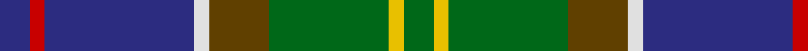
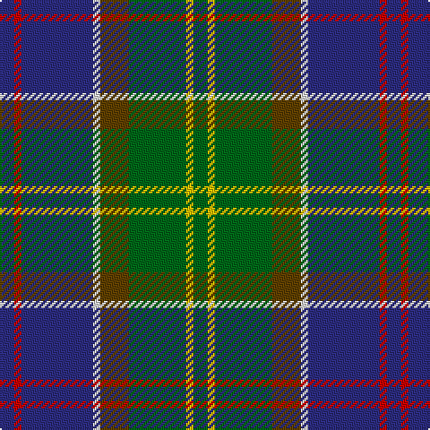

In pattern [BRBWGGYG](/patterns/brbwggyg/).

This was sourced from house-of-tartan.  It is a [8 stripes tartan](/stripes/stripes8/).

Original link http://www.house-of-tartan.scotland.net/house/TartanViewjs.asp?colr=Def&tnam=436

## Thread count
DB/8 R4 DB40 LN4 T16 G32 Y4 G/8

## Palette
Each colour and its ΔE from the base-6 reference it is a variant of.

| Colour | Shade | Base | ΔE (OKLab) |
|---|---|---|---|
| DB | <code style="background-color:#2C2C80;">#2C2C80</code> `#2C2C80` | B <code style="background-color:#2C4084;">#2C4084</code> | 0.05 |
| G | <code style="background-color:#006818;">#006818</code> `#006818` | G <code style="background-color:#006400;">#006400</code> | 0.02 |
| LN | <code style="background-color:#E0E0E0;">#E0E0E0</code> `#E0E0E0` | W <code style="background-color:#F4F4F0;">#F4F4F0</code> | 0.06 |
| R | <code style="background-color:#C80000;">#C80000</code> `#C80000` | R <code style="background-color:#C80000;">#C80000</code> | 0.00 |
| T | <code style="background-color:#604000;">#604000</code> `#604000` | G <code style="background-color:#006400;">#006400</code> | 0.14 |
| Y | <code style="background-color:#E8C000;">#E8C000</code> `#E8C000` | Y <code style="background-color:#E8C000;">#E8C000</code> | 0.00 |

# Sample pattern

## Nearest tartans

The nearest existing variants by ΔTartan distance.

1. [McComb (Personal)](/setts/s7/b6r4b36k12g36y4ga6-b2c2c80-g006818-ga408060-k101010-rc80000-ye8c000/) — ΔT 0.48
1. [Connor (Personal)](/setts/s9/b4g16ga32y4ga32b48w4b8r4-b2c2c80-g604000-ga006818-rc80000-we0e0e0-ye8c000/) — ΔT 0.59
1. [Ayrshire](/setts/s8/b8r4b40w4ra16g32y4g8-b304080-g008000-rc00000-ra806050-we0e0e0-yf0c000/) — ΔT 0.65
1. [Big Rory (Corporate)](/setts/s10/b10w5b48k35g5k5g35r5g5ba5-b2c607c-ba780078-g006818-k101010-rc80000-we0e0e0/) — ΔT 0.85
1. [Schmidt (2014)](/setts/s10/k6b40ba16b8g40k4g4r4g6y6-b202060-ba2c2c80-g006818-k101010-rc80000-yfccc00/) — ΔT 0.85
1. [Patel (2013)](/setts/s9/g6y4r20g20b40g24ra6b20w4-b1870a4-g004028-r781c38-ra960028-wffffff-ye0a126/) — ΔT 0.90
1. [MacComb Family Tartan Tartan Number: 2340. Earliest known date: pre 1997 STS notes: Designed for a Mr McComb to play himself in as club captain of a golf club. It is the MacThomas with the over check changed to the clubs colours. Design by Donald Fraser (Oct 2002) of Berwick upon Tweed. See products available Copyright © Blair Urquhart, Comrie, 2015](/setts/s12/b6r4b36k12g36y4ga6y4g36k12b36r4-b2c2c80-g006818-ga408060-k101010-rc80000-ye8c000/) — ΔT 0.93
1. [State Seal of Utah (Fashion)](/setts/s8/b96y50g30r14w10b14k20w20-b003c64-g604000-k101010-r880000-we8ccb8-ya08858/) — ΔT 0.95
1. [James (Personal)](/setts/s7/r8k24y4g48y4b24w8-b242470-g004828-k101010-rc80000-wb4bcc0-yb0b430/) — ΔT 0.95
1. [Christian Hunting (Personal)](/setts/s7/r6g4b54k38g54ba4y6-b2c2c80-ba780078-g006818-k101010-rc80000-ye8c000/) — ΔT 0.96

## Neighbour map

Every grey dot is one of 15726 variants placed by the first two principal components of the ΔTartan feature space (44% of its variance). Red is this tartan; blue dots are its nearest — click one to open its page.

<svg viewBox="0 0 640 380" role="img" style="max-width:100%;height:auto;border:1px solid #e0e0e0;border-radius:4px;display:block" xmlns="http://www.w3.org/2000/svg"><image href="/nn/cloud.v1.png" width="640" height="380"/><a href="/setts/s7/b6r4b36k12g36y4ga6-b2c2c80-g006818-ga408060-k101010-rc80000-ye8c000/"><circle cx="180.1" cy="180.1" r="4" fill="#3465a4"><title>McComb (Personal)</title></circle></a><a href="/setts/s9/b4g16ga32y4ga32b48w4b8r4-b2c2c80-g604000-ga006818-rc80000-we0e0e0-ye8c000/"><circle cx="212.1" cy="161.9" r="4" fill="#3465a4"><title>Connor (Personal)</title></circle></a><a href="/setts/s8/b8r4b40w4ra16g32y4g8-b304080-g008000-rc00000-ra806050-we0e0e0-yf0c000/"><circle cx="187.5" cy="168.6" r="4" fill="#3465a4"><title>Ayrshire</title></circle></a><a href="/setts/s10/b10w5b48k35g5k5g35r5g5ba5-b2c607c-ba780078-g006818-k101010-rc80000-we0e0e0/"><circle cx="163.8" cy="157.2" r="4" fill="#3465a4"><title>Big Rory (Corporate)</title></circle></a><a href="/setts/s10/k6b40ba16b8g40k4g4r4g6y6-b202060-ba2c2c80-g006818-k101010-rc80000-yfccc00/"><circle cx="169.1" cy="154.2" r="4" fill="#3465a4"><title>Schmidt (2014)</title></circle></a><a href="/setts/s9/g6y4r20g20b40g24ra6b20w4-b1870a4-g004028-r781c38-ra960028-wffffff-ye0a126/"><circle cx="181.3" cy="185.0" r="4" fill="#3465a4"><title>Patel (2013)</title></circle></a><a href="/setts/s12/b6r4b36k12g36y4ga6y4g36k12b36r4-b2c2c80-g006818-ga408060-k101010-rc80000-ye8c000/"><circle cx="165.5" cy="160.9" r="4" fill="#3465a4"><title>MacComb Family Tartan Tartan Number: 2340. Earliest known date: pre 1997 STS notes: Designed for a Mr McComb to play himself in as club captain of a golf club. It is the MacThomas with the over check changed to the clubs colours. Design by Donald Fraser (Oct 2002) of Berwick upon Tweed. See products available Copyright © Blair Urquhart, Comrie, 2015</title></circle></a><a href="/setts/s8/b96y50g30r14w10b14k20w20-b003c64-g604000-k101010-r880000-we8ccb8-ya08858/"><circle cx="153.8" cy="161.1" r="4" fill="#3465a4"><title>State Seal of Utah (Fashion)</title></circle></a><a href="/setts/s7/r8k24y4g48y4b24w8-b242470-g004828-k101010-rc80000-wb4bcc0-yb0b430/"><circle cx="158.7" cy="166.4" r="4" fill="#3465a4"><title>James (Personal)</title></circle></a><a href="/setts/s7/r6g4b54k38g54ba4y6-b2c2c80-ba780078-g006818-k101010-rc80000-ye8c000/"><circle cx="169.6" cy="162.6" r="4" fill="#3465a4"><title>Christian Hunting (Personal)</title></circle></a><circle cx="186.5" cy="169.1" r="5" fill="#c00000"/></svg>

ID: /setts/s8/b8r4b40w4g16ga32y4ga8-b2c2c80-g604000-ga006818-rc80000-we0e0e0-ye8c000/
