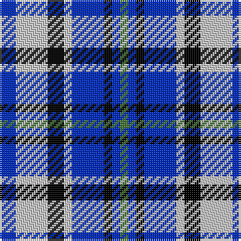

In pattern [BWKWBKBG](/patterns/bwkwbkbg/).

This was sourced from tartans-authority.  It is a [8 stripes tartan](/stripes/stripes8/).

Original link http://www.tartansauthority.com/tartan-ferret/display/4622/

## Thread count
B/8 N16 K8 N4 B16 K4 B4 G/4

## Palette
Each colour and its ΔE from the base-6 reference it is a variant of.

| Colour | Shade | Base | ΔE (OKLab) |
|---|---|---|---|
| B | <code style="background-color:#002CC0;">#002CC0</code> `#002CC0` | B <code style="background-color:#2A418A;">#2A418A</code> | 0.10 |
| G | <code style="background-color:#48783C;">#48783C</code> `#48783C` | G <code style="background-color:#006100;">#006100</code> | 0.11 |
| K | <code style="background-color:#000000;">#000000</code> `#000000` | K <code style="background-color:#000000;">#000000</code> | 0.00 |
| N | <code style="background-color:#C8C8C8;">#C8C8C8</code> `#C8C8C8` | W <code style="background-color:#F7F7F7;">#F7F7F7</code> | 0.14 |

# Sample pattern

## Nearest tartans

The nearest existing variants by ΔTartan distance.

1. [Thompson (Dance)](/setts/s6/b8w48ba8b24k24b8-b3474fc-ba00008c-k000000-wc8c8c8/) — ΔT 1.25
1. [Strathclyde](/setts/s7/b8ba4b30w20k30ba4k8-b0596fa-ba2c4084-k000028-we0e0e0/) — ΔT 1.28
1. [Strathclyde](/setts/s7/b8ba4b30w20k30ba4k8-b8080d0-ba304080-k000030-we0e0e0/) — ΔT 1.35
1. [City of Pointe-Claire](/setts/s10/b16w4r4k8b16r8w4r4w4r4-b285e99-k000000-r866c5a-wffffff/) — ΔT 1.45
1. [Investors Group](/setts/s10/w28k8wa8k8wa8k8w28b16k40wa8-b2888c4-k101010-wa8ace8-waf8f8f8/) — ΔT 1.52
1. [Greer (Name?)](/setts/s8/b32ba6b6r6b6ba20ra24w8-b2888c4-ba000064-r888888-ra880000-wf8f8f8/) — ΔT 1.56
1. [Hummelt, Katherine (Personal)](/setts/s8/b22g20ga12b14w4b6ba20w4-b0000cd-ba6c0070-g004c00-ga767e52-w00fcfc/) — ΔT 1.56
1. [Creek Indian Nation (District)](/setts/s7/b24b48y12b12y24b48y24-b2c2c80-ye8c000/) — ΔT 1.56
1. [Marshall of Keith (Personal)](/setts/s5/b20k20b20g52y10-b3f0ffe-g003c14-k101010-ye8c000/) — ΔT 1.59
1. [Unidentified #55](/setts/s11/y8b40r12y8w12y8b12r12b12w12y8-b000064-r8c0000-wc8c8c8-ybca06c/) — ΔT 1.61

## Neighbour map

Every grey dot is one of 15726 variants placed by the first two principal components of the ΔTartan feature space (44% of its variance). Red is this tartan; blue dots are its nearest — click one to open its page.

<svg viewBox="0 0 640 380" role="img" style="max-width:100%;height:auto;border:1px solid #e0e0e0;border-radius:4px;display:block" xmlns="http://www.w3.org/2000/svg"><image href="/nn/cloud.v1.png" width="640" height="380"/><a href="/setts/s6/b8w48ba8b24k24b8-b3474fc-ba00008c-k000000-wc8c8c8/"><circle cx="131.8" cy="215.9" r="4" fill="#3465a4"><title>Thompson (Dance)</title></circle></a><a href="/setts/s7/b8ba4b30w20k30ba4k8-b0596fa-ba2c4084-k000028-we0e0e0/"><circle cx="125.4" cy="207.6" r="4" fill="#3465a4"><title>Strathclyde</title></circle></a><a href="/setts/s7/b8ba4b30w20k30ba4k8-b8080d0-ba304080-k000030-we0e0e0/"><circle cx="134.1" cy="205.2" r="4" fill="#3465a4"><title>Strathclyde</title></circle></a><a href="/setts/s10/b16w4r4k8b16r8w4r4w4r4-b285e99-k000000-r866c5a-wffffff/"><circle cx="128.6" cy="221.0" r="4" fill="#3465a4"><title>City of Pointe-Claire</title></circle></a><a href="/setts/s10/w28k8wa8k8wa8k8w28b16k40wa8-b2888c4-k101010-wa8ace8-waf8f8f8/"><circle cx="116.8" cy="201.8" r="4" fill="#3465a4"><title>Investors Group</title></circle></a><a href="/setts/s8/b32ba6b6r6b6ba20ra24w8-b2888c4-ba000064-r888888-ra880000-wf8f8f8/"><circle cx="121.2" cy="202.8" r="4" fill="#3465a4"><title>Greer (Name?)</title></circle></a><a href="/setts/s8/b22g20ga12b14w4b6ba20w4-b0000cd-ba6c0070-g004c00-ga767e52-w00fcfc/"><circle cx="104.4" cy="228.3" r="4" fill="#3465a4"><title>Hummelt, Katherine (Personal)</title></circle></a><a href="/setts/s7/b24b48y12b12y24b48y24-b2c2c80-ye8c000/"><circle cx="162.1" cy="256.8" r="4" fill="#3465a4"><title>Creek Indian Nation (District)</title></circle></a><a href="/setts/s5/b20k20b20g52y10-b3f0ffe-g003c14-k101010-ye8c000/"><circle cx="155.0" cy="262.9" r="4" fill="#3465a4"><title>Marshall of Keith (Personal)</title></circle></a><a href="/setts/s11/y8b40r12y8w12y8b12r12b12w12y8-b000064-r8c0000-wc8c8c8-ybca06c/"><circle cx="135.4" cy="206.4" r="4" fill="#3465a4"><title>Unidentified #55</title></circle></a><circle cx="121.4" cy="236.1" r="5" fill="#c00000"/></svg>

ID: /setts/s8/b8w16k8w4b16k4b4g4-b002cc0-g48783c-k000000-wc8c8c8/
