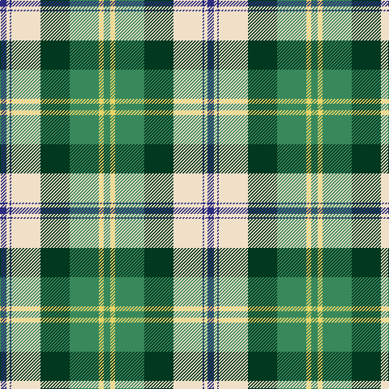

In pattern [BWBWGGYG](/patterns/bwbwggyg/).

This was sourced from house-of-tartan.  It is a [8 stripes tartan](/stripes/stripes8/).

Original link http://www.house-of-tartan.scotland.net/house/TartanViewjs.asp?colr=Def&tnam=7603

## Thread count
DB/8 W4 DB2 W36 DG36 G36 LY6 G/8

## Palette
Each colour and its ΔE from the base-6 reference it is a variant of.

| Colour | Shade | Base | ΔE (OKLab) |
|---|---|---|---|
| DB | <code style="background-color:#2C2C80;">#2C2C80</code> `#2C2C80` | B <code style="background-color:#2C4084;">#2C4084</code> | 0.05 |
| DG | <code style="background-color:#003820;">#003820</code> `#003820` | G <code style="background-color:#006400;">#006400</code> | 0.16 |
| G | <code style="background-color:#38885C;">#38885C</code> `#38885C` | G <code style="background-color:#006400;">#006400</code> | 0.14 |
| LY | <code style="background-color:#E8D468;">#E8D468</code> `#E8D468` | Y <code style="background-color:#E8C000;">#E8C000</code> | 0.06 |
| W | <code style="background-color:#F0E0C8;">#F0E0C8</code> `#F0E0C8` | W <code style="background-color:#F4F4F0;">#F4F4F0</code> | 0.06 |

# Sample pattern

ID: /setts/s8/b8w4b2w36g36ga36y6ga8-b2c2c80-g003820-ga38885c-wf0e0c8-ye8d468/
