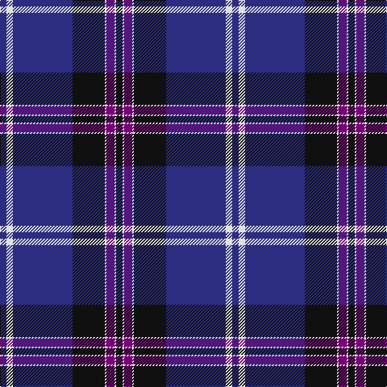

In pattern [BWBKWBWK](/patterns/bwbkwbwk/).

This was sourced from tartans-authority.  It is a [8 stripes tartan](/stripes/stripes8/).

Original link http://www.tartansauthority.com/tartan-ferret/display/7364/

## Thread count
DB/8 LN8 DB74 K40 LN2 P10 LN2 K/8

## Palette
Each colour and its ΔE from the base-6 reference it is a variant of.

| Colour | Shade | Base | ΔE (OKLab) |
|---|---|---|---|
| DB | <code style="background-color:#2C2C80;">#2C2C80</code> `#2C2C80` | B <code style="background-color:#2C4084;">#2C4084</code> | 0.05 |
| K | <code style="background-color:#101010;">#101010</code> `#101010` | K <code style="background-color:#000000;">#000000</code> | 0.17 |
| LN | <code style="background-color:#E0E0E0;">#E0E0E0</code> `#E0E0E0` | W <code style="background-color:#F4F4F0;">#F4F4F0</code> | 0.06 |
| P | <code style="background-color:#780078;">#780078</code> `#780078` | B <code style="background-color:#2C4084;">#2C4084</code> | 0.16 |

# Sample pattern

## Nearest tartans

The nearest existing variants by ΔTartan distance.

1. [NHS Grampian](/setts/s7/b8ba72k32w2b4w2k8-b2888c4-ba2c2c80-k101010-wfcfcfc/) — ΔT 0.67
1. [Dunlop](/setts/s8/k6r2k60w2b56r2b2w6-b2c2c80-k101010-rc80000-we0e0e0/) — ΔT 0.90
1. [Grahame Laurie Band (Corporate)](/setts/s7/k8y2b6y2k36ba84w7-b780078-ba2c2c80-k101010-we0e0e0-yfccc00/) — ΔT 1.03
1. [Koot Wedding (Personal)](/setts/s6/b96k64r2k16r6w6-b2c2c80-k101010-rc80000-wfcfcfc/) — ΔT 1.07
1. [Raith Rovers F.C.](/setts/s8/b12w4g4w6b48r2ba70r4-b000050-ba304080-g30a010-rc00000-we0e0e0/) — ΔT 1.19
1. [Hill (Name)](/setts/s9/w6b4y2b4y2b62k56r4k4-b2c2c80-k101010-rc80000-we0e0e0-ye8c000/) — ΔT 1.20
1. [Scottish Bluebell (Corporate)](/setts/s13/b80k34w4ba8w4k8w4ba8w4k34b80w1ba8-b2c2c80-ba1474b4-k101010-we0e0e0/) — ΔT 1.22
1. [Prince George's Police Pipe Band](/setts/s8/b84r4g32r4b12r4g16y6-b1c0070-g789484-r880000-yd09800/) — ΔT 1.26
1. [Mead (Tennessee) Modern Dress (Personal)](/setts/s10/b72k6r12k6ba20r10ba6y8k2b4-b271b86-ba041b67-k101010-rdd1212-yf9c75c/) — ΔT 1.27
1. [British Energy](/setts/s6/b80k28ba44y2ba2y6-b0060b0-ba800080-k000000-yf0c000/) — ΔT 1.27

## Neighbour map

Every grey dot is one of 15726 variants placed by the first two principal components of the ΔTartan feature space (44% of its variance). Red is this tartan; blue dots are its nearest — click one to open its page.

<svg viewBox="0 0 640 380" role="img" style="max-width:100%;height:auto;border:1px solid #e0e0e0;border-radius:4px;display:block" xmlns="http://www.w3.org/2000/svg"><image href="/nn/cloud.v1.png" width="640" height="380"/><a href="/setts/s7/b8ba72k32w2b4w2k8-b2888c4-ba2c2c80-k101010-wfcfcfc/"><circle cx="390.6" cy="142.9" r="4" fill="#3465a4"><title>NHS Grampian</title></circle></a><a href="/setts/s8/k6r2k60w2b56r2b2w6-b2c2c80-k101010-rc80000-we0e0e0/"><circle cx="354.6" cy="135.5" r="4" fill="#3465a4"><title>Dunlop</title></circle></a><a href="/setts/s7/k8y2b6y2k36ba84w7-b780078-ba2c2c80-k101010-we0e0e0-yfccc00/"><circle cx="382.2" cy="114.4" r="4" fill="#3465a4"><title>Grahame Laurie Band (Corporate)</title></circle></a><a href="/setts/s6/b96k64r2k16r6w6-b2c2c80-k101010-rc80000-wfcfcfc/"><circle cx="386.0" cy="151.2" r="4" fill="#3465a4"><title>Koot Wedding (Personal)</title></circle></a><a href="/setts/s8/b12w4g4w6b48r2ba70r4-b000050-ba304080-g30a010-rc00000-we0e0e0/"><circle cx="308.9" cy="117.8" r="4" fill="#3465a4"><title>Raith Rovers F.C.</title></circle></a><a href="/setts/s9/w6b4y2b4y2b62k56r4k4-b2c2c80-k101010-rc80000-we0e0e0-ye8c000/"><circle cx="332.2" cy="109.8" r="4" fill="#3465a4"><title>Hill (Name)</title></circle></a><a href="/setts/s13/b80k34w4ba8w4k8w4ba8w4k34b80w1ba8-b2c2c80-ba1474b4-k101010-we0e0e0/"><circle cx="386.1" cy="104.5" r="4" fill="#3465a4"><title>Scottish Bluebell (Corporate)</title></circle></a><a href="/setts/s8/b84r4g32r4b12r4g16y6-b1c0070-g789484-r880000-yd09800/"><circle cx="362.0" cy="144.4" r="4" fill="#3465a4"><title>Prince George's Police Pipe Band</title></circle></a><a href="/setts/s10/b72k6r12k6ba20r10ba6y8k2b4-b271b86-ba041b67-k101010-rdd1212-yf9c75c/"><circle cx="312.9" cy="96.8" r="4" fill="#3465a4"><title>Mead (Tennessee) Modern Dress (Personal)</title></circle></a><a href="/setts/s6/b80k28ba44y2ba2y6-b0060b0-ba800080-k000000-yf0c000/"><circle cx="306.1" cy="139.8" r="4" fill="#3465a4"><title>British Energy</title></circle></a><circle cx="360.6" cy="132.1" r="5" fill="#c00000"/></svg>

ID: /setts/s8/b8w8b74k40w2ba10w2k8-b2c2c80-ba780078-k101010-we0e0e0/
