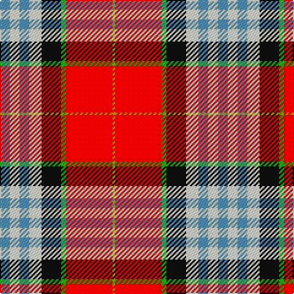

In pattern [BWBWKGRY](/patterns/bwbwkgry/).

This was sourced from tartans-authority.  It is a [8 stripes tartan](/stripes/stripes8/).

Original link http://www.tartansauthority.com/tartan-ferret/display/10005/

## Attestations

This cloth appears in 2 source records; the oldest owns this page.

- Feb. 2009 — Edinburgh Napier University (Corp.) (tartans-authority, [record](http://www.tartansauthority.com/tartan-ferret/display/10005/))
- undated — Edinburgh Napier University Corporate Tartan Tartan Number: 10005. Earliest known date: Feb. 2009 Based on the Clan Napier sett and incorporating the colours from the University's coat of arms. Against a red background the white is predominant. The red square divided by a dark green line and a border of gold corresponds to the four red roses with fine green leaves and gold seeds, featured on the coat of arms. This red also represents the main colour of the University's logo, the red triangle. The three azure blue lines correspond to the three crescent moon shapes. Exclusively design by Kinloch Anderson for Edinburgh Napier University. Restricted availability. Please contact Kinloch Anderson regarding its use. See products available Copyright © Blair Urquhart, Comrie, 2015 (house-of-tartan, [record](http://www.house-of-tartan.scotland.net/house/TartanViewjs.asp?colr=Def&tnam=10005))

## Thread count
B/8 W8 B8 W10 K16 G4 R38 DY/2

## Palette
Each colour and its ΔE from the base-6 reference it is a variant of.

| Colour | Shade | Base | ΔE (OKLab) |
|---|---|---|---|
| B | <code style="background-color:#5C8CA8;">#5C8CA8</code> `#5C8CA8` | B <code style="background-color:#2C4084;">#2C4084</code> | 0.23 |
| DY | <code style="background-color:#BC8C00;">#BC8C00</code> `#BC8C00` | Y <code style="background-color:#E8C000;">#E8C000</code> | 0.16 |
| G | <code style="background-color:#289C18;">#289C18</code> `#289C18` | G <code style="background-color:#006400;">#006400</code> | 0.18 |
| K | <code style="background-color:#101010;">#101010</code> `#101010` | K <code style="background-color:#000000;">#000000</code> | 0.17 |
| R | <code style="background-color:#C80000;">#C80000</code> `#C80000` | R <code style="background-color:#C80000;">#C80000</code> | 0.00 |
| W | <code style="background-color:#F0E4CC;">#F0E4CC</code> `#F0E4CC` | W <code style="background-color:#F4F4F0;">#F4F4F0</code> | 0.05 |

# Sample pattern

## Nearest tartans

The nearest existing variants by ΔTartan distance.

1. [Bro-sant-Malou](/setts/s6/g6y2w22b32r48k6-b1c3054-g006818-k101010-rc83c28-wf8f8f8-yd8c800/) — ΔT 0.90
1. [Oor Wullie (Corporate)](/setts/s7/y6r6ya4r40k32w48wa4-k101010-rc80000-wc0c0c0-wae0e0e0-yfccc00-yae8c000/) — ΔT 0.93
1. [Oor Wullie Corporate Tartan Tartan Number: 10356. Earliest known date: August 2010 Oor Wullie's tartan is based on the Black Watch which was his Uncle Wattie's regiment and in this new design the red is from the hackle on their famous bonnets. The silver grey is for Wullie's iconic bucket and for his faithful pet, Jeemie the moose. The black is for his mentor PC Murdoch and for Wullie's dungarees, the yellow is for his tousled gold locks that never see a comb. The three lines on the yellow are for his best pals Fat Bob, Soapy Soutar and Wee Eck. The black and white are for the newsprint of The Sunday Post in which Wullie and his pals have lived for 75 years. See products available Copyright © Blair Urquhart, Comrie, 2015](/setts/s7/k6r6y4r40ka32w48wa4-k000000-ka101010-rc80000-wc0c0c0-wae0e0e0-yf09400/) — ΔT 0.99
1. [Rosevear](/setts/s9/r100y8w32b4w8b4w30g54ra8-b2c2c80-g006818-r901c38-rac80000-we0e0e0-ye8c000/) — ΔT 0.99
1. [Round Table Sweden](/setts/s8/r6y30g8b12w4r60b12ya6-b3c82af-g007800-r800028-wffffff-ye0a126-yaffff00/) — ΔT 1.01
1. [Stewart - Pr Ch Ed (Royal)](/setts/s12/r56y16b24ya4b8w8b8yb48r24b8r8w4-b1c1c1c-rc80000-we0e0e0-ya4c8ac-yae8c000-ybacb884/) — ΔT 1.02
1. [Wilson's, No 227](/setts/s9/r52b14ba16y6r6w6g40ba20w4-b5480b0-ba800080-g008000-rc00000-we0e0e0-yf0c000/) — ΔT 1.15
1. [MacLean of Duart #3](/setts/s11/b16k12y4k4w6k4g32r50b6r8k3-b3c82af-g005020-k101010-rdc0000-we0e0e0-ye8c000/) — ΔT 1.15
1. [Hewitt](/setts/s7/r60b24k12g24y4g6w4-b2c4084-g005020-k101010-rdc0000-we0e0e0-ye8c000/) — ΔT 1.16
1. [Rosevear](/setts/s9/r100y8w32b4w8b4w30g54ra8-b304080-g008000-r802040-rac00000-we0e0e0-yf0c000/) — ΔT 1.16

## Neighbour map

Every grey dot is one of 15726 variants placed by the first two principal components of the ΔTartan feature space (44% of its variance). Red is this tartan; blue dots are its nearest — click one to open its page.

<svg viewBox="0 0 640 380" role="img" style="max-width:100%;height:auto;border:1px solid #e0e0e0;border-radius:4px;display:block" xmlns="http://www.w3.org/2000/svg"><image href="/nn/cloud.v1.png" width="640" height="380"/><a href="/setts/s6/g6y2w22b32r48k6-b1c3054-g006818-k101010-rc83c28-wf8f8f8-yd8c800/"><circle cx="179.3" cy="118.9" r="4" fill="#3465a4"><title>Bro-sant-Malou</title></circle></a><a href="/setts/s7/y6r6ya4r40k32w48wa4-k101010-rc80000-wc0c0c0-wae0e0e0-yfccc00-yae8c000/"><circle cx="127.1" cy="130.2" r="4" fill="#3465a4"><title>Oor Wullie (Corporate)</title></circle></a><a href="/setts/s7/k6r6y4r40ka32w48wa4-k000000-ka101010-rc80000-wc0c0c0-wae0e0e0-yf09400/"><circle cx="125.6" cy="131.1" r="4" fill="#3465a4"><title>Oor Wullie Corporate Tartan Tartan Number: 10356. Earliest known date: August 2010 Oor Wullie's tartan is based on the Black Watch which was his Uncle Wattie's regiment and in this new design the red is from the hackle on their famous bonnets. The silver grey is for Wullie's iconic bucket and for his faithful pet, Jeemie the moose. The black is for his mentor PC Murdoch and for Wullie's dungarees, the yellow is for his tousled gold locks that never see a comb. The three lines on the yellow are for his best pals Fat Bob, Soapy Soutar and Wee Eck. The black and white are for the newsprint of The Sunday Post in which Wullie and his pals have lived for 75 years. See products available Copyright © Blair Urquhart, Comrie, 2015</title></circle></a><a href="/setts/s9/r100y8w32b4w8b4w30g54ra8-b2c2c80-g006818-r901c38-rac80000-we0e0e0-ye8c000/"><circle cx="191.3" cy="85.6" r="4" fill="#3465a4"><title>Rosevear</title></circle></a><a href="/setts/s8/r6y30g8b12w4r60b12ya6-b3c82af-g007800-r800028-wffffff-ye0a126-yaffff00/"><circle cx="214.6" cy="116.1" r="4" fill="#3465a4"><title>Round Table Sweden</title></circle></a><a href="/setts/s12/r56y16b24ya4b8w8b8yb48r24b8r8w4-b1c1c1c-rc80000-we0e0e0-ya4c8ac-yae8c000-ybacb884/"><circle cx="153.7" cy="104.2" r="4" fill="#3465a4"><title>Stewart - Pr Ch Ed (Royal)</title></circle></a><a href="/setts/s9/r52b14ba16y6r6w6g40ba20w4-b5480b0-ba800080-g008000-rc00000-we0e0e0-yf0c000/"><circle cx="142.8" cy="131.3" r="4" fill="#3465a4"><title>Wilson's, No 227</title></circle></a><a href="/setts/s11/b16k12y4k4w6k4g32r50b6r8k3-b3c82af-g005020-k101010-rdc0000-we0e0e0-ye8c000/"><circle cx="169.3" cy="98.3" r="4" fill="#3465a4"><title>MacLean of Duart #3</title></circle></a><a href="/setts/s7/r60b24k12g24y4g6w4-b2c4084-g005020-k101010-rdc0000-we0e0e0-ye8c000/"><circle cx="205.4" cy="131.5" r="4" fill="#3465a4"><title>Hewitt</title></circle></a><a href="/setts/s9/r100y8w32b4w8b4w30g54ra8-b304080-g008000-r802040-rac00000-we0e0e0-yf0c000/"><circle cx="188.5" cy="86.1" r="4" fill="#3465a4"><title>Rosevear</title></circle></a><circle cx="159.1" cy="108.8" r="5" fill="#c00000"/></svg>

ID: /setts/s8/b8w8b8w10k16g4r38y2-b5c8ca8-g289c18-k101010-rc80000-wf0e4cc-ybc8c00/
