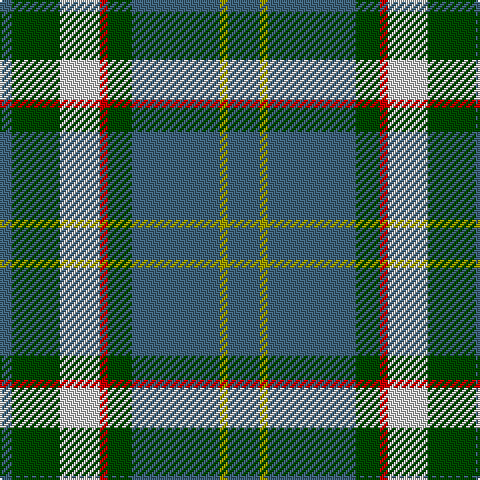

In pattern [BGWRGBYB](/patterns/bgwrgbyb/).

This was sourced from register-of-tartans.  It is a [8 stripes tartan](/stripes/stripes8/).

Original link https://www.tartanregister.gov.uk/tartanDetails.aspx?ref=158

## Register references

External register numbers recorded for this tartan.

- Scottish Register of Tartans: [158](https://www.tartanregister.gov.uk/tartanDetails.aspx?ref=158)
- Scottish Tartans Authority (ITI): 2089
- Scottish Tartans World Register: 2089

## Thread count
G/6 Ga24 N20 R4 Ga12 G44 LG4 G/16

## Palette
Each colour and its ΔE from the base-6 reference it is a variant of.

| Colour | Shade | Base | ΔE (OKLab) |
|---|---|---|---|
| DR | <code style="background-color:#880000;">#880000</code> `#880000` | R <code style="background-color:#CC0000;">#CC0000</code> | 0.15 |
| G | <code style="background-color:#40647C;">#40647C</code> `#40647C` | B <code style="background-color:#2A418A;">#2A418A</code> | 0.12 |
| Ga | <code style="background-color:#004800;">#004800</code> `#004800` | G <code style="background-color:#006100;">#006100</code> | 0.08 |
| LG | <code style="background-color:#9C9C00;">#9C9C00</code> `#9C9C00` | Y <code style="background-color:#F2BF00;">#F2BF00</code> | 0.17 |
| N | <code style="background-color:#C8C8C8;">#C8C8C8</code> `#C8C8C8` | W <code style="background-color:#F7F7F7;">#F7F7F7</code> | 0.14 |
| R | <code style="background-color:#C80000;">#C80000</code> `#C80000` | R <code style="background-color:#CC0000;">#CC0000</code> | 0.01 |

# Sample pattern

## Nearest tartans

The nearest existing variants by ΔTartan distance.

1. [Bahamas (District)](/setts/s8/b8y2b22g6r2w10g12b3~b40647c-g007c00-rc80000-wc8c8c8-y9c9c00~x2/) — ΔT 0.72
1. [MacConnell Clan Tartan Tartan Number: 141. Earliest known date: 1989 Based on MacDonald Hunting without the black. For use by the McConnells in addition to the MacDonald. Sample in STA Johnston Collection states 'from Margaret McConnel of Highland Heritage (USA). See products available Copyright © Blair Urquhart, Comrie, 2015](/setts/s10/b22g6b5ba2g22r6g5r4g9w3~b2c2c80-ba5c8ca8-g006818-rc80000-we0e0e0~x2/) — ΔT 0.79
1. [MacConnell](/setts/s10/b22g6b5ba2g22r6g5r4g9w3~b304080-ba5480b0-g008000-rc00000-we0e0e0~x2/) — ΔT 0.83
1. [Donegal Irish County Tartan Tartan Number: 2247. Earliest known date: 1996 One of a series of Irish District tartans designed by Polly Wittering of the House of Edgar, with colours reminiscent of the Country with soft warm colours dominating. See products available Copyright © Blair Urquhart, Comrie, 2015](/setts/s10/y3g17b3g3b3k5b18r2b8r2~b406088-g508c60-k000000-r8c0020-yd09000~x2/) — ΔT 0.87
1. [Inglis](/setts/s6/w4g28b18r4b18y3~b304080-g008000-rc00000-we0e0e0-yf0c000~x2/) — ΔT 0.93
1. [Carrick Hunting (Personal)](/setts/s8/g13b1g1b1g3ba5k4y2~b780078-ba1474b4-g408060-k101010-ye8c000~x4/) — ΔT 0.94
1. [Rotary](/setts/s7/g25r4b25r13g25y2ba6~b304080-ba5480b0-g008000-rc00000-yf0c000~x2/) — ΔT 0.97
1. [Carrick Htg (Clan)](/setts/s8/g13b1g1b1g3ba5k4y2~b440044-ba1474b4-g408060-k101010-ye8c000~x4/) — ΔT 0.97
1. [Donegal](/setts/s10/g3ga17b3ga3b3ba5b18r2b8r2~b304080-ba401000-g908000-ga008000-rc00000~x2/) — ΔT 1.00
1. [Rotary International](/setts/s7/g15r3b15r8g15y2ba4~b2888c4-ba202060-g006818-rc80000-yd8b000~x2/) — ΔT 1.07

## Neighbour map

Every grey dot is one of 15726 variants placed by the first two principal components of the ΔTartan feature space (44% of its variance). Red is this tartan; blue dots are its nearest — click one to open its page.

<svg viewBox="0 0 640 380" role="img" style="max-width:100%;height:auto;border:1px solid #e0e0e0;border-radius:4px;display:block" xmlns="http://www.w3.org/2000/svg"><image href="/nn/cloud.v1.png" width="640" height="380"/><a href="/setts/s8/b8y2b22g6r2w10g12b3~b40647c-g007c00-rc80000-wc8c8c8-y9c9c00~x2/"><circle cx="258.7" cy="196.8" r="4" fill="#3465a4"><title>Bahamas (District)</title></circle></a><a href="/setts/s10/b22g6b5ba2g22r6g5r4g9w3~b2c2c80-ba5c8ca8-g006818-rc80000-we0e0e0~x2/"><circle cx="245.8" cy="177.9" r="4" fill="#3465a4"><title>MacConnell Clan Tartan Tartan Number: 141. Earliest known date: 1989 Based on MacDonald Hunting without the black. For use by the McConnells in addition to the MacDonald. Sample in STA Johnston Collection states 'from Margaret McConnel of Highland Heritage (USA). See products available Copyright © Blair Urquhart, Comrie, 2015</title></circle></a><a href="/setts/s10/b22g6b5ba2g22r6g5r4g9w3~b304080-ba5480b0-g008000-rc00000-we0e0e0~x2/"><circle cx="244.0" cy="177.1" r="4" fill="#3465a4"><title>MacConnell</title></circle></a><a href="/setts/s10/y3g17b3g3b3k5b18r2b8r2~b406088-g508c60-k000000-r8c0020-yd09000~x2/"><circle cx="246.5" cy="180.4" r="4" fill="#3465a4"><title>Donegal Irish County Tartan Tartan Number: 2247. Earliest known date: 1996 One of a series of Irish District tartans designed by Polly Wittering of the House of Edgar, with colours reminiscent of the Country with soft warm colours dominating. See products available Copyright © Blair Urquhart, Comrie, 2015</title></circle></a><a href="/setts/s6/w4g28b18r4b18y3~b304080-g008000-rc00000-we0e0e0-yf0c000~x2/"><circle cx="226.5" cy="207.8" r="4" fill="#3465a4"><title>Inglis</title></circle></a><a href="/setts/s8/g13b1g1b1g3ba5k4y2~b780078-ba1474b4-g408060-k101010-ye8c000~x4/"><circle cx="290.8" cy="168.8" r="4" fill="#3465a4"><title>Carrick Hunting (Personal)</title></circle></a><a href="/setts/s7/g25r4b25r13g25y2ba6~b304080-ba5480b0-g008000-rc00000-yf0c000~x2/"><circle cx="240.8" cy="201.6" r="4" fill="#3465a4"><title>Rotary</title></circle></a><a href="/setts/s8/g13b1g1b1g3ba5k4y2~b440044-ba1474b4-g408060-k101010-ye8c000~x4/"><circle cx="288.2" cy="168.6" r="4" fill="#3465a4"><title>Carrick Htg (Clan)</title></circle></a><a href="/setts/s10/g3ga17b3ga3b3ba5b18r2b8r2~b304080-ba401000-g908000-ga008000-rc00000~x2/"><circle cx="256.5" cy="185.9" r="4" fill="#3465a4"><title>Donegal</title></circle></a><a href="/setts/s7/g15r3b15r8g15y2ba4~b2888c4-ba202060-g006818-rc80000-yd8b000~x2/"><circle cx="203.6" cy="223.3" r="4" fill="#3465a4"><title>Rotary International</title></circle></a><circle cx="246.8" cy="192.3" r="5" fill="#c00000"/></svg>

ID: /setts/s8/b8y2b22g6r2w10g12b3~b40647c-g004800-rc80000-wc8c8c8-y9c9c00~x2/
