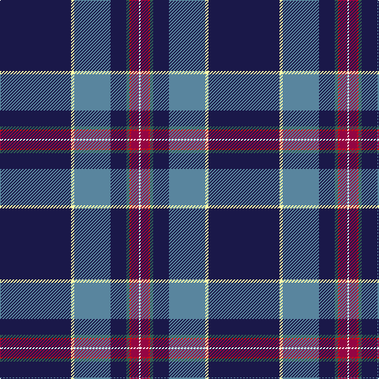

In pattern [BWBBGRRW](/patterns/bwbbgrrw/).

This was sourced from register-of-tartans.  It is a [8 stripes tartan](/stripes/stripes8/).

Original link https://www.tartanregister.gov.uk/tartanDetails.aspx?ref=10531

## Thread count
DB/90 LY4 B46 DB20 N4 R2 Ra10 W/2

## Palette
Each colour and its ΔE from the base-6 reference it is a variant of.

| Colour | Shade | Base | ΔE (OKLab) |
|---|---|---|---|
| B | <code style="background-color:#59859E;">#59859E</code> `#59859E` | B <code style="background-color:#2C4084;">#2C4084</code> | 0.21 |
| DB | <code style="background-color:#1A1849;">#1A1849</code> `#1A1849` | B <code style="background-color:#2C4084;">#2C4084</code> | 0.15 |
| LY | <code style="background-color:#FEFFAA;">#FEFFAA</code> `#FEFFAA` | W <code style="background-color:#F4F4F0;">#F4F4F0</code> | 0.10 |
| N | <code style="background-color:#305E53;">#305E53</code> `#305E53` | G <code style="background-color:#006400;">#006400</code> | 0.11 |
| R | <code style="background-color:#C91015;">#C91015</code> `#C91015` | R <code style="background-color:#C80000;">#C80000</code> | 0.01 |
| Ra | <code style="background-color:#940543;">#940543</code> `#940543` | R <code style="background-color:#C80000;">#C80000</code> | 0.13 |
| W | <code style="background-color:#FFFFFF;">#FFFFFF</code> `#FFFFFF` | W <code style="background-color:#F4F4F0;">#F4F4F0</code> | 0.03 |

# Sample pattern

ID: /setts/s8/b90w4ba46b20g4r2ra10wa2-b1a1849-ba59859e-g305e53-rc91015-ra940543-wfeffaa-waffffff/
