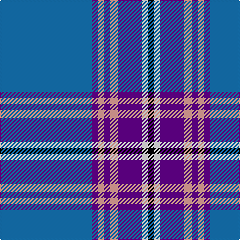

In pattern [BBYBYBWK](/patterns/bbybybwk/).

This was sourced from register-of-tartans.  It is a [8 stripes tartan](/stripes/stripes8/).

Original link https://www.tartanregister.gov.uk/tartanDetails.aspx?ref=1079

## Thread count
B/92 P6 LR6 P6 LR8 P24 W6 K/6

## Palette
Each colour and its ΔE from the base-6 reference it is a variant of.

| Colour | Shade | Base | ΔE (OKLab) |
|---|---|---|---|
| B | <code style="background-color:#1474B4;">#1474B4</code> `#1474B4` | B <code style="background-color:#2A418A;">#2A418A</code> | 0.15 |
| K | <code style="background-color:#000000;">#000000</code> `#000000` | K <code style="background-color:#000000;">#000000</code> | 0.00 |
| LR | <code style="background-color:#FCA098;">#FCA098</code> `#FCA098` | Y <code style="background-color:#F2BF00;">#F2BF00</code> | 0.16 |
| P | <code style="background-color:#64008C;">#64008C</code> `#64008C` | B <code style="background-color:#2A418A;">#2A418A</code> | 0.14 |
| W | <code style="background-color:#FCFCFC;">#FCFCFC</code> `#FCFCFC` | W <code style="background-color:#F7F7F7;">#F7F7F7</code> | 0.01 |

# Sample pattern

## Nearest tartans

The nearest existing variants by ΔTartan distance.

1. [Edinburgh Festival(Corporate)](/setts/s8/b92ba6y6ba6y8ba24w6k6-b1474b4-ba64008c-k000000-wfcfcfc-yec9898/) — ΔT 0.11
1. [Royal Troon Golf Club, The](/setts/s8/y6b68g10w4g4w20b8ya6-b2c2c80-g003820-wfcfcfc-ye8c000-yafcb464/) — ΔT 1.34
1. [Blue Rust](/setts/s8/b84ba8w4ba8b4r8b4ra24-b000088-ba606060-r880000-ra886024-wffffff/) — ΔT 1.45
1. [Fujisankei Serene (Corporate)](/setts/s9/r4w24b16w4b64ba4b16ba24w4-b2c2c80-ba5c5c5c-r888888-wc0c0c0/) — ΔT 1.46
1. [International Pairs (Corporate)](/setts/s10/b68y12g12r4w4r4g20y16b46w4-b2c2c80-g007460-rc80000-we0e0e0-ybc8c00/) — ΔT 1.48
1. [Dunbarton Weft](/setts/s11/b60r4b4k10b6g4b6g44b6k4b6-b0596fa-g503c14-k101010-rdc0000/) — ΔT 1.48
1. [Summerwood (School)](/setts/s12/b76w3r4w3g4w3ga8b19ba20b3ba8w10-b2c2c80-ba2888c4-g006818-ga003820-rc80000-we0e0e0/) — ΔT 1.50
1. [Sinclair Dress Personal Tartan Tartan Number: 2047. Earliest known date: 1977 Originally a private copyright tartan which has been given approval by the Earl of Caithness. Jack Sinclair wore this tartan on stage. The following was noted in 2003: More recently the tartan has become known as the Sinclair Dress and restrictions on its use are no longer applied. In 2010 the designer, M. Sinclair intimated that she wished the restrictions on use to be applied for the exclusive use of Jack Sinclair and his immediate family. See products available Copyright © Blair Urquhart, Comrie, 2015](/setts/s7/b8r4b78k22g4w32r4-b2c2c80-g006818-k101010-rc80000-we0e0e0/) — ΔT 1.52
1. [Kruenaegel and Schropp (Name)](/setts/s8/b80r4w12ba4w8ba32g12w4-b1474b4-ba202060-g006818-r880000-wfcfcfc/) — ΔT 1.53
1. [MacCormick Festive](/setts/s9/w6b6k2ba32k2b16r6b48y6-b2c2c80-ba5c8ca8-k101010-rc80000-we0e0e0-ye8c000/) — ΔT 1.55

## Neighbour map

Every grey dot is one of 15726 variants placed by the first two principal components of the ΔTartan feature space (44% of its variance). Red is this tartan; blue dots are its nearest — click one to open its page.

<svg viewBox="0 0 640 380" role="img" style="max-width:100%;height:auto;border:1px solid #e0e0e0;border-radius:4px;display:block" xmlns="http://www.w3.org/2000/svg"><image href="/nn/cloud.v1.png" width="640" height="380"/><a href="/setts/s8/b92ba6y6ba6y8ba24w6k6-b1474b4-ba64008c-k000000-wfcfcfc-yec9898/"><circle cx="338.3" cy="128.3" r="4" fill="#3465a4"><title>Edinburgh Festival(Corporate)</title></circle></a><a href="/setts/s8/y6b68g10w4g4w20b8ya6-b2c2c80-g003820-wfcfcfc-ye8c000-yafcb464/"><circle cx="300.2" cy="117.9" r="4" fill="#3465a4"><title>Royal Troon Golf Club, The</title></circle></a><a href="/setts/s8/b84ba8w4ba8b4r8b4ra24-b000088-ba606060-r880000-ra886024-wffffff/"><circle cx="378.5" cy="129.8" r="4" fill="#3465a4"><title>Blue Rust</title></circle></a><a href="/setts/s9/r4w24b16w4b64ba4b16ba24w4-b2c2c80-ba5c5c5c-r888888-wc0c0c0/"><circle cx="341.6" cy="165.8" r="4" fill="#3465a4"><title>Fujisankei Serene (Corporate)</title></circle></a><a href="/setts/s10/b68y12g12r4w4r4g20y16b46w4-b2c2c80-g007460-rc80000-we0e0e0-ybc8c00/"><circle cx="320.5" cy="140.6" r="4" fill="#3465a4"><title>International Pairs (Corporate)</title></circle></a><a href="/setts/s11/b60r4b4k10b6g4b6g44b6k4b6-b0596fa-g503c14-k101010-rdc0000/"><circle cx="322.7" cy="137.6" r="4" fill="#3465a4"><title>Dunbarton Weft</title></circle></a><a href="/setts/s12/b76w3r4w3g4w3ga8b19ba20b3ba8w10-b2c2c80-ba2888c4-g006818-ga003820-rc80000-we0e0e0/"><circle cx="328.4" cy="79.2" r="4" fill="#3465a4"><title>Summerwood (School)</title></circle></a><a href="/setts/s7/b8r4b78k22g4w32r4-b2c2c80-g006818-k101010-rc80000-we0e0e0/"><circle cx="288.1" cy="130.3" r="4" fill="#3465a4"><title>Sinclair Dress Personal Tartan Tartan Number: 2047. Earliest known date: 1977 Originally a private copyright tartan which has been given approval by the Earl of Caithness. Jack Sinclair wore this tartan on stage. The following was noted in 2003: More recently the tartan has become known as the Sinclair Dress and restrictions on its use are no longer applied. In 2010 the designer, M. Sinclair intimated that she wished the restrictions on use to be applied for the exclusive use of Jack Sinclair and his immediate family. See products available Copyright © Blair Urquhart, Comrie, 2015</title></circle></a><a href="/setts/s8/b80r4w12ba4w8ba32g12w4-b1474b4-ba202060-g006818-r880000-wfcfcfc/"><circle cx="259.5" cy="121.5" r="4" fill="#3465a4"><title>Kruenaegel and Schropp (Name)</title></circle></a><a href="/setts/s9/w6b6k2ba32k2b16r6b48y6-b2c2c80-ba5c8ca8-k101010-rc80000-we0e0e0-ye8c000/"><circle cx="292.9" cy="112.1" r="4" fill="#3465a4"><title>MacCormick Festive</title></circle></a><circle cx="335.4" cy="126.8" r="5" fill="#c00000"/></svg>

ID: /setts/s8/b92ba6y6ba6y8ba24w6k6-b1474b4-ba64008c-k000000-wfcfcfc-yfca098/
