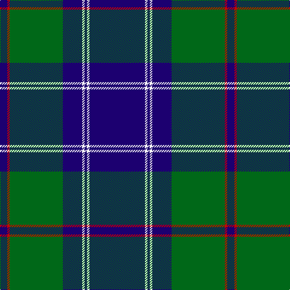

In pattern [BRGBWBWB](/patterns/brgbwbwb/).

This was sourced from tartans-authority.  It is a [8 stripes tartan](/stripes/stripes8/).

Original link http://www.tartansauthority.com/tartan-ferret/display/500/

## Thread count
DB/12 R4 G88 DB32 W4 DB4 W4 DB/92

## Palette
Each colour and its ΔE from the base-6 reference it is a variant of.

| Colour | Shade | Base | ΔE (OKLab) |
|---|---|---|---|
| DB | <code style="background-color:#1C0070;">#1C0070</code> `#1C0070` | B <code style="background-color:#2A418A;">#2A418A</code> | 0.14 |
| G | <code style="background-color:#006818;">#006818</code> `#006818` | G <code style="background-color:#006100;">#006100</code> | 0.02 |
| R | <code style="background-color:#C80000;">#C80000</code> `#C80000` | R <code style="background-color:#CC0000;">#CC0000</code> | 0.01 |
| W | <code style="background-color:#F8F8F8;">#F8F8F8</code> `#F8F8F8` | W <code style="background-color:#F7F7F7;">#F7F7F7</code> | 0.00 |

# Sample pattern

## Nearest tartans

The nearest existing variants by ΔTartan distance.

1. [Tern House](/setts/s7/g23b3k8b4g4b56y8-b2c2c80-g006818-k101010-yd8b000/) — ΔT 0.95
1. [Jon's Theme](/setts/s6/k2y4k6b24k36w2-b555b7c-k010542-wffffff-y9e8f00/) — ΔT 1.01
1. [Micron](/setts/s6/k60b80y6b10w4b12-b1474b4-k101010-wfcfcfc-ye8c000/) — ΔT 1.02
1. [Prince George's Police Pipe Band](/setts/s8/b84r4g32r4b12r4g16y6-b1c0070-g789484-r880000-yd09800/) — ΔT 1.07
1. [Sorbie](/setts/s10/k4b68k68b4r4b4k68b68k4w4-b1474b4-k101010-rc80000-wfcfcfc/) — ΔT 1.07
1. [Home (Clan)](/setts/s8/k72r6k6r6k18b72g6b4-b1474b4-g289c18-k101010-rc80000/) — ΔT 1.08
1. [Unidentified Plaid 9](/setts/s10/b52g12b52r4g52w2r12b4r12b26-b000050-g006030-rc00000-we0e0e0/) — ΔT 1.22
1. [Oliver, hunting](/setts/s9/b80g6b4g24k4g4y4g4k6-b304080-g008000-k000000-yf0c000/) — ΔT 1.22
1. [Gracie](/setts/s8/g94r6g12b70y6b70g12r6-b1c0070-g006818-r880000-yd09800/) — ΔT 1.23
1. [Hannah (Personal)](/setts/s6/w4b70k18w6k18y4-b30308c-k101010-we0e0e0-ye8c000/) — ΔT 1.23

## Neighbour map

Every grey dot is one of 15726 variants placed by the first two principal components of the ΔTartan feature space (44% of its variance). Red is this tartan; blue dots are its nearest — click one to open its page.

<svg viewBox="0 0 640 380" role="img" style="max-width:100%;height:auto;border:1px solid #e0e0e0;border-radius:4px;display:block" xmlns="http://www.w3.org/2000/svg"><image href="/nn/cloud.v1.png" width="640" height="380"/><a href="/setts/s7/g23b3k8b4g4b56y8-b2c2c80-g006818-k101010-yd8b000/"><circle cx="367.5" cy="171.2" r="4" fill="#3465a4"><title>Tern House</title></circle></a><a href="/setts/s6/k2y4k6b24k36w2-b555b7c-k010542-wffffff-y9e8f00/"><circle cx="363.0" cy="184.0" r="4" fill="#3465a4"><title>Jon's Theme</title></circle></a><a href="/setts/s6/k60b80y6b10w4b12-b1474b4-k101010-wfcfcfc-ye8c000/"><circle cx="352.2" cy="173.5" r="4" fill="#3465a4"><title>Micron</title></circle></a><a href="/setts/s8/b84r4g32r4b12r4g16y6-b1c0070-g789484-r880000-yd09800/"><circle cx="362.0" cy="144.4" r="4" fill="#3465a4"><title>Prince George's Police Pipe Band</title></circle></a><a href="/setts/s10/k4b68k68b4r4b4k68b68k4w4-b1474b4-k101010-rc80000-wfcfcfc/"><circle cx="311.3" cy="161.5" r="4" fill="#3465a4"><title>Sorbie</title></circle></a><a href="/setts/s8/k72r6k6r6k18b72g6b4-b1474b4-g289c18-k101010-rc80000/"><circle cx="314.6" cy="158.4" r="4" fill="#3465a4"><title>Home (Clan)</title></circle></a><a href="/setts/s10/b52g12b52r4g52w2r12b4r12b26-b000050-g006030-rc00000-we0e0e0/"><circle cx="349.3" cy="165.4" r="4" fill="#3465a4"><title>Unidentified Plaid 9</title></circle></a><a href="/setts/s9/b80g6b4g24k4g4y4g4k6-b304080-g008000-k000000-yf0c000/"><circle cx="393.7" cy="136.2" r="4" fill="#3465a4"><title>Oliver, hunting</title></circle></a><a href="/setts/s8/g94r6g12b70y6b70g12r6-b1c0070-g006818-r880000-yd09800/"><circle cx="322.4" cy="185.9" r="4" fill="#3465a4"><title>Gracie</title></circle></a><a href="/setts/s6/w4b70k18w6k18y4-b30308c-k101010-we0e0e0-ye8c000/"><circle cx="346.4" cy="169.9" r="4" fill="#3465a4"><title>Hannah (Personal)</title></circle></a><circle cx="370.8" cy="155.0" r="5" fill="#c00000"/></svg>

ID: /setts/s8/b92w4b4w4b32g88r4b12-b1c0070-g006818-rc80000-wf8f8f8/
