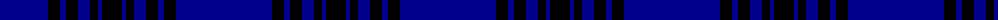

In pattern [BKBKBKBK](/patterns/bkbkbkbk/).

This was sourced from tartans-authority.  It is a [8 stripes tartan](/stripes/stripes8/).

Original link http://www.tartansauthority.com/tartan-ferret/display/4990/

## Thread count
DB/96 K12 DB6 K12 DB12 K8 DB4 K/20

## Palette
Each colour and its ΔE from the base-6 reference it is a variant of.

| Colour | Shade | Base | ΔE (OKLab) |
|---|---|---|---|
| DB | <code style="background-color:#00008C;">#00008C</code> `#00008C` | B <code style="background-color:#2A418A;">#2A418A</code> | 0.13 |
| K | <code style="background-color:#000000;">#000000</code> `#000000` | K <code style="background-color:#000000;">#000000</code> | 0.00 |

# Sample pattern

## Nearest tartans

The nearest existing variants by ΔTartan distance.

1. [Lochleven (Dance)](/setts/s8/b96g12b6g12b12g8b4g20-b00008c-g004c00/) — ΔT 1.52
1. [United French Freemasons (Corporate](/setts/s6/b144r9ba44b4ba4b4-b202060-ba2888c4-r880000/) — ΔT 2.13
1. [Auchairne](/setts/s6/b20ba12b6ba124w8ba10-b8080d0-ba000050-we0e0e0/) — ΔT 2.13
1. [Atlin (Fashion)](/setts/s6/k28b28k28b80k6b4-b000060-k000000/) — ΔT 2.20
1. [MacKay V](/setts/s6/b4k12b4k12b32r2-b000064-k000000-rc80000/) — ΔT 2.20
1. [Waugh](/setts/s5/b100g10k5g10r8-b000080-g65909a-k000000-rb22222/) — ΔT 2.30
1. [Calum's Cabin](/setts/s10/b32r4ba12b2ba4b2ba2g16b67r6-b000048-ba003c64-g808080-re86000/) — ΔT 2.30
1. [Marist School, The](/setts/s8/b116ba8b4ba4b4ba4bb32y4-b1c0070-ba2c2c80-bb5c8ca8-yd09800/) — ΔT 2.31
1. [Auchairne (Corporate)](/setts/s6/b22ba14b6ba140w8ba12-b1474b4-ba1c1c50-w98c8e8/) — ΔT 2.38
1. [French Freemasons' Pride (Fashion)](/setts/s6/b128r8ba41bb4ba4bb4-b1c0070-ba2888c4-bb5c5c5c-r901c38/) — ΔT 2.39

## Neighbour map

Every grey dot is one of 15726 variants placed by the first two principal components of the ΔTartan feature space (44% of its variance). Red is this tartan; blue dots are its nearest — click one to open its page.

<svg viewBox="0 0 640 380" role="img" style="max-width:100%;height:auto;border:1px solid #e0e0e0;border-radius:4px;display:block" xmlns="http://www.w3.org/2000/svg"><image href="/nn/cloud.v1.png" width="640" height="380"/><a href="/setts/s8/b96g12b6g12b12g8b4g20-b00008c-g004c00/"><circle cx="535.3" cy="206.1" r="4" fill="#3465a4"><title>Lochleven (Dance)</title></circle></a><a href="/setts/s6/b144r9ba44b4ba4b4-b202060-ba2888c4-r880000/"><circle cx="555.0" cy="171.3" r="4" fill="#3465a4"><title>United French Freemasons (Corporate</title></circle></a><a href="/setts/s6/b20ba12b6ba124w8ba10-b8080d0-ba000050-we0e0e0/"><circle cx="550.7" cy="183.2" r="4" fill="#3465a4"><title>Auchairne</title></circle></a><a href="/setts/s6/k28b28k28b80k6b4-b000060-k000000/"><circle cx="498.2" cy="265.2" r="4" fill="#3465a4"><title>Atlin (Fashion)</title></circle></a><a href="/setts/s6/b4k12b4k12b32r2-b000064-k000000-rc80000/"><circle cx="424.3" cy="238.5" r="4" fill="#3465a4"><title>MacKay V</title></circle></a><a href="/setts/s5/b100g10k5g10r8-b000080-g65909a-k000000-rb22222/"><circle cx="497.9" cy="180.8" r="4" fill="#3465a4"><title>Waugh</title></circle></a><a href="/setts/s10/b32r4ba12b2ba4b2ba2g16b67r6-b000048-ba003c64-g808080-re86000/"><circle cx="457.8" cy="133.6" r="4" fill="#3465a4"><title>Calum's Cabin</title></circle></a><a href="/setts/s8/b116ba8b4ba4b4ba4bb32y4-b1c0070-ba2c2c80-bb5c8ca8-yd09800/"><circle cx="497.9" cy="138.6" r="4" fill="#3465a4"><title>Marist School, The</title></circle></a><a href="/setts/s6/b22ba14b6ba140w8ba12-b1474b4-ba1c1c50-w98c8e8/"><circle cx="611.6" cy="193.9" r="4" fill="#3465a4"><title>Auchairne (Corporate)</title></circle></a><a href="/setts/s6/b128r8ba41bb4ba4bb4-b1c0070-ba2888c4-bb5c5c5c-r901c38/"><circle cx="476.8" cy="154.0" r="4" fill="#3465a4"><title>French Freemasons' Pride (Fashion)</title></circle></a><circle cx="516.8" cy="198.4" r="5" fill="#c00000"/></svg>

ID: /setts/s8/b96k12b6k12b12k8b4k20-b00008c-k000000/
