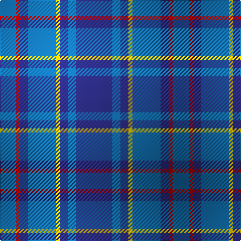

In pattern [BBBYBBRB](/patterns/bbbybbrb/).

This was sourced from register-of-tartans.  It is a [8 stripes tartan](/stripes/stripes8/).

Original link https://www.tartanregister.gov.uk/tartanDetails.aspx?ref=2933

## Attestations

This cloth appears in 2 source records; the oldest owns this page.

- 01/01/2001 — Mercer, Charles (register-of-tartans, [record](https://www.tartanregister.gov.uk/tartanDetails.aspx?ref=2933))
- 2001 — Mercer, Charles (Name) (tartans-authority, [record](http://www.tartansauthority.com/tartan-ferret/display/5880/))

## Thread count
B/16 R4 DB8 B28 Y4 DB8 B8 DB/36

## Palette
Each colour and its ΔE from the base-6 reference it is a variant of.

| Colour | Shade | Base | ΔE (OKLab) |
|---|---|---|---|
| B | <code style="background-color:#1474B4;">#1474B4</code> `#1474B4` | B <code style="background-color:#2A418A;">#2A418A</code> | 0.15 |
| DB | <code style="background-color:#2C2C80;">#2C2C80</code> `#2C2C80` | B <code style="background-color:#2A418A;">#2A418A</code> | 0.06 |
| R | <code style="background-color:#C80000;">#C80000</code> `#C80000` | R <code style="background-color:#CC0000;">#CC0000</code> | 0.01 |
| Y | <code style="background-color:#E8C000;">#E8C000</code> `#E8C000` | Y <code style="background-color:#F2BF00;">#F2BF00</code> | 0.02 |

# Sample pattern

## Nearest tartans

The nearest existing variants by ΔTartan distance.

1. [Mercer Blue Personal Tartan Tartan Number: 5880. Earliest known date: 2001 Designed by Dr P{hil Smith of TECA for Charles Mercer of Rocky Mount, North Carolina. Can be worn by all of the name. See products available Copyright © Blair Urquhart, Comrie, 2015](/setts/s14/b9ba2b2y1ba7b2r1ba4r1b2ba7y1b2ba2x4~b2c2c80-ba1474b4-rc80000-ye8c000/) — ΔT 1.26
1. [Van Loo Tartan Tartan Number: 6717. Earliest known date: pre 2005 Nothing See products available Copyright © Blair Urquhart, Comrie, 2015](/setts/s7/b5ba30k25b5ba30bb3b5x2~b2888c4-ba2c2c80-bb780078-k101010/) — ΔT 1.46
1. [Ewell Castle School](/setts/s6/b4w1b18ba18r1ba4x4~b1474b4-ba202060-rc80000-wfcfcfc/) — ΔT 1.57
1. [Pacific](/setts/s12/g2ga2g1ga14b2ga10b10ga2b14r1b2r2x4~b6840fc-g289c18-ga005448-r9c68a4/) — ΔT 1.61
1. [Daks, Muted blue](/setts/s8/r5b12ba4ra4ba22b3ba4r5~b304080-ba000050-r806050-ra906030/) — ΔT 1.62
1. [MacKerrell](/setts/s7/r2b36ba36w3ba36b36y2x2~b304080-ba5480b0-rc00000-we0e0e0-yf0c000/) — ΔT 1.64
1. [Thorburn (Lochcarron)](/setts/s6/b3ba14b3r16b34ra3x2~b003c64-ba5c8ca8-r888888-rac80000/) — ΔT 1.65
1. [Westwood MacSky (Fashion)](/setts/s10/w2b13ba13y2ba13b13w2b6ba6y1x2~b1c0070-ba283890-we0e0e0-ye8c000/) — ΔT 1.66
1. [Van Loo (Personal)](/setts/s7/b5ba30k25b5ba30bb2b5x2~b2888c4-ba2c2c80-bb780078-k101010/) — ΔT 1.66
1. [Joker Fancy Tartan Tartan Number: 6769. Earliest known date: 2005 I have a photo of a fabric swatch that I am trying to match as close as possible. I have been commissioned to make a life size mannequin of Jack Nicholson as the Joker and he wore plaid/tartan pants. I could send you some photos through email and possibly you could help me. Thanks, Andy Garringer USA, January 2008. (96 threads @ 40 epi heavyweight = 2.5 inch repeat) See products available Copyright © Blair Urquhart, Comrie, 2015](/setts/s6/b11k1b3k5ba9y1x2~b1870a4-ba4c0470-k101010-yd87c00/) — ΔT 1.67

## Neighbour map

Every grey dot is one of 15726 variants placed by the first two principal components of the ΔTartan feature space (44% of its variance). Red is this tartan; blue dots are its nearest — click one to open its page.

<svg viewBox="0 0 640 380" role="img" style="max-width:100%;height:auto;border:1px solid #e0e0e0;border-radius:4px;display:block" xmlns="http://www.w3.org/2000/svg"><image href="/nn/cloud.v1.png" width="640" height="380"/><a href="/setts/s14/b9ba2b2y1ba7b2r1ba4r1b2ba7y1b2ba2x4~b2c2c80-ba1474b4-rc80000-ye8c000/"><circle cx="296.2" cy="199.8" r="4" fill="#3465a4"><title>Mercer Blue Personal Tartan Tartan Number: 5880. Earliest known date: 2001 Designed by Dr P{hil Smith of TECA for Charles Mercer of Rocky Mount, North Carolina. Can be worn by all of the name. See products available Copyright © Blair Urquhart, Comrie, 2015</title></circle></a><a href="/setts/s7/b5ba30k25b5ba30bb3b5x2~b2888c4-ba2c2c80-bb780078-k101010/"><circle cx="346.5" cy="235.2" r="4" fill="#3465a4"><title>Van Loo Tartan Tartan Number: 6717. Earliest known date: pre 2005 Nothing See products available Copyright © Blair Urquhart, Comrie, 2015</title></circle></a><a href="/setts/s6/b4w1b18ba18r1ba4x4~b1474b4-ba202060-rc80000-wfcfcfc/"><circle cx="342.5" cy="200.9" r="4" fill="#3465a4"><title>Ewell Castle School</title></circle></a><a href="/setts/s12/g2ga2g1ga14b2ga10b10ga2b14r1b2r2x4~b6840fc-g289c18-ga005448-r9c68a4/"><circle cx="283.2" cy="170.6" r="4" fill="#3465a4"><title>Pacific</title></circle></a><a href="/setts/s8/r5b12ba4ra4ba22b3ba4r5~b304080-ba000050-r806050-ra906030/"><circle cx="278.0" cy="233.3" r="4" fill="#3465a4"><title>Daks, Muted blue</title></circle></a><a href="/setts/s7/r2b36ba36w3ba36b36y2x2~b304080-ba5480b0-rc00000-we0e0e0-yf0c000/"><circle cx="343.6" cy="205.3" r="4" fill="#3465a4"><title>MacKerrell</title></circle></a><a href="/setts/s6/b3ba14b3r16b34ra3x2~b003c64-ba5c8ca8-r888888-rac80000/"><circle cx="330.6" cy="220.5" r="4" fill="#3465a4"><title>Thorburn (Lochcarron)</title></circle></a><a href="/setts/s10/w2b13ba13y2ba13b13w2b6ba6y1x2~b1c0070-ba283890-we0e0e0-ye8c000/"><circle cx="266.2" cy="207.6" r="4" fill="#3465a4"><title>Westwood MacSky (Fashion)</title></circle></a><a href="/setts/s7/b5ba30k25b5ba30bb2b5x2~b2888c4-ba2c2c80-bb780078-k101010/"><circle cx="367.4" cy="219.9" r="4" fill="#3465a4"><title>Van Loo (Personal)</title></circle></a><a href="/setts/s6/b11k1b3k5ba9y1x2~b1870a4-ba4c0470-k101010-yd87c00/"><circle cx="260.9" cy="225.2" r="4" fill="#3465a4"><title>Joker Fancy Tartan Tartan Number: 6769. Earliest known date: 2005 I have a photo of a fabric swatch that I am trying to match as close as possible. I have been commissioned to make a life size mannequin of Jack Nicholson as the Joker and he wore plaid/tartan pants. I could send you some photos through email and possibly you could help me. Thanks, Andy Garringer USA, January 2008. (96 threads @ 40 epi heavyweight = 2.5 inch repeat) See products available Copyright © Blair Urquhart, Comrie, 2015</title></circle></a><circle cx="302.9" cy="231.5" r="5" fill="#c00000"/></svg>

ID: /setts/s8/b9ba2b2y1ba7b2r1ba4x4~b2c2c80-ba1474b4-rc80000-ye8c000/
