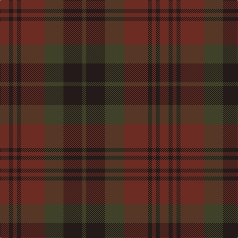

In pattern [BBBBBGBG](/patterns/bbbbbgbg/).

This was sourced from register-of-tartans.  It is a [8 stripes tartan](/stripes/stripes8/).

Original link https://www.tartanregister.gov.uk/tartanDetails.aspx?ref=10253

## Register references

External register numbers recorded for this tartan.

- Scottish Register of Tartans: [10253](https://www.tartanregister.gov.uk/tartanDetails.aspx?ref=10253)

## Thread count
DR/18 K8 DR8 K8 DR48 T38 K38 T/8

## Palette
Each colour and its ΔE from the base-6 reference it is a variant of.

| Colour | Shade | Base | ΔE (OKLab) |
|---|---|---|---|
| DR | <code style="background-color:#6C2C23;">#6C2C23</code> `#6C2C23` | B <code style="background-color:#2A418A;">#2A418A</code> | 0.19 |
| K | <code style="background-color:#241A19;">#241A19</code> `#241A19` | B <code style="background-color:#2A418A;">#2A418A</code> | 0.22 |
| T | <code style="background-color:#3F4129;">#3F4129</code> `#3F4129` | G <code style="background-color:#006100;">#006100</code> | 0.13 |

# Sample pattern

## Nearest tartans

The nearest existing variants by ΔTartan distance.

1. [Brown Heather (Fashion)](/setts/s6/b1g6b6g1ba6g1~b3c2010-ba5c5c5c-g64340c~x8/) — ΔT 0.85
1. [Brown Watch (single) (Fashion)](/setts/s6/b7k2b12k10g12k3~b481c04-g003820-k101010~x2/) — ΔT 1.43
1. [Gleneagles (Corporate)](/setts/s7/g6ga6gb1ga6g5b6g1~b083454-g581c00-ga003820-gb684800~x4/) — ΔT 1.62
1. [Laois, County](/setts/s9/b15ba2b5ba5k18g5b5g2b15~b441800-ba202060-g604000-k101010~x2/) — ΔT 1.76
1. [St. Mirren (Corporate)](/setts/s12/b10k4ba16k4ba10k16ba8k24ba28r3b4r3~b404040-ba343434-k101010-r880000/) — ΔT 1.86
1. [Devarr (Fashion)](/setts/s8/g31b3g3b3g3b22ga26r4~b441800-g604000-ga5c6428-r880000~x2/) — ΔT 1.93
1. [Callum (Buchan)](/setts/s5/b7r1ba6r8ra1~b4b4f4b-ba4b4b58-r8c2828-raa07d73~x8/) — ΔT 1.98
1. [Daks, (Muted Skye)](/setts/s8/b5g15r4g4r24g4r4b5~b304080-g808080-r806050/) — ΔT 2.04
1. [Inneryne (Personal)](/setts/s7/b4k4b16k14g14r3g3~b141e46-g003c14-k101010-r781c38~x2/) — ΔT 2.20
1. [MacArthur of Milton Hunting](/setts/s6/g7b1g1k4ba4k1~b202060-ba440044-g003820-k101010~x4/) — ΔT 2.24

## Neighbour map

Every grey dot is one of 15726 variants placed by the first two principal components of the ΔTartan feature space (44% of its variance). Red is this tartan; blue dots are its nearest — click one to open its page.

<svg viewBox="0 0 640 380" role="img" style="max-width:100%;height:auto;border:1px solid #e0e0e0;border-radius:4px;display:block" xmlns="http://www.w3.org/2000/svg"><image href="/nn/cloud.v1.png" width="640" height="380"/><a href="/setts/s6/b1g6b6g1ba6g1~b3c2010-ba5c5c5c-g64340c~x8/"><circle cx="365.5" cy="321.7" r="4" fill="#3465a4"><title>Brown Heather (Fashion)</title></circle></a><a href="/setts/s6/b7k2b12k10g12k3~b481c04-g003820-k101010~x2/"><circle cx="376.8" cy="359.7" r="4" fill="#3465a4"><title>Brown Watch (single) (Fashion)</title></circle></a><a href="/setts/s7/g6ga6gb1ga6g5b6g1~b083454-g581c00-ga003820-gb684800~x4/"><circle cx="328.6" cy="333.6" r="4" fill="#3465a4"><title>Gleneagles (Corporate)</title></circle></a><a href="/setts/s9/b15ba2b5ba5k18g5b5g2b15~b441800-ba202060-g604000-k101010~x2/"><circle cx="431.8" cy="280.0" r="4" fill="#3465a4"><title>Laois, County</title></circle></a><a href="/setts/s12/b10k4ba16k4ba10k16ba8k24ba28r3b4r3~b404040-ba343434-k101010-r880000/"><circle cx="389.5" cy="264.3" r="4" fill="#3465a4"><title>St. Mirren (Corporate)</title></circle></a><a href="/setts/s8/g31b3g3b3g3b22ga26r4~b441800-g604000-ga5c6428-r880000~x2/"><circle cx="364.4" cy="247.4" r="4" fill="#3465a4"><title>Devarr (Fashion)</title></circle></a><a href="/setts/s5/b7r1ba6r8ra1~b4b4f4b-ba4b4b58-r8c2828-raa07d73~x8/"><circle cx="376.1" cy="315.5" r="4" fill="#3465a4"><title>Callum (Buchan)</title></circle></a><a href="/setts/s8/b5g15r4g4r24g4r4b5~b304080-g808080-r806050/"><circle cx="415.1" cy="291.7" r="4" fill="#3465a4"><title>Daks, (Muted Skye)</title></circle></a><a href="/setts/s7/b4k4b16k14g14r3g3~b141e46-g003c14-k101010-r781c38~x2/"><circle cx="290.5" cy="310.8" r="4" fill="#3465a4"><title>Inneryne (Personal)</title></circle></a><a href="/setts/s6/g7b1g1k4ba4k1~b202060-ba440044-g003820-k101010~x4/"><circle cx="343.8" cy="296.6" r="4" fill="#3465a4"><title>MacArthur of Milton Hunting</title></circle></a><circle cx="388.9" cy="314.6" r="5" fill="#c00000"/></svg>

ID: /setts/s8/b9ba4b4ba4b24g19ba19g4~b6c2c23-ba241a19-g3f4129~x2/
