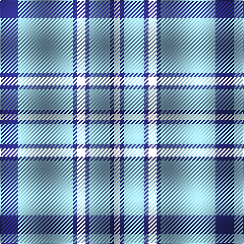

In pattern [BWBKBWBW](/patterns/bwbkbwbw/).

This was sourced from house-of-tartan.  It is a [8 stripes tartan](/stripes/stripes8/).

Original link http://www.house-of-tartan.scotland.net/house/TartanViewjs.asp?colr=Def&tnam=8433

## Thread count
DB/18 LB54 DB4 YY8 DB4 LB20 DB4 W/6

## Palette
Each colour and its ΔE from the base-6 reference it is a variant of.

| Colour | Shade | Base | ΔE (OKLab) |
|---|---|---|---|
| DB | <code style="background-color:#2C2C80;">#2C2C80</code> `#2C2C80` | B <code style="background-color:#2A418A;">#2A418A</code> | 0.06 |
| LB | <code style="background-color:#98C8E8;">#98C8E8</code> `#98C8E8` | W <code style="background-color:#F7F7F7;">#F7F7F7</code> | 0.18 |
| W | <code style="background-color:#F8F8F8;">#F8F8F8</code> `#F8F8F8` | W <code style="background-color:#F7F7F7;">#F7F7F7</code> | 0.00 |

# Sample pattern

## Nearest tartans

The nearest existing variants by ΔTartan distance.

1. [Alaska Highlanders P & D (Corporate)](/setts/s8/b9w27b2y4b2w10b2wa3~b2c2c80-w98c8e8-wafcfcfc-yfccc00~x2/) — ΔT 0.78
1. [Orlando Dress, City of (District)](/setts/s9/b12y1w16b1w1b14w3b14r2~b1870a4-rc80000-wfcfcfc-yfccc00~x4/) — ΔT 1.01
1. [MacLintock #2](/setts/s7/b3ba2w10ba2b6ba26k2~b5c5c5c-ba1474b4-k101010-wfcfcfc~x2/) — ΔT 1.12
1. [Legary (Name)](/setts/s6/y5b15w5b5w40y3~b1c1c50-w98c8e8-ye8c000~x2/) — ΔT 1.20
1. [Legary](/setts/s6/y5b15w5b5w40y3~b00006b-wabcdd9-yeff265~x2/) — ΔT 1.22
1. [WaterAid](/setts/s6/b23w8wa2k5w44b4~b00008c-k101010-wffffff-wa98c8e8~x2/) — ΔT 1.29
1. [Traynor](/setts/s10/w2b18w3b4w3b4w30b3w2y2~b2c2c80-w98c8e8-ye8c000~x2/) — ΔT 1.29
1. [Jack Sinclair (Personal)](/setts/s7/b4r2b40k11g2w16r2~b6495ed-g006818-k101010-rcc1100-wf8f8f8~x2/) — ΔT 1.39
1. [Whitley (Personal)](/setts/s6/b1w5b1w5b15y1~b3850c8-we0e0e0-ye8c000~x4/) — ΔT 1.47
1. [Angle, Blue (Fashion)](/setts/s7/w1y11k6y3w1y1w1~k101010-we8ccb8-y48a4c0~x4/) — ΔT 1.48

## Neighbour map

Every grey dot is one of 15726 variants placed by the first two principal components of the ΔTartan feature space (44% of its variance). Red is this tartan; blue dots are its nearest — click one to open its page.

<svg viewBox="0 0 640 380" role="img" style="max-width:100%;height:auto;border:1px solid #e0e0e0;border-radius:4px;display:block" xmlns="http://www.w3.org/2000/svg"><image href="/nn/cloud.v1.png" width="640" height="380"/><a href="/setts/s8/b9w27b2y4b2w10b2wa3~b2c2c80-w98c8e8-wafcfcfc-yfccc00~x2/"><circle cx="331.3" cy="157.1" r="4" fill="#3465a4"><title>Alaska Highlanders P &amp; D (Corporate)</title></circle></a><a href="/setts/s9/b12y1w16b1w1b14w3b14r2~b1870a4-rc80000-wfcfcfc-yfccc00~x4/"><circle cx="338.2" cy="164.3" r="4" fill="#3465a4"><title>Orlando Dress, City of (District)</title></circle></a><a href="/setts/s7/b3ba2w10ba2b6ba26k2~b5c5c5c-ba1474b4-k101010-wfcfcfc~x2/"><circle cx="312.9" cy="170.7" r="4" fill="#3465a4"><title>MacLintock #2</title></circle></a><a href="/setts/s6/y5b15w5b5w40y3~b1c1c50-w98c8e8-ye8c000~x2/"><circle cx="340.9" cy="184.6" r="4" fill="#3465a4"><title>Legary (Name)</title></circle></a><a href="/setts/s6/y5b15w5b5w40y3~b00006b-wabcdd9-yeff265~x2/"><circle cx="331.4" cy="181.9" r="4" fill="#3465a4"><title>Legary</title></circle></a><a href="/setts/s6/b23w8wa2k5w44b4~b00008c-k101010-wffffff-wa98c8e8~x2/"><circle cx="317.5" cy="142.0" r="4" fill="#3465a4"><title>WaterAid</title></circle></a><a href="/setts/s10/w2b18w3b4w3b4w30b3w2y2~b2c2c80-w98c8e8-ye8c000~x2/"><circle cx="343.1" cy="153.4" r="4" fill="#3465a4"><title>Traynor</title></circle></a><a href="/setts/s7/b4r2b40k11g2w16r2~b6495ed-g006818-k101010-rcc1100-wf8f8f8~x2/"><circle cx="284.5" cy="122.5" r="4" fill="#3465a4"><title>Jack Sinclair (Personal)</title></circle></a><a href="/setts/s6/b1w5b1w5b15y1~b3850c8-we0e0e0-ye8c000~x4/"><circle cx="364.0" cy="186.7" r="4" fill="#3465a4"><title>Whitley (Personal)</title></circle></a><a href="/setts/s7/w1y11k6y3w1y1w1~k101010-we8ccb8-y48a4c0~x4/"><circle cx="335.9" cy="196.3" r="4" fill="#3465a4"><title>Angle, Blue (Fashion)</title></circle></a><circle cx="317.3" cy="154.9" r="5" fill="#c00000"/></svg>

ID: /setts/s8/b9w27b2k4b2w10b2wa3~b2c2c80-k000000-w98c8e8-waf8f8f8~x2/
