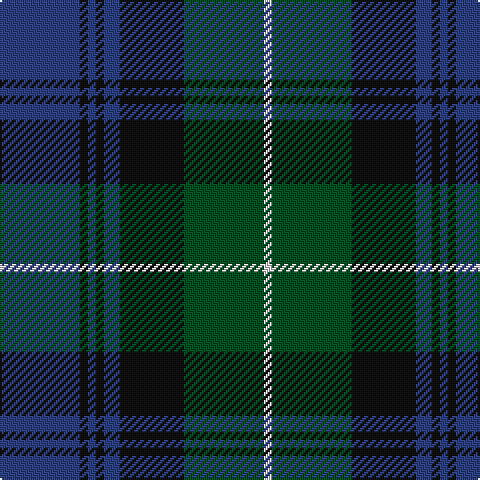

In pattern [BKBKBKGW](/stripes/bkbkbkgw/).

This was sourced from register-of-tartans.  It is a [8 stripe tartan](/stripes/stripes8/).

Original link https://www.tartanregister.gov.uk/tartanDetails.aspx?ref=2033

## Register references

External register numbers recorded for this tartan.

- Scottish Register of Tartans: [2033](https://www.tartanregister.gov.uk/tartanDetails.aspx?ref=2033)
- Scottish Tartans World Register: 296

## Thread count
B/40 K4 B4 K4 B8 K32 G40 LN/4

## Palette
Each colour and the base-6 reference it is a variant of.

| Colour | Shade | Base |
|---|---|---|
| B | <code style="background-color:#2C4084;">#2C4084</code> `oklch(39.4% 0.117 268.3)` <small>#2C4084</small> | B <code style="background-color:#2A418A;">#2A418A</code> |
| G | <code style="background-color:#005020;">#005020</code> `oklch(37.7% 0.105 149.6)` <small>#005020</small> | G <code style="background-color:#006100;">#006100</code> |
| K | <code style="background-color:#101010;">#101010</code> `oklch(17.3% 0.000 89.9)` <small>#101010</small> | K <code style="background-color:#000000;">#000000</code> |
| LN | <code style="background-color:#E0E0E0;">#E0E0E0</code> `oklch(90.7% 0.000 89.9)` <small>#E0E0E0</small> | W <code style="background-color:#F7F7F7;">#F7F7F7</code> |

# Sample pattern

## Nearest tartans

The nearest existing variants by ΔTartan distance.

1. [Aitchison Family (Kinghorn) (Personal)](/setts/s9/k2db3k2db18k11db2k11g25p2~x2/) — ΔT 0.68
1. [MacHarg, Iain](/setts/s9/g20k2g2k2g2k8db24dp3db3~x2/) — ΔT 0.70
1. [Reid and Taylor](/setts/s7/k2g10k9db9r1k1db2~x2/) — ΔT 0.73
1. [Forbes #3](/setts/s9/db8k2db2k2db2k8dg7k1w1~x2/) — ΔT 0.75
1. [Renfrew](/setts/s7/db6k2db18k18g18k3r2~x2/) — ΔT 0.77
1. [Brabender](/setts/s8/k1g4r1k4db1k1db7g1~x6/) — ΔT 0.79
1. [Forbes #5](/setts/s9/db28k3db6k3db6k20dy28k3w6~x2/) — ΔT 0.92
1. [Gammell (1978) (Personal)](/setts/s7/db3r2db22k11g22r2g3~x2/) — ΔT 0.94
1. [Dundas #2](/setts/s7/k4db16k12g12r1g2k2~x2/) — ΔT 0.97
1. [Princess Louise (Royal)](/setts/s11/g2k1db9k7g1k1g1k1g9r1db1~x4/) — ΔT 0.98

## Neighbour map

Every grey dot is one of 14299 variants placed by the first two principal components of the ΔTartan feature space (44% of its variance). Red is this tartan; blue dots are its nearest — click one to open its page.

<svg viewBox="0 0 640 380" role="img" style="max-width:100%;height:auto;border:1px solid #e0e0e0;border-radius:4px;display:block" xmlns="http://www.w3.org/2000/svg"><image href="/nn/cloud.v1.png" width="640" height="380"/><a href="/setts/s9/k2db3k2db18k11db2k11g25p2~x2/"><circle cx="247.5" cy="212.4" r="4" fill="#3465a4"><title>Aitchison Family (Kinghorn) (Personal)</title></circle></a><a href="/setts/s9/g20k2g2k2g2k8db24dp3db3~x2/"><circle cx="273.5" cy="195.7" r="4" fill="#3465a4"><title>MacHarg, Iain</title></circle></a><a href="/setts/s7/k2g10k9db9r1k1db2~x2/"><circle cx="221.3" cy="231.7" r="4" fill="#3465a4"><title>Reid and Taylor</title></circle></a><a href="/setts/s9/db8k2db2k2db2k8dg7k1w1~x2/"><circle cx="226.4" cy="233.2" r="4" fill="#3465a4"><title>Forbes #3</title></circle></a><a href="/setts/s7/db6k2db18k18g18k3r2~x2/"><circle cx="219.3" cy="238.9" r="4" fill="#3465a4"><title>Renfrew</title></circle></a><a href="/setts/s8/k1g4r1k4db1k1db7g1~x6/"><circle cx="223.5" cy="233.1" r="4" fill="#3465a4"><title>Brabender</title></circle></a><a href="/setts/s9/db28k3db6k3db6k20dy28k3w6~x2/"><circle cx="219.0" cy="207.5" r="4" fill="#3465a4"><title>Forbes #5</title></circle></a><a href="/setts/s7/db3r2db22k11g22r2g3~x2/"><circle cx="231.6" cy="210.5" r="4" fill="#3465a4"><title>Gammell (1978) (Personal)</title></circle></a><a href="/setts/s7/k4db16k12g12r1g2k2~x2/"><circle cx="248.7" cy="216.6" r="4" fill="#3465a4"><title>Dundas #2</title></circle></a><a href="/setts/s11/g2k1db9k7g1k1g1k1g9r1db1~x4/"><circle cx="233.6" cy="196.3" r="4" fill="#3465a4"><title>Princess Louise (Royal)</title></circle></a><circle cx="244.0" cy="219.3" r="5" fill="#c00000"/></svg>

ID: /setts/s8/db10k1db1k1db2k8dg10w1~x4/
