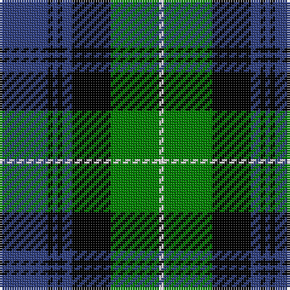

In pattern [BKBKBKGW](/stripes/bkbkbkgw/).

This was sourced from weddslist.  It is a [8 stripe tartan](/stripes/stripes8/).

Original link http://www.weddslist.com/cgi-bin/tartans/pg.pl?source=sts

## Thread count
B/20 K2 B2 K2 B4 K16 G20 LN/2

## Palette
Each colour and the base-6 reference it is a variant of.

| Colour | Shade | Base |
|---|---|---|
| B | <code style="background-color:#304080;">#304080</code> `oklch(39.4% 0.109 270.2)` <small>#304080</small> | B <code style="background-color:#2A418A;">#2A418A</code> |
| G | <code style="background-color:#008000;">#008000</code> `oklch(52.0% 0.177 142.5)` <small>#008000</small> | G <code style="background-color:#006100;">#006100</code> |
| K | <code style="background-color:#000000;">#000000</code> `oklch(0.0% 0.000 0.0)` <small>#000000</small> | K <code style="background-color:#000000;">#000000</code> |
| LN | <code style="background-color:#E0E0E0;">#E0E0E0</code> `oklch(90.7% 0.000 89.9)` <small>#E0E0E0</small> | W <code style="background-color:#F7F7F7;">#F7F7F7</code> |

# Sample pattern

## Nearest tartans

The nearest existing variants by ΔTartan distance.

1. [Gordon 3](/setts/s10/db56k6db6k6db6k44g44ly4g5ly8/) — ΔT 0.83
1. [Forbes](/setts/s9/db8k2db2k2db2k8g7k1w1~x2/) — ΔT 0.85
1. [Unnamed, No 59](/setts/s6/t1db11k11g11k2t1~x2/) — ΔT 0.88
1. [Louise](/setts/s11/k1r1g6k1g1k1g1k6db9k1db1~x2/) — ΔT 0.88
1. [Flower of Scotland](/setts/s6/db3g28db3k16db28r3/) — ΔT 0.90
1. [Blair](/setts/s7/db3r1db10k8g10r1g3~x4/) — ΔT 0.91
1. [Louisiana](/setts/s8/k3g3lb2g11k12db18k2lb3~x2/) — ΔT 0.93
1. [Gunn](/setts/s6/r2g12k12g1db12g1~x2/) — ΔT 0.94
1. [Hebridean Old](/setts/s9/k2db3g16b1k13b1db18k2db2~x2/) — ΔT 0.99
1. [MacNeil 1](/setts/s6/w1db9k9g9k2w1~x4/) — ΔT 1.00

## Neighbour map

Every grey dot is one of 14299 variants placed by the first two principal components of the ΔTartan feature space (44% of its variance). Red is this tartan; blue dots are its nearest — click one to open its page.

<svg viewBox="0 0 640 380" role="img" style="max-width:100%;height:auto;border:1px solid #e0e0e0;border-radius:4px;display:block" xmlns="http://www.w3.org/2000/svg"><image href="/nn/cloud.v1.png" width="640" height="380"/><a href="/setts/s10/db56k6db6k6db6k44g44ly4g5ly8/"><circle cx="185.6" cy="156.3" r="4" fill="#3465a4"><title>Gordon 3</title></circle></a><a href="/setts/s9/db8k2db2k2db2k8g7k1w1~x2/"><circle cx="171.5" cy="206.5" r="4" fill="#3465a4"><title>Forbes</title></circle></a><a href="/setts/s6/t1db11k11g11k2t1~x2/"><circle cx="167.6" cy="212.4" r="4" fill="#3465a4"><title>Unnamed, No 59</title></circle></a><a href="/setts/s11/k1r1g6k1g1k1g1k6db9k1db1~x2/"><circle cx="173.5" cy="173.8" r="4" fill="#3465a4"><title>Louise</title></circle></a><a href="/setts/s6/db3g28db3k16db28r3/"><circle cx="207.2" cy="216.0" r="4" fill="#3465a4"><title>Flower of Scotland</title></circle></a><a href="/setts/s7/db3r1db10k8g10r1g3~x4/"><circle cx="167.4" cy="213.5" r="4" fill="#3465a4"><title>Blair</title></circle></a><a href="/setts/s8/k3g3lb2g11k12db18k2lb3~x2/"><circle cx="137.5" cy="198.6" r="4" fill="#3465a4"><title>Louisiana</title></circle></a><a href="/setts/s6/r2g12k12g1db12g1~x2/"><circle cx="173.1" cy="206.0" r="4" fill="#3465a4"><title>Gunn</title></circle></a><a href="/setts/s9/k2db3g16b1k13b1db18k2db2~x2/"><circle cx="220.6" cy="160.3" r="4" fill="#3465a4"><title>Hebridean Old</title></circle></a><a href="/setts/s6/w1db9k9g9k2w1~x4/"><circle cx="146.6" cy="216.6" r="4" fill="#3465a4"><title>MacNeil 1</title></circle></a><circle cx="184.7" cy="189.5" r="5" fill="#c00000"/></svg>

ID: /setts/s8/db10k1db1k1db2k8g10w1~x2/
