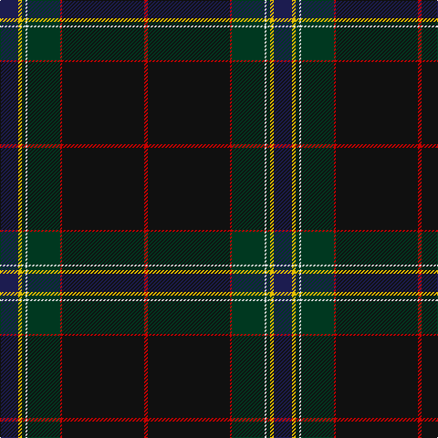

This page is one **sett** — a single exact thread-count. It belongs to the [tartan](/tartans/db10ly2dg2w1dg18r1k45r2/)
(the same proportion at any scale), whose colour order is pattern [BYGWGRKR](/stripes/bygwgrkr/).

Sourced from register-of-tartans.  It is a [8 stripe tartan](/stripes/stripes8/).

Original link https://www.tartanregister.gov.uk/tartanDetails.aspx?ref=969

## Register references

External register numbers recorded for this tartan.

- Scottish Register of Tartans: [969](https://www.tartanregister.gov.uk/tartanDetails.aspx?ref=969)
- Scottish Tartans Authority (ITI): 7105

## Thread count
DB/20 Y4 DG4 LN2 DG36 R2 K90 R/4

## Palette

Palette: <strong>Tartan Register</strong>
<table><thead><tr><th>Colour</th><th>Threads</th><th>Shade</th><th>Base</th><th>OKLCh</th></tr></thead><tbody><tr><td>DB/</td><td style="text-align:right;font-variant-numeric:tabular-nums">20</td><td><code style="background-color:#1C1C50;">#1C1C50</code> <small style="color:#888">#1C1C50</small></td><td>B <code style="background-color:#2A418A;">#2A418A</code></td><td><small style="color:#888">oklch(26.2% 0.093 277.9)</small></td></tr><tr><td>Y</td><td style="text-align:right;font-variant-numeric:tabular-nums">4</td><td><code style="background-color:#E8C000;">#E8C000</code> <small style="color:#888">#E8C000</small></td><td>Y <code style="background-color:#F2BF00;">#F2BF00</code></td><td><small style="color:#888">oklch(81.9% 0.168 93.7)</small></td></tr><tr><td>DG</td><td style="text-align:right;font-variant-numeric:tabular-nums">4</td><td><code style="background-color:#003820;">#003820</code> <small style="color:#888">#003820</small></td><td>G <code style="background-color:#006100;">#006100</code></td><td><small style="color:#888">oklch(30.0% 0.070 158.3)</small></td></tr><tr><td>LN</td><td style="text-align:right;font-variant-numeric:tabular-nums">2</td><td><code style="background-color:#E0E0E0;">#E0E0E0</code> <small style="color:#888">#E0E0E0</small></td><td>W <code style="background-color:#F7F7F7;">#F7F7F7</code></td><td><small style="color:#888">oklch(90.7% 0.000 89.9)</small></td></tr><tr><td>DG</td><td style="text-align:right;font-variant-numeric:tabular-nums">36</td><td><code style="background-color:#003820;">#003820</code> <small style="color:#888">#003820</small></td><td>G <code style="background-color:#006100;">#006100</code></td><td><small style="color:#888">oklch(30.0% 0.070 158.3)</small></td></tr><tr><td>R</td><td style="text-align:right;font-variant-numeric:tabular-nums">2</td><td><code style="background-color:#C80000;">#C80000</code> <small style="color:#888">#C80000</small></td><td>R <code style="background-color:#CC0000;">#CC0000</code></td><td><small style="color:#888">oklch(52.3% 0.215 29.2)</small></td></tr><tr><td>K</td><td style="text-align:right;font-variant-numeric:tabular-nums">90</td><td><code style="background-color:#101010;">#101010</code> <small style="color:#888">#101010</small></td><td>K <code style="background-color:#000000;">#000000</code></td><td><small style="color:#888">oklch(17.3% 0.000 89.9)</small></td></tr><tr><td>R/</td><td style="text-align:right;font-variant-numeric:tabular-nums">4</td><td><code style="background-color:#C80000;">#C80000</code> <small style="color:#888">#C80000</small></td><td>R <code style="background-color:#CC0000;">#CC0000</code></td><td><small style="color:#888">oklch(52.3% 0.215 29.2)</small></td></tr></tbody></table>

# Sample pattern

## Nearest tartans

The nearest existing variants by ΔTartan distance, with this tartan at the top so the swatches line up against it.

ΔTartan

Tartan

Sett

—

<a href="/ttd/edit/#slug=db10ly2dg2w1dg18r1k45r2~x2">Downs</a> <a class="nn-out" href="/setts/s8/db10ly2dg2w1dg18r1k45r2~x2/" title="open its dictionary page">↗</a>

0.60

<a href="/ttd/edit/#slug=b10lr2k2b1k18lr1k45lr2~x2">Downs (Name)</a> <a class="nn-out" href="/setts/s8/b10lr2k2b1k18lr1k45lr2~x2/" title="open its dictionary page">↗</a>

0.75

<a href="/ttd/edit/#slug=dg42lo1k23r7w1db4lo3~x2">Henschke, Felix (Personal)</a> <a class="nn-out" href="/setts/s7/dg42lo1k23r7w1db4lo3~x2/" title="open its dictionary page">↗</a>

1.04

<a href="/ttd/edit/#slug=k4r1w1r2k48dr4w1db30ly2r2~x2">RCACA</a> <a class="nn-out" href="/setts/s10/k4r1w1r2k48dr4w1db30ly2r2~x2/" title="open its dictionary page">↗</a>

1.38

<a href="/ttd/edit/#slug=dt46w1lo3dg13w1r7g3w1~x2">Victorian Highland Pipe Band Association (Australia)</a> <a class="nn-out" href="/setts/s8/dt46w1lo3dg13w1r7g3w1~x2/" title="open its dictionary page">↗</a>

1.44

<a href="/ttd/edit/#slug=dbi56dg11r2dg7k2dg7r2dg7db3lo4~x2">CAL FIRE Local 2881</a> <a class="nn-out" href="/setts/s10/dbi56dg11r2dg7k2dg7r2dg7db3lo4~x2/" title="open its dictionary page">↗</a>

1.49

<a href="/ttd/edit/#slug=w2dg15db8dg2db32lb1db8k13r2lb1~x2">Pilkington (2016)</a> <a class="nn-out" href="/setts/s10/w2dg15db8dg2db32lb1db8k13r2lb1~x2/" title="open its dictionary page">↗</a>

1.52

<a href="/ttd/edit/#slug=db5w1db44dp1g12k12dp5k2m2k3~x2">Heart of Scotland (Fashion)</a> <a class="nn-out" href="/setts/s10/db5w1db44dp1g12k12dp5k2m2k3~x2/" title="open its dictionary page">↗</a>

1.53

<a href="/ttd/edit/#slug=r4dg10lo1lb1dt4lb1dt25r2~x2">Raymond of Doune</a> <a class="nn-out" href="/setts/s8/r4dg10lo1lb1dt4lb1dt25r2~x2/" title="open its dictionary page">↗</a>

1.56

<a href="/ttd/edit/#slug=dp23w1o3w1dp12lo9dg40dp3~x2">Pictou County</a> <a class="nn-out" href="/setts/s8/dp23w1o3w1dp12lo9dg40dp3~x2/" title="open its dictionary page">↗</a>

1.57

<a href="/setts/s7/db2k4kii36g1ki34db4w2~x2/">Police College Tulliallan</a>

## Neighbour map

Every grey dot is one of 14359 variants placed by the first two principal components of the ΔTartan feature space (44% of its variance). Red is this tartan; blue dots are its nearest — click one to open its page.

<svg viewBox="0 0 640 380" role="img" style="max-width:100%;height:auto;border:1px solid #e0e0e0;border-radius:4px;display:block" xmlns="http://www.w3.org/2000/svg"><image href="/nn/cloud.v1.png" width="640" height="380"/><a href="/setts/s8/b10lr2k2b1k18lr1k45lr2~x2/"><circle cx="378.3" cy="114.3" r="4" fill="#3465a4"><title>Downs (Name)</title></circle></a><a href="/setts/s7/dg42lo1k23r7w1db4lo3~x2/"><circle cx="362.5" cy="135.7" r="4" fill="#3465a4"><title>Henschke, Felix (Personal)</title></circle></a><a href="/setts/s10/k4r1w1r2k48dr4w1db30ly2r2~x2/"><circle cx="388.7" cy="89.1" r="4" fill="#3465a4"><title>RCACA</title></circle></a><a href="/setts/s8/dt46w1lo3dg13w1r7g3w1~x2/"><circle cx="402.1" cy="95.7" r="4" fill="#3465a4"><title>Victorian Highland Pipe Band Association (Australia)</title></circle></a><a href="/setts/s10/dbi56dg11r2dg7k2dg7r2dg7db3lo4~x2/"><circle cx="405.4" cy="133.0" r="4" fill="#3465a4"><title>CAL FIRE Local 2881</title></circle></a><a href="/setts/s10/w2dg15db8dg2db32lb1db8k13r2lb1~x2/"><circle cx="342.3" cy="128.3" r="4" fill="#3465a4"><title>Pilkington (2016)</title></circle></a><a href="/setts/s10/db5w1db44dp1g12k12dp5k2m2k3~x2/"><circle cx="383.3" cy="105.6" r="4" fill="#3465a4"><title>Heart of Scotland (Fashion)</title></circle></a><a href="/setts/s8/r4dg10lo1lb1dt4lb1dt25r2~x2/"><circle cx="416.0" cy="162.7" r="4" fill="#3465a4"><title>Raymond of Doune</title></circle></a><a href="/setts/s8/dp23w1o3w1dp12lo9dg40dp3~x2/"><circle cx="294.1" cy="124.6" r="4" fill="#3465a4"><title>Pictou County</title></circle></a><a href="/setts/s7/db2k4kii36g1ki34db4w2~x2/"><circle cx="322.1" cy="146.3" r="4" fill="#3465a4"><title>Police College Tulliallan</title></circle></a><circle cx="391.6" cy="119.5" r="5" fill="#c00000"/></svg>

ID: /setts/s8/db10ly2dg2w1dg18r1k45r2~x2/
