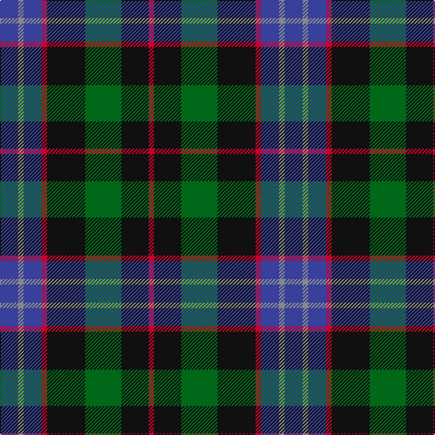

This page is one **sett** — a single exact thread-count. It belongs to the [tartan](/tartans/db10o3db10r3k21g20k15r3/)
(the same proportion at any scale), whose colour order is pattern [BRBRKGKR](/stripes/brbrkgkr/).

Sourced from tartans-authority.  It is a [8 stripe tartan](/stripes/stripes8/).

Original link http://www.tartansauthority.com/tartan-ferret/display/10696/

## Register references

External register numbers recorded for this tartan.

- Scottish Register of Tartans: [10696](https://www.tartanregister.gov.uk/tartanDetails?ref=10696)
- Scottish Tartans Authority (ITI): 10696

## Thread count
B/20 N6 B20 R6 K42 G40 K30 R/6

## Palette

Palette: <strong>Tartan Register</strong> <small style="color:#888">(4 of 5 colours)</small>
<table><thead><tr><th>Colour</th><th>Threads</th><th>Shade</th><th>Base</th><th>OKLCh</th></tr></thead><tbody><tr><td>B/</td><td style="text-align:right;font-variant-numeric:tabular-nums">20</td><td><code style="background-color:#38409C;">#38409C</code> <small style="color:#888">#38409C</small></td><td>B <code style="background-color:#2A418A;">#2A418A</code></td><td><small style="color:#888">oklch(42.1% 0.148 274.4)</small></td></tr><tr><td>N</td><td style="text-align:right;font-variant-numeric:tabular-nums">6</td><td><code style="background-color:#888888;">#888888</code> <small style="color:#888">#888888</small></td><td>R <code style="background-color:#CC0000;">#CC0000</code></td><td><small style="color:#888">oklch(62.7% 0.000 89.9)</small></td></tr><tr><td>B</td><td style="text-align:right;font-variant-numeric:tabular-nums">20</td><td><code style="background-color:#38409C;">#38409C</code> <small style="color:#888">#38409C</small></td><td>B <code style="background-color:#2A418A;">#2A418A</code></td><td><small style="color:#888">oklch(42.1% 0.148 274.4)</small></td></tr><tr><td>R</td><td style="text-align:right;font-variant-numeric:tabular-nums">6</td><td><code style="background-color:#C8002C;">#C8002C</code> <small style="color:#888">#C8002C</small></td><td>R <code style="background-color:#CC0000;">#CC0000</code></td><td><small style="color:#888">oklch(52.6% 0.212 22.0)</small></td></tr><tr><td>K</td><td style="text-align:right;font-variant-numeric:tabular-nums">42</td><td><code style="background-color:#101010;">#101010</code> <small style="color:#888">#101010</small></td><td>K <code style="background-color:#000000;">#000000</code></td><td><small style="color:#888">oklch(17.3% 0.000 89.9)</small></td></tr><tr><td>G</td><td style="text-align:right;font-variant-numeric:tabular-nums">40</td><td><code style="background-color:#006818;">#006818</code> <small style="color:#888">#006818</small></td><td>G <code style="background-color:#006100;">#006100</code></td><td><small style="color:#888">oklch(45.0% 0.142 145.0)</small></td></tr><tr><td>K</td><td style="text-align:right;font-variant-numeric:tabular-nums">30</td><td><code style="background-color:#101010;">#101010</code> <small style="color:#888">#101010</small></td><td>K <code style="background-color:#000000;">#000000</code></td><td><small style="color:#888">oklch(17.3% 0.000 89.9)</small></td></tr><tr><td>R/</td><td style="text-align:right;font-variant-numeric:tabular-nums">6</td><td><code style="background-color:#C8002C;">#C8002C</code> <small style="color:#888">#C8002C</small></td><td>R <code style="background-color:#CC0000;">#CC0000</code></td><td><small style="color:#888">oklch(52.6% 0.212 22.0)</small></td></tr></tbody></table>

# Sample pattern

## Nearest tartans

The nearest existing variants by ΔTartan distance, with this tartan at the top so the swatches line up against it.

ΔTartan

Tartan

Sett

—

<a href="/ttd/edit/#slug=db10o3db10r3k21g20k15r3~x2">Williamson/Smart (Personal)</a> <a class="nn-out" href="/setts/s8/db10o3db10r3k21g20k15r3~x2/" title="open its dictionary page">↗</a>

0.53

<a href="/ttd/edit/#slug=db20k10lo3k7r4k7lo3k8g20~x2">Scottish Tartan Society</a> <a class="nn-out" href="/setts/s9/db20k10lo3k7r4k7lo3k8g20~x2/" title="open its dictionary page">↗</a>

0.59

<a href="/ttd/edit/#slug=db10r7db31k25dg23k8db7k8ly5~x2">MacCallum of Berwick</a> <a class="nn-out" href="/setts/s9/db10r7db31k25dg23k8db7k8ly5~x2/" title="open its dictionary page">↗</a>

0.71

<a href="/ttd/edit/#slug=k18db12k5g4r6g12k2lo4~x2">MacLeish</a> <a class="nn-out" href="/setts/s8/k18db12k5g4r6g12k2lo4~x2/" title="open its dictionary page">↗</a>

0.75

<a href="/setts/s8/k8t3g13dp12ly2~x2/">Wilson's No.176</a>

0.80

<a href="/ttd/edit/#slug=g16lb3g3k10db12r2db3~x2">MacLean, Donald (Personal)</a> <a class="nn-out" href="/setts/s7/g16lb3g3k10db12r2db3~x2/" title="open its dictionary page">↗</a>

0.81

<a href="/ttd/edit/#slug=k4db8k4db8r2g10k1w2~x2">MacKean Green (Personal)</a> <a class="nn-out" href="/setts/s8/k4db8k4db8r2g10k1w2~x2/" title="open its dictionary page">↗</a>

0.85

<a href="/ttd/edit/#slug=lr8g33k21db6k6db33r6db6">Royal Highland Corporate Tartan Tartan Number: 2054. Earliest known date: March 1992 In 1808 the Highland Society of Scotland used the Universal or Black Watch tartan. This has been incorporated in the new design along with colours to represent the agricultural heritage and interests of the Society. This design includes changes that were made when the first version proved an exact match to the 'Wellington' tartan. The white is 'Barley white'. See products available Copyright © Blair Urquhart, Comrie, 2015</a> <a class="nn-out" href="/setts/s8/lr8g33k21db6k6db33r6db6/" title="open its dictionary page">↗</a>

0.87

<a href="/ttd/edit/#slug=r4db24k12g14k4lb3~x2">MacPhail Hunting #2</a> <a class="nn-out" href="/setts/s6/r4db24k12g14k4lb3~x2/" title="open its dictionary page">↗</a>

0.89

<a href="/ttd/edit/#slug=k4w1g10k10db10r2~x2">Rose Hunting Clan Tartan Tartan Number: 1226. Earliest known date: 1831 First recorded in James Logan's, 'The Scottish Gael' in 1831. See products available Copyright © Blair Urquhart, Comrie, 2015</a> <a class="nn-out" href="/setts/s6/k4w1g10k10db10r2~x2/" title="open its dictionary page">↗</a>

0.90

<a href="/ttd/edit/#slug=g11t3g5r3g5k22db22k5~x2">Wood (Personal)</a> <a class="nn-out" href="/setts/s8/g11t3g5r3g5k22db22k5~x2/" title="open its dictionary page">↗</a>

## Neighbour map

Every grey dot is one of 14359 variants placed by the first two principal components of the ΔTartan feature space (44% of its variance). Red is this tartan; blue dots are its nearest — click one to open its page.

<svg viewBox="0 0 640 380" role="img" style="max-width:100%;height:auto;border:1px solid #e0e0e0;border-radius:4px;display:block" xmlns="http://www.w3.org/2000/svg"><image href="/nn/cloud.v1.png" width="640" height="380"/><a href="/setts/s9/db20k10lo3k7r4k7lo3k8g20~x2/"><circle cx="149.2" cy="218.4" r="4" fill="#3465a4"><title>Scottish Tartan Society</title></circle></a><a href="/setts/s9/db10r7db31k25dg23k8db7k8ly5~x2/"><circle cx="159.6" cy="225.2" r="4" fill="#3465a4"><title>MacCallum of Berwick</title></circle></a><a href="/setts/s8/k18db12k5g4r6g12k2lo4~x2/"><circle cx="156.4" cy="211.1" r="4" fill="#3465a4"><title>MacLeish</title></circle></a><a href="/setts/s8/k8t3g13dp12ly2~x2/"><circle cx="150.3" cy="234.7" r="4" fill="#3465a4"><title>Wilson's No.176</title></circle></a><a href="/setts/s7/g16lb3g3k10db12r2db3~x2/"><circle cx="164.3" cy="216.4" r="4" fill="#3465a4"><title>MacLean, Donald (Personal)</title></circle></a><a href="/setts/s8/k4db8k4db8r2g10k1w2~x2/"><circle cx="167.4" cy="208.6" r="4" fill="#3465a4"><title>MacKean Green (Personal)</title></circle></a><a href="/setts/s8/lr8g33k21db6k6db33r6db6/"><circle cx="146.7" cy="219.0" r="4" fill="#3465a4"><title>Royal Highland Corporate Tartan Tartan Number: 2054. Earliest known date: March 1992 In 1808 the Highland Society of Scotland used the Universal or Black Watch tartan. This has been incorporated in the new design along with colours to represent the agricultural heritage and interests of the Society. This design includes changes that were made when the first version proved an exact match to the 'Wellington' tartan. The white is 'Barley white'. See products available Copyright © Blair Urquhart, Comrie, 2015</title></circle></a><a href="/setts/s6/r4db24k12g14k4lb3~x2/"><circle cx="172.4" cy="222.0" r="4" fill="#3465a4"><title>MacPhail Hunting #2</title></circle></a><a href="/setts/s6/k4w1g10k10db10r2~x2/"><circle cx="170.5" cy="226.5" r="4" fill="#3465a4"><title>Rose Hunting Clan Tartan Tartan Number: 1226. Earliest known date: 1831 First recorded in James Logan's, 'The Scottish Gael' in 1831. See products available Copyright © Blair Urquhart, Comrie, 2015</title></circle></a><a href="/setts/s8/g11t3g5r3g5k22db22k5~x2/"><circle cx="172.5" cy="217.9" r="4" fill="#3465a4"><title>Wood (Personal)</title></circle></a><circle cx="172.9" cy="225.4" r="5" fill="#c00000"/></svg>

ID: /setts/s8/db10o3db10r3k21g20k15r3~x2/
