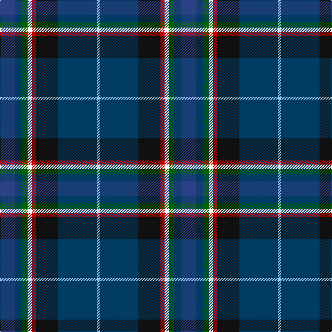

In pattern [BBGWRKBW](/stripes/bbgwrkbw/).

This was sourced from register-of-tartans.  It is a [8 stripe tartan](/stripes/stripes8/).

Original link https://www.tartanregister.gov.uk/tartanDetails.aspx?ref=11248

## Register references

External register numbers recorded for this tartan.

- Scottish Register of Tartans: [11248](https://www.tartanregister.gov.uk/tartanDetails.aspx?ref=11248)

## Thread count
B/22 DB10 G8 W6 R6 K32 DB56 LB/4

## Palette
Each colour and the base-6 reference it is a variant of.

| Colour | Shade | Base |
|---|---|---|
| B | <code style="background-color:#2C4084;">#2C4084</code> `oklch(39.4% 0.117 268.3)` <small>#2C4084</small> | B <code style="background-color:#2A418A;">#2A418A</code> |
| DB | <code style="background-color:#003C64;">#003C64</code> `oklch(34.5% 0.089 246.0)` <small>#003C64</small> | B <code style="background-color:#2A418A;">#2A418A</code> |
| G | <code style="background-color:#006400;">#006400</code> `oklch(43.6% 0.148 142.5)` <small>#006400</small> | G <code style="background-color:#006100;">#006100</code> |
| K | <code style="background-color:#101010;">#101010</code> `oklch(17.3% 0.000 89.9)` <small>#101010</small> | K <code style="background-color:#000000;">#000000</code> |
| LB | <code style="background-color:#98C8E8;">#98C8E8</code> `oklch(81.0% 0.068 237.9)` <small>#98C8E8</small> | W <code style="background-color:#F7F7F7;">#F7F7F7</code> |
| R | <code style="background-color:#C80000;">#C80000</code> `oklch(52.3% 0.215 29.2)` <small>#C80000</small> | R <code style="background-color:#CC0000;">#CC0000</code> |
| W | <code style="background-color:#FFFFFF;">#FFFFFF</code> `oklch(100.0% 0.000 89.9)` <small>#FFFFFF</small> | W <code style="background-color:#F7F7F7;">#F7F7F7</code> |

# Sample pattern

## Nearest tartans

The nearest existing variants by ΔTartan distance.

1. [Anne Arundel County](/setts/s8/r4o10k9o2k9db33dt7g4~x2/) — ΔT 0.88
1. [Unidentified Lady's kilt](/setts/s8/db39dy3k14dy3t14ly4w2dy2~x2/) — ΔT 1.01
1. [St. Columba (one green)](/setts/s8/db20y1w1lo3g14n4y1dp4~x2/) — ΔT 1.03
1. [Suzugamine (Corporate)](/setts/s9/db4dy5g19dp5dy5k5dy5db36ly3~x2/) — ΔT 1.05
1. [Scottish Italian](/setts/s8/b11db5g4w3r3k16db28b2~x2/) — ΔT 1.06
1. [Highland, Blue (Corporate)](/setts/s10/dp4g13db5ly3t6ly3db5n6db28w2~x2/) — ΔT 1.12
1. [Anne Arundel County](/setts/s8/r4y10k9dy2k9db33k7g4~x2/) — ΔT 1.18
1. [Renfrewshire](/setts/s7/dp4db2t8db25k8g13ly4~x2/) — ΔT 1.25
1. [MacLeroy and Troine 1987](/setts/s10/k4t6w4t6do8t37lr12do46o6lo4/) — ΔT 1.25
1. [Loch Long One Design (Corporate)](/setts/s6/lo4k28r2db22b8dy3~x2/) — ΔT 1.30

## Neighbour map

Every grey dot is one of 14299 variants placed by the first two principal components of the ΔTartan feature space (44% of its variance). Red is this tartan; blue dots are its nearest — click one to open its page.

<svg viewBox="0 0 640 380" role="img" style="max-width:100%;height:auto;border:1px solid #e0e0e0;border-radius:4px;display:block" xmlns="http://www.w3.org/2000/svg"><image href="/nn/cloud.v1.png" width="640" height="380"/><a href="/setts/s8/r4o10k9o2k9db33dt7g4~x2/"><circle cx="196.4" cy="143.2" r="4" fill="#3465a4"><title>Anne Arundel County</title></circle></a><a href="/setts/s8/db39dy3k14dy3t14ly4w2dy2~x2/"><circle cx="231.5" cy="114.8" r="4" fill="#3465a4"><title>Unidentified Lady's kilt</title></circle></a><a href="/setts/s8/db20y1w1lo3g14n4y1dp4~x2/"><circle cx="206.6" cy="121.1" r="4" fill="#3465a4"><title>St. Columba (one green)</title></circle></a><a href="/setts/s9/db4dy5g19dp5dy5k5dy5db36ly3~x2/"><circle cx="224.3" cy="156.1" r="4" fill="#3465a4"><title>Suzugamine (Corporate)</title></circle></a><a href="/setts/s8/b11db5g4w3r3k16db28b2~x2/"><circle cx="208.4" cy="156.1" r="4" fill="#3465a4"><title>Scottish Italian</title></circle></a><a href="/setts/s10/dp4g13db5ly3t6ly3db5n6db28w2~x2/"><circle cx="205.6" cy="122.4" r="4" fill="#3465a4"><title>Highland, Blue (Corporate)</title></circle></a><a href="/setts/s8/r4y10k9dy2k9db33k7g4~x2/"><circle cx="162.5" cy="127.8" r="4" fill="#3465a4"><title>Anne Arundel County</title></circle></a><a href="/setts/s7/dp4db2t8db25k8g13ly4~x2/"><circle cx="168.2" cy="173.8" r="4" fill="#3465a4"><title>Renfrewshire</title></circle></a><a href="/setts/s10/k4t6w4t6do8t37lr12do46o6lo4/"><circle cx="183.8" cy="127.3" r="4" fill="#3465a4"><title>MacLeroy and Troine 1987</title></circle></a><a href="/setts/s6/lo4k28r2db22b8dy3~x2/"><circle cx="216.4" cy="177.8" r="4" fill="#3465a4"><title>Loch Long One Design (Corporate)</title></circle></a><circle cx="195.4" cy="146.9" r="5" fill="#c00000"/></svg>

ID: /setts/s8/db11dt5g4w3r3k16dt28lb2~x2/
