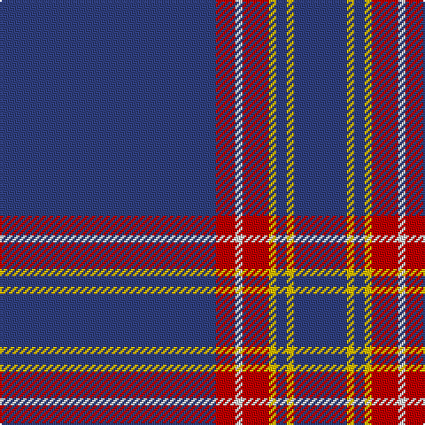

In pattern [BRWRYBYB](/stripes/brwrybyb/).

This was sourced from weddslist.  It is a [8 stripe tartan](/stripes/stripes8/).

Original link http://www.weddslist.com/cgi-bin/tartans/pg.pl?source=sts

## Thread count
B/122 R11 LN4 R15 Y4 B6 Y4 B/30

## Palette
Each colour and the base-6 reference it is a variant of.

| Colour | Shade | Base |
|---|---|---|
| B | <code style="background-color:#304080;">#304080</code> `oklch(39.4% 0.109 270.2)` <small>#304080</small> | B <code style="background-color:#2A418A;">#2A418A</code> |
| LN | <code style="background-color:#E0E0E0;">#E0E0E0</code> `oklch(90.7% 0.000 89.9)` <small>#E0E0E0</small> | W <code style="background-color:#F7F7F7;">#F7F7F7</code> |
| R | <code style="background-color:#C00000;">#C00000</code> `oklch(50.7% 0.208 29.2)` <small>#C00000</small> | R <code style="background-color:#CC0000;">#CC0000</code> |
| Y | <code style="background-color:#F0C000;">#F0C000</code> `oklch(82.7% 0.169 90.5)` <small>#F0C000</small> | Y <code style="background-color:#F2BF00;">#F2BF00</code> |

# Sample pattern

## Nearest tartans

The nearest existing variants by ΔTartan distance, with this tartan at the top so the swatches line up against it.

ΔTartan

Tartan

Sett

—

<a href="/ttd/edit/#slug=db122r11w4r15ly4db6ly4db30">Inverness, Duke of York</a> <a class="nn-out" href="/setts/s8/db122r11w4r15ly4db6ly4db30/" title="open its dictionary page">↗</a>

1.04

<a href="/ttd/edit/#slug=dt35ly1dt3ly1dt3ly1dt20r6w1r5~x2">Alpha Chi Sigma Fraternity</a> <a class="nn-out" href="/setts/s10/dt35ly1dt3ly1dt3ly1dt20r6w1r5~x2/" title="open its dictionary page">↗</a>

1.18

<a href="/ttd/edit/#slug=db32r3db4k1ly3~x2">MacLaine of Lochbuie, hunting</a> <a class="nn-out" href="/setts/s5/db32r3db4k1ly3~x2/" title="open its dictionary page">↗</a>

1.25

<a href="/ttd/edit/#slug=db48w2db7w2db7w2db20t11r2~x2">RAAF #4</a> <a class="nn-out" href="/setts/s9/db48w2db7w2db7w2db20t11r2~x2/" title="open its dictionary page">↗</a>

1.42

<a href="/ttd/edit/#slug=w2db49r5ly2r5ly2~x2">Balmer (Personal)</a> <a class="nn-out" href="/setts/s6/w2db49r5ly2r5ly2~x2/" title="open its dictionary page">↗</a>

1.43

<a href="/ttd/edit/#slug=db7dt5lr6dt5r7dt2db2dt70lr2">United States Trade sett Tartan Tartan Number: 2126. Earliest known date: 1989 This design is different in warp and weft. The display gives the general appearance only. Produced to celebrate American tourism is Scotland. The colours are taken from the flags of the two nations and the Atlantic Ocean that separates them. See products available Copyright © Blair Urquhart, Comrie, 2015</a> <a class="nn-out" href="/setts/s9/db7dt5lr6dt5r7dt2db2dt70lr2/" title="open its dictionary page">↗</a>

1.46

<a href="/ttd/edit/#slug=db45ly3db10o4k1w2~x2">Wylie</a> <a class="nn-out" href="/setts/s6/db45ly3db10o4k1w2~x2/" title="open its dictionary page">↗</a>

1.48

<a href="/ttd/edit/#slug=db6lo2db7g4db3g6db2g4db39ly2~x2">Seletar Shipping (Corporate)</a> <a class="nn-out" href="/setts/s10/db6lo2db7g4db3g6db2g4db39ly2~x2/" title="open its dictionary page">↗</a>

1.49

<a href="/ttd/edit/#slug=b7db5w6db5r7db2b2db70w2">United States (Corporate)</a> <a class="nn-out" href="/setts/s9/b7db5w6db5r7db2b2db70w2/" title="open its dictionary page">↗</a>

1.54

<a href="/ttd/edit/#slug=b70db5b3w5b3w5b3r5b8~x2">Wyckoff, Ann Grainger Phillips</a> <a class="nn-out" href="/setts/s9/b70db5b3w5b3w5b3r5b8~x2/" title="open its dictionary page">↗</a>

1.59

<a href="/ttd/edit/#slug=db61w4db2w7p2g3ly2db16~x2">Boat of Garten (District)</a> <a class="nn-out" href="/setts/s8/db61w4db2w7p2g3ly2db16~x2/" title="open its dictionary page">↗</a>

## Neighbour map

Every grey dot is one of 14299 variants placed by the first two principal components of the ΔTartan feature space (44% of its variance). Red is this tartan; blue dots are its nearest — click one to open its page.

<svg viewBox="0 0 640 380" role="img" style="max-width:100%;height:auto;border:1px solid #e0e0e0;border-radius:4px;display:block" xmlns="http://www.w3.org/2000/svg"><image href="/nn/cloud.v1.png" width="640" height="380"/><a href="/setts/s10/dt35ly1dt3ly1dt3ly1dt20r6w1r5~x2/"><circle cx="559.6" cy="131.5" r="4" fill="#3465a4"><title>Alpha Chi Sigma Fraternity</title></circle></a><a href="/setts/s5/db32r3db4k1ly3~x2/"><circle cx="597.3" cy="164.2" r="4" fill="#3465a4"><title>MacLaine of Lochbuie, hunting</title></circle></a><a href="/setts/s9/db48w2db7w2db7w2db20t11r2~x2/"><circle cx="549.6" cy="157.8" r="4" fill="#3465a4"><title>RAAF #4</title></circle></a><a href="/setts/s6/w2db49r5ly2r5ly2~x2/"><circle cx="508.7" cy="140.4" r="4" fill="#3465a4"><title>Balmer (Personal)</title></circle></a><a href="/setts/s9/db7dt5lr6dt5r7dt2db2dt70lr2/"><circle cx="571.8" cy="136.2" r="4" fill="#3465a4"><title>United States Trade sett Tartan Tartan Number: 2126. Earliest known date: 1989 This design is different in warp and weft. The display gives the general appearance only. Produced to celebrate American tourism is Scotland. The colours are taken from the flags of the two nations and the Atlantic Ocean that separates them. See products available Copyright © Blair Urquhart, Comrie, 2015</title></circle></a><a href="/setts/s6/db45ly3db10o4k1w2~x2/"><circle cx="593.6" cy="123.9" r="4" fill="#3465a4"><title>Wylie</title></circle></a><a href="/setts/s10/db6lo2db7g4db3g6db2g4db39ly2~x2/"><circle cx="525.2" cy="163.2" r="4" fill="#3465a4"><title>Seletar Shipping (Corporate)</title></circle></a><a href="/setts/s9/b7db5w6db5r7db2b2db70w2/"><circle cx="525.5" cy="107.7" r="4" fill="#3465a4"><title>United States (Corporate)</title></circle></a><a href="/setts/s9/b70db5b3w5b3w5b3r5b8~x2/"><circle cx="559.8" cy="126.5" r="4" fill="#3465a4"><title>Wyckoff, Ann Grainger Phillips</title></circle></a><a href="/setts/s8/db61w4db2w7p2g3ly2db16~x2/"><circle cx="534.7" cy="111.4" r="4" fill="#3465a4"><title>Boat of Garten (District)</title></circle></a><circle cx="576.2" cy="137.7" r="5" fill="#c00000"/></svg>

ID: /setts/s8/db122r11w4r15ly4db6ly4db30/
