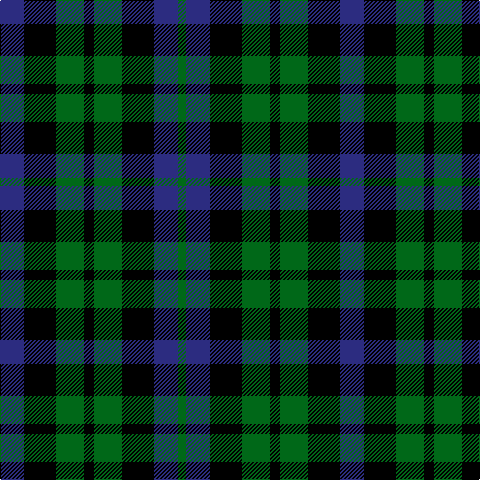

This page is one **sett** — a single exact thread-count. It belongs to the [tartan](/tartans/db12k16g14k5g14k16db12g4/)
(the same proportion at any scale), whose colour order is pattern [BKGKGKBG](/stripes/bkgkgkbg/).

Sourced from register-of-tartans.  It is a [8 stripe tartan](/stripes/stripes8/).

Original link https://www.tartanregister.gov.uk/tartanDetails.aspx?ref=3193

## Register references

External register numbers recorded for this tartan.

- Scottish Register of Tartans: [3193](https://www.tartanregister.gov.uk/tartanDetails.aspx?ref=3193)
- Scottish Tartans Authority (ITI): 5553

## Thread count
DBa/24 K32 G28 K10 G28 K32 DBa24 G/8

## Palette

Palette: <strong>Tartan Register</strong>
<table><thead><tr><th>Colour</th><th>Threads</th><th>Shade</th><th>Base</th><th>OKLCh</th></tr></thead><tbody><tr><td>DBa/</td><td style="text-align:right;font-variant-numeric:tabular-nums">24</td><td><code style="background-color:#2C2C80;">#2C2C80</code> <small style="color:#888">#2C2C80</small></td><td>B <code style="background-color:#2A418A;">#2A418A</code></td><td><small style="color:#888">oklch(35.0% 0.138 276.6)</small></td></tr><tr><td>K</td><td style="text-align:right;font-variant-numeric:tabular-nums">32</td><td><code style="background-color:#000000;">#000000</code> <small style="color:#888">#000000</small></td><td>K <code style="background-color:#000000;">#000000</code></td><td><small style="color:#888">oklch(0.0% 0.000 0.0)</small></td></tr><tr><td>G</td><td style="text-align:right;font-variant-numeric:tabular-nums">28</td><td><code style="background-color:#006818;">#006818</code> <small style="color:#888">#006818</small></td><td>G <code style="background-color:#006100;">#006100</code></td><td><small style="color:#888">oklch(45.0% 0.142 145.0)</small></td></tr><tr><td>K</td><td style="text-align:right;font-variant-numeric:tabular-nums">10</td><td><code style="background-color:#000000;">#000000</code> <small style="color:#888">#000000</small></td><td>K <code style="background-color:#000000;">#000000</code></td><td><small style="color:#888">oklch(0.0% 0.000 0.0)</small></td></tr><tr><td>G</td><td style="text-align:right;font-variant-numeric:tabular-nums">28</td><td><code style="background-color:#006818;">#006818</code> <small style="color:#888">#006818</small></td><td>G <code style="background-color:#006100;">#006100</code></td><td><small style="color:#888">oklch(45.0% 0.142 145.0)</small></td></tr><tr><td>K</td><td style="text-align:right;font-variant-numeric:tabular-nums">32</td><td><code style="background-color:#000000;">#000000</code> <small style="color:#888">#000000</small></td><td>K <code style="background-color:#000000;">#000000</code></td><td><small style="color:#888">oklch(0.0% 0.000 0.0)</small></td></tr><tr><td>DBa</td><td style="text-align:right;font-variant-numeric:tabular-nums">24</td><td><code style="background-color:#2C2C80;">#2C2C80</code> <small style="color:#888">#2C2C80</small></td><td>B <code style="background-color:#2A418A;">#2A418A</code></td><td><small style="color:#888">oklch(35.0% 0.138 276.6)</small></td></tr><tr><td>G/</td><td style="text-align:right;font-variant-numeric:tabular-nums">8</td><td><code style="background-color:#006818;">#006818</code> <small style="color:#888">#006818</small></td><td>G <code style="background-color:#006100;">#006100</code></td><td><small style="color:#888">oklch(45.0% 0.142 145.0)</small></td></tr></tbody></table>

# Sample pattern

## Nearest tartans

The nearest existing variants by ΔTartan distance, with this tartan at the top so the swatches line up against it.

ΔTartan

Tartan

Sett

—

<a href="/ttd/edit/#slug=db12k16g14k5g14k16db12g4~x2">Norwich No.064</a> <a class="nn-out" href="/setts/s8/db12k16g14k5g14k16db12g4~x2/" title="open its dictionary page">↗</a>

1.03

<a href="/ttd/edit/#slug=k3g4k1g4k3db4k1~x2">Unnamed, No 63</a> <a class="nn-out" href="/setts/s7/k3g4k1g4k3db4k1~x2/" title="open its dictionary page">↗</a>

1.04

<a href="/ttd/edit/#slug=db4k3g4k1g4k3g4k1g4k3db4k1~x2">Norwich No.063</a> <a class="nn-out" href="/setts/s12/db4k3g4k1g4k3g4k1g4k3db4k1~x2/" title="open its dictionary page">↗</a>

1.04

<a href="/ttd/edit/#slug=k4dg4lb1dg4k4db4k1~x2">Graham of Montrose</a> <a class="nn-out" href="/setts/s7/k4dg4lb1dg4k4db4k1~x2/" title="open its dictionary page">↗</a>

1.06

<a href="/ttd/edit/#slug=k1g3k3db3k1db1~x4">Sutherland, 42nd</a> <a class="nn-out" href="/setts/s6/k1g3k3db3k1db1~x4/" title="open its dictionary page">↗</a>

1.08

<a href="/ttd/edit/#slug=k9g9ly2g9k9db9k3~x2">Campbell of Breadalbane (Clan)</a> <a class="nn-out" href="/setts/s7/k9g9ly2g9k9db9k3~x2/" title="open its dictionary page">↗</a>

1.10

<a href="/ttd/edit/#slug=k9dg9ly2dg9k9db9k3">Campbell Breadalbane</a> <a class="nn-out" href="/setts/s7/k9dg9ly2dg9k9db9k3/" title="open its dictionary page">↗</a>

1.12

<a href="/ttd/edit/#slug=k4dg4lr1dg4k4db4k1~x2">Graham of Montrose</a> <a class="nn-out" href="/setts/s7/k4dg4lr1dg4k4db4k1~x2/" title="open its dictionary page">↗</a>

1.16

<a href="/ttd/edit/#slug=g8k7db8r2db8k7g8k2~x2">Denholm</a> <a class="nn-out" href="/setts/s8/g8k7db8r2db8k7g8k2~x2/" title="open its dictionary page">↗</a>

1.18

<a href="/ttd/edit/#slug=k9dg9ly2dg9k9db9k3~x2">Campbell of Breadalbane</a> <a class="nn-out" href="/setts/s7/k9dg9ly2dg9k9db9k3~x2/" title="open its dictionary page">↗</a>

1.23

<a href="/ttd/edit/#slug=db6k6db18k18g22k5">Campbell, the 42nd</a> <a class="nn-out" href="/setts/s6/db6k6db18k18g22k5/" title="open its dictionary page">↗</a>

## Neighbour map

Every grey dot is one of 14359 variants placed by the first two principal components of the ΔTartan feature space (44% of its variance). Red is this tartan; blue dots are its nearest — click one to open its page.

<svg viewBox="0 0 640 380" role="img" style="max-width:100%;height:auto;border:1px solid #e0e0e0;border-radius:4px;display:block" xmlns="http://www.w3.org/2000/svg"><image href="/nn/cloud.v1.png" width="640" height="380"/><a href="/setts/s7/k3g4k1g4k3db4k1~x2/"><circle cx="140.2" cy="298.8" r="4" fill="#3465a4"><title>Unnamed, No 63</title></circle></a><a href="/setts/s12/db4k3g4k1g4k3g4k1g4k3db4k1~x2/"><circle cx="152.8" cy="286.5" r="4" fill="#3465a4"><title>Norwich No.063</title></circle></a><a href="/setts/s7/k4dg4lb1dg4k4db4k1~x2/"><circle cx="134.6" cy="293.8" r="4" fill="#3465a4"><title>Graham of Montrose</title></circle></a><a href="/setts/s6/k1g3k3db3k1db1~x4/"><circle cx="148.8" cy="308.7" r="4" fill="#3465a4"><title>Sutherland, 42nd</title></circle></a><a href="/setts/s7/k9g9ly2g9k9db9k3~x2/"><circle cx="129.1" cy="283.5" r="4" fill="#3465a4"><title>Campbell of Breadalbane (Clan)</title></circle></a><a href="/setts/s7/k9dg9ly2dg9k9db9k3/"><circle cx="143.2" cy="293.0" r="4" fill="#3465a4"><title>Campbell Breadalbane</title></circle></a><a href="/setts/s7/k4dg4lr1dg4k4db4k1~x2/"><circle cx="145.9" cy="299.0" r="4" fill="#3465a4"><title>Graham of Montrose</title></circle></a><a href="/setts/s8/g8k7db8r2db8k7g8k2~x2/"><circle cx="87.3" cy="286.1" r="4" fill="#3465a4"><title>Denholm</title></circle></a><a href="/setts/s7/k9dg9ly2dg9k9db9k3~x2/"><circle cx="155.4" cy="299.1" r="4" fill="#3465a4"><title>Campbell of Breadalbane</title></circle></a><a href="/setts/s6/db6k6db18k18g22k5/"><circle cx="154.6" cy="287.0" r="4" fill="#3465a4"><title>Campbell, the 42nd</title></circle></a><circle cx="138.1" cy="308.7" r="5" fill="#c00000"/></svg>

ID: /setts/s8/db12k16g14k5g14k16db12g4~x2/
