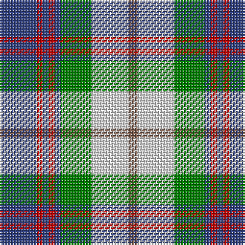

In pattern [BRBRBGWR](/stripes/brbrbgwr/).

This was sourced from weddslist.  It is a [8 stripe tartan](/stripes/stripes8/).

Original link http://www.weddslist.com/cgi-bin/tartans/pg.pl?source=sts

## Thread count
B/24 R4 B4 R4 B4 G20 LN24 LT/6

## Palette
Each colour and the base-6 reference it is a variant of.

| Colour | Shade | Base |
|---|---|---|
| B | <code style="background-color:#304080;">#304080</code> `oklch(39.4% 0.109 270.2)` <small>#304080</small> | B <code style="background-color:#2A418A;">#2A418A</code> |
| G | <code style="background-color:#008000;">#008000</code> `oklch(52.0% 0.177 142.5)` <small>#008000</small> | G <code style="background-color:#006100;">#006100</code> |
| LN | <code style="background-color:#E0E0E0;">#E0E0E0</code> `oklch(90.7% 0.000 89.9)` <small>#E0E0E0</small> | W <code style="background-color:#F7F7F7;">#F7F7F7</code> |
| LT | <code style="background-color:#806050;">#806050</code> `oklch(51.7% 0.049 47.8)` <small>#806050</small> | R <code style="background-color:#CC0000;">#CC0000</code> |
| R | <code style="background-color:#C00000;">#C00000</code> `oklch(50.7% 0.208 29.2)` <small>#C00000</small> | R <code style="background-color:#CC0000;">#CC0000</code> |

# Sample pattern

## Nearest tartans

The nearest existing variants by ΔTartan distance.

1. [Vermont Dress](/setts/s8/g1w1g6db5w6r1g1lo1~x4/) — ΔT 0.72
1. [Ship Hector](/setts/s8/k4db9ly6db22g4w20g6w4/) — ΔT 0.89
1. [Fraser, Red dress](/setts/s7/r4db18r4g19w25r10w4~x2/) — ΔT 0.95
1. [Fraser Red Dress](/setts/s7/r4db18r4dg19w25r10w4~x2/) — ΔT 1.00
1. [Business Air](/setts/s8/b4ly2b16db15g16w3g3w4~x2/) — ΔT 1.04
1. [Fitzpatrick](/setts/s11/w6ly2w2ly3w11g11b2k12b3k6w2~x2/) — ΔT 1.05
1. [Alexander Brothers - 2007? (Corp.)](/setts/s8/g5ly2t20w2k20w20k2w5~x2/) — ΔT 1.06
1. [Northern Ontario](/setts/s7/dy17g5db2w12db2ly4g7~x4/) — ΔT 1.07
1. [Lobban (Personal)](/setts/s10/ly5g2r2g12k9t12r2t2r2t2~x2/) — ΔT 1.09
1. [Elora (District)](/setts/s8/dt2g2dt11o2w8t12ly2t2~x2/) — ΔT 1.14

## Neighbour map

Every grey dot is one of 14299 variants placed by the first two principal components of the ΔTartan feature space (44% of its variance). Red is this tartan; blue dots are its nearest — click one to open its page.

<svg viewBox="0 0 640 380" role="img" style="max-width:100%;height:auto;border:1px solid #e0e0e0;border-radius:4px;display:block" xmlns="http://www.w3.org/2000/svg"><image href="/nn/cloud.v1.png" width="640" height="380"/><a href="/setts/s8/g1w1g6db5w6r1g1lo1~x4/"><circle cx="111.0" cy="180.0" r="4" fill="#3465a4"><title>Vermont Dress</title></circle></a><a href="/setts/s8/k4db9ly6db22g4w20g6w4/"><circle cx="115.2" cy="188.2" r="4" fill="#3465a4"><title>Ship Hector</title></circle></a><a href="/setts/s7/r4db18r4g19w25r10w4~x2/"><circle cx="86.6" cy="192.6" r="4" fill="#3465a4"><title>Fraser, Red dress</title></circle></a><a href="/setts/s7/r4db18r4dg19w25r10w4~x2/"><circle cx="86.0" cy="191.0" r="4" fill="#3465a4"><title>Fraser Red Dress</title></circle></a><a href="/setts/s8/b4ly2b16db15g16w3g3w4~x2/"><circle cx="95.4" cy="181.6" r="4" fill="#3465a4"><title>Business Air</title></circle></a><a href="/setts/s11/w6ly2w2ly3w11g11b2k12b3k6w2~x2/"><circle cx="70.0" cy="171.1" r="4" fill="#3465a4"><title>Fitzpatrick</title></circle></a><a href="/setts/s8/g5ly2t20w2k20w20k2w5~x2/"><circle cx="120.7" cy="153.5" r="4" fill="#3465a4"><title>Alexander Brothers - 2007? (Corp.)</title></circle></a><a href="/setts/s7/dy17g5db2w12db2ly4g7~x4/"><circle cx="103.4" cy="175.6" r="4" fill="#3465a4"><title>Northern Ontario</title></circle></a><a href="/setts/s10/ly5g2r2g12k9t12r2t2r2t2~x2/"><circle cx="91.9" cy="183.1" r="4" fill="#3465a4"><title>Lobban (Personal)</title></circle></a><a href="/setts/s8/dt2g2dt11o2w8t12ly2t2~x2/"><circle cx="82.4" cy="170.1" r="4" fill="#3465a4"><title>Elora (District)</title></circle></a><circle cx="106.2" cy="185.5" r="5" fill="#c00000"/></svg>

ID: /setts/s8/db12r2db2r2db2g10w12o3~x2/
