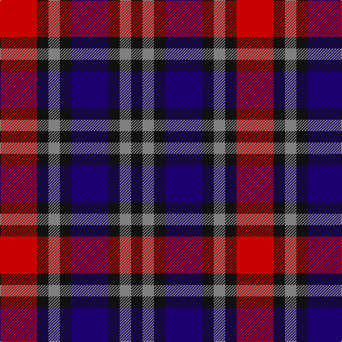

This page is one **sett** — a single exact thread-count. It belongs to the [tartan](/tartans/db13k4n4k4r13/)
(the same proportion at any scale), whose colour order is pattern [KGKBKGKR](/stripes/kgkbkgkr/).

Sourced from register-of-tartans.  It is a [8 stripe tartan](/stripes/stripes8/).

Original link https://www.tartanregister.gov.uk/tartanDetails.aspx?ref=668

## Register references

External register numbers recorded for this tartan.

- Scottish Register of Tartans: [668](https://www.tartanregister.gov.uk/tartanDetails.aspx?ref=668)
- Scottish Tartans Authority (ITI): 4094

## Thread count
R/52 K16 N16 K16 DB52 K16 N16 K/16

## Palette
Each colour and the base-6 reference it is a variant of.

| Colour | Shade | Base |
|---|---|---|
| DB | <code style="background-color:#1C0070;">#1C0070</code> `oklch(26.3% 0.162 277.1)` <small>#1C0070</small> | B <code style="background-color:#2A418A;">#2A418A</code> |
| K | <code style="background-color:#101010;">#101010</code> `oklch(17.3% 0.000 89.9)` <small>#101010</small> | K <code style="background-color:#000000;">#000000</code> |
| N | <code style="background-color:#808080;">#808080</code> `oklch(60.0% 0.000 89.9)` <small>#808080</small> | G <code style="background-color:#006100;">#006100</code> |
| R | <code style="background-color:#C80000;">#C80000</code> `oklch(52.3% 0.215 29.2)` <small>#C80000</small> | R <code style="background-color:#CC0000;">#CC0000</code> |

# Sample pattern

## Nearest tartans

The nearest existing variants by ΔTartan distance, with this tartan at the top so the swatches line up against it.

ΔTartan

Tartan

Sett

—

<a href="/ttd/edit/#slug=db13k4y4k4r13~x4">Clark, Red</a> <a class="nn-out" href="/setts/s8/db13k4y4k4r13~x4/" title="open its dictionary page">↗</a>

1.06

<a href="/ttd/edit/#slug=r2k4r2k4db1lb1db4r1~x4">MacKean Red (Personal)</a> <a class="nn-out" href="/setts/s8/r2k4r2k4db1lb1db4r1~x4/" title="open its dictionary page">↗</a>

1.09

<a href="/ttd/edit/#slug=k1dg3k3r1db3r1db1r3dg1k1~x4">MacInroy</a> <a class="nn-out" href="/setts/s10/k1dg3k3r1db3r1db1r3dg1k1~x4/" title="open its dictionary page">↗</a>

1.12

<a href="/ttd/edit/#slug=k1g3k3r1db3r1db1r3g1k1~x8">MacInroy (Clan)</a> <a class="nn-out" href="/setts/s10/k1g3k3r1db3r1db1r3g1k1~x8/" title="open its dictionary page">↗</a>

1.15

<a href="/ttd/edit/#slug=k1g3k3r1dp3r1dp1r3g1k1~x4">MacInroy Clan Tartan Tartan Number: 1081. Earliest known date: 1819 The pattern books of the old firm of weavers, Wilson's of Bannockburn, provide a reliable early source for this tartan. Wilson's were in business with a monopoly to supply tartan to the regiments in the second half of the 18th century before this pattern was recorded. See products available Copyright © Blair Urquhart, Comrie, 2015</a> <a class="nn-out" href="/setts/s10/k1g3k3r1dp3r1dp1r3g1k1~x4/" title="open its dictionary page">↗</a>

1.21

<a href="/ttd/edit/#slug=r3k1dg1k1b3~x8">Clark</a> <a class="nn-out" href="/setts/s5/r3k1dg1k1b3~x8/" title="open its dictionary page">↗</a>

1.21

<a href="/ttd/edit/#slug=r3k1dg1k1b3~x4">Clark</a> <a class="nn-out" href="/setts/s5/r3k1dg1k1b3~x4/" title="open its dictionary page">↗</a>

1.42

<a href="/ttd/edit/#slug=r3t4k11r11g11do3r3~x4">Stewart /Stuart- Fragment Cf 1452 &amp; 1445</a> <a class="nn-out" href="/setts/s7/r3t4k11r11g11do3r3~x4/" title="open its dictionary page">↗</a>

1.44

<a href="/ttd/edit/#slug=db5k1dg1k1r3k1~x4">Clerk</a> <a class="nn-out" href="/setts/s6/db5k1dg1k1r3k1~x4/" title="open its dictionary page">↗</a>

1.47

<a href="/ttd/edit/#slug=r7db20r4k18o20dp5~x2">Williamson (Personal)</a> <a class="nn-out" href="/setts/s6/r7db20r4k18o20dp5~x2/" title="open its dictionary page">↗</a>

1.49

<a href="/ttd/edit/#slug=dp13n8w5dg24w5n10w5n10~x2">Chaudhri, Zafar Iqbal</a> <a class="nn-out" href="/setts/s8/dp13n8w5dg24w5n10w5n10~x2/" title="open its dictionary page">↗</a>

## Neighbour map

Every grey dot is one of 14299 variants placed by the first two principal components of the ΔTartan feature space (44% of its variance). Red is this tartan; blue dots are its nearest — click one to open its page.

<svg viewBox="0 0 640 380" role="img" style="max-width:100%;height:auto;border:1px solid #e0e0e0;border-radius:4px;display:block" xmlns="http://www.w3.org/2000/svg"><image href="/nn/cloud.v1.png" width="640" height="380"/><a href="/setts/s8/r2k4r2k4db1lb1db4r1~x4/"><circle cx="156.7" cy="253.4" r="4" fill="#3465a4"><title>MacKean Red (Personal)</title></circle></a><a href="/setts/s10/k1dg3k3r1db3r1db1r3dg1k1~x4/"><circle cx="77.3" cy="258.0" r="4" fill="#3465a4"><title>MacInroy</title></circle></a><a href="/setts/s10/k1g3k3r1db3r1db1r3g1k1~x8/"><circle cx="77.0" cy="258.9" r="4" fill="#3465a4"><title>MacInroy (Clan)</title></circle></a><a href="/setts/s10/k1g3k3r1dp3r1dp1r3g1k1~x4/"><circle cx="80.7" cy="253.7" r="4" fill="#3465a4"><title>MacInroy Clan Tartan Tartan Number: 1081. Earliest known date: 1819 The pattern books of the old firm of weavers, Wilson's of Bannockburn, provide a reliable early source for this tartan. Wilson's were in business with a monopoly to supply tartan to the regiments in the second half of the 18th century before this pattern was recorded. See products available Copyright © Blair Urquhart, Comrie, 2015</title></circle></a><a href="/setts/s5/r3k1dg1k1b3~x8/"><circle cx="100.6" cy="277.4" r="4" fill="#3465a4"><title>Clark</title></circle></a><a href="/setts/s5/r3k1dg1k1b3~x4/"><circle cx="100.6" cy="277.4" r="4" fill="#3465a4"><title>Clark</title></circle></a><a href="/setts/s7/r3t4k11r11g11do3r3~x4/"><circle cx="97.6" cy="233.3" r="4" fill="#3465a4"><title>Stewart /Stuart- Fragment Cf 1452 &amp; 1445</title></circle></a><a href="/setts/s6/db5k1dg1k1r3k1~x4/"><circle cx="195.5" cy="242.1" r="4" fill="#3465a4"><title>Clerk</title></circle></a><a href="/setts/s6/r7db20r4k18o20dp5~x2/"><circle cx="79.5" cy="239.7" r="4" fill="#3465a4"><title>Williamson (Personal)</title></circle></a><a href="/setts/s8/dp13n8w5dg24w5n10w5n10~x2/"><circle cx="108.6" cy="231.1" r="4" fill="#3465a4"><title>Chaudhri, Zafar Iqbal</title></circle></a><circle cx="105.0" cy="251.6" r="5" fill="#c00000"/></svg>

ID: /setts/s8/db13k4y4k4r13~x4/
