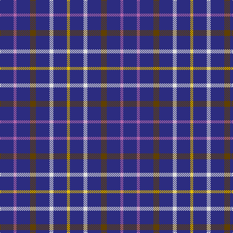

In pattern [BRBGBWBY](/stripes/brbgbwby/).

This was sourced from tartans-authority.  It is a [8 stripe tartan](/stripes/stripes8/).

Original link http://www.tartansauthority.com/tartan-ferret/display/8117/

## Thread count
DB/28 P6 DB28 T12 DB28 LN8 DB28 Y/6

## Palette
Each colour and the base-6 reference it is a variant of.

| Colour | Shade | Base |
|---|---|---|
| DB | <code style="background-color:#2C2C80;">#2C2C80</code> `oklch(35.0% 0.138 276.6)` <small>#2C2C80</small> | B <code style="background-color:#2A418A;">#2A418A</code> |
| LN | <code style="background-color:#E0E0E0;">#E0E0E0</code> `oklch(90.7% 0.000 89.9)` <small>#E0E0E0</small> | W <code style="background-color:#F7F7F7;">#F7F7F7</code> |
| P | <code style="background-color:#B468AC;">#B468AC</code> `oklch(62.5% 0.131 330.9)` <small>#B468AC</small> | R <code style="background-color:#CC0000;">#CC0000</code> |
| T | <code style="background-color:#604000;">#604000</code> `oklch(39.8% 0.083 76.8)` <small>#604000</small> | G <code style="background-color:#006100;">#006100</code> |
| Y | <code style="background-color:#E8C000;">#E8C000</code> `oklch(81.9% 0.168 93.7)` <small>#E8C000</small> | Y <code style="background-color:#F2BF00;">#F2BF00</code> |

# Sample pattern

## Nearest tartans

The nearest existing variants by ΔTartan distance.

1. [Abertay University (Estimated threadcount)](/setts/s6/r5db15g3db15ly3db3~x2/) — ΔT 1.42
1. [Maud, Mary](/setts/s8/db65k9db21ly8db21w8db35r35/) — ΔT 1.77
1. [De Grussa](/setts/s6/db24w4db24ly4r5k4~x2/) — ΔT 1.82
1. [de Grussa (Personal)](/setts/s6/db24w4db24lo4r5k4~x2/) — ΔT 1.91
1. [Louisville Fire & Rescue P&D](/setts/s9/w1db8r3db2r1db2r3db8lo1~x4/) — ΔT 2.16
1. [Royal National Lifeboat Inst. (Corp)](/setts/s13/db15w2db15ly2db15r2db15ly2db15w2db15r4k2~x2/) — ΔT 2.19
1. [Bukowski-Jackson (Personal)](/setts/s10/dt30t5dt5lp5dt10w4r4dt10g5dt10~x2/) — ΔT 2.34
1. [Baptist Union of Scotland](/setts/s6/lo4db23k4g16db23lb4/) — ΔT 2.35
1. [Parker (USA)](/setts/s14/db4r6db16w4db4w4db4w4db16lo2db16r6w3db4~x2/) — ΔT 2.41
1. [Digital](/setts/s10/b6k3b10o5b2o2b2o2b7w2~x2/) — ΔT 2.45

## Neighbour map

Every grey dot is one of 14299 variants placed by the first two principal components of the ΔTartan feature space (44% of its variance). Red is this tartan; blue dots are its nearest — click one to open its page.

<svg viewBox="0 0 640 380" role="img" style="max-width:100%;height:auto;border:1px solid #e0e0e0;border-radius:4px;display:block" xmlns="http://www.w3.org/2000/svg"><image href="/nn/cloud.v1.png" width="640" height="380"/><a href="/setts/s6/r5db15g3db15ly3db3~x2/"><circle cx="401.5" cy="255.1" r="4" fill="#3465a4"><title>Abertay University (Estimated threadcount)</title></circle></a><a href="/setts/s8/db65k9db21ly8db21w8db35r35/"><circle cx="350.1" cy="203.8" r="4" fill="#3465a4"><title>Maud, Mary</title></circle></a><a href="/setts/s6/db24w4db24ly4r5k4~x2/"><circle cx="360.0" cy="213.4" r="4" fill="#3465a4"><title>De Grussa</title></circle></a><a href="/setts/s6/db24w4db24lo4r5k4~x2/"><circle cx="377.3" cy="220.5" r="4" fill="#3465a4"><title>de Grussa (Personal)</title></circle></a><a href="/setts/s9/w1db8r3db2r1db2r3db8lo1~x4/"><circle cx="382.3" cy="207.3" r="4" fill="#3465a4"><title>Louisville Fire &amp; Rescue P&amp;D</title></circle></a><a href="/setts/s13/db15w2db15ly2db15r2db15ly2db15w2db15r4k2~x2/"><circle cx="464.2" cy="197.1" r="4" fill="#3465a4"><title>Royal National Lifeboat Inst. (Corp)</title></circle></a><a href="/setts/s10/dt30t5dt5lp5dt10w4r4dt10g5dt10~x2/"><circle cx="351.5" cy="177.1" r="4" fill="#3465a4"><title>Bukowski-Jackson (Personal)</title></circle></a><a href="/setts/s6/lo4db23k4g16db23lb4/"><circle cx="274.8" cy="234.8" r="4" fill="#3465a4"><title>Baptist Union of Scotland</title></circle></a><a href="/setts/s14/db4r6db16w4db4w4db4w4db16lo2db16r6w3db4~x2/"><circle cx="329.8" cy="183.4" r="4" fill="#3465a4"><title>Parker (USA)</title></circle></a><a href="/setts/s10/b6k3b10o5b2o2b2o2b7w2~x2/"><circle cx="303.5" cy="226.1" r="4" fill="#3465a4"><title>Digital</title></circle></a><circle cx="376.3" cy="250.8" r="5" fill="#c00000"/></svg>

ID: /setts/s8/db14m3db14dy6db14w4db14ly3~x2/
