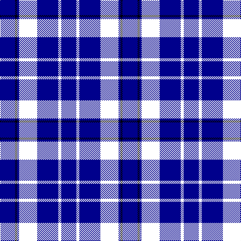

This page is one **sett** — a single exact thread-count. It belongs to the [tartan](/tartans/db15ki3db21ki3ki15db2k2db15/)
(the same proportion at any scale), whose colour order is pattern [BKBKKBKB](/stripes/bkbkkbkb/).

Sourced from tartans-authority.  It is a [8 stripe tartan](/stripes/stripes8/).

Original link http://www.tartansauthority.com/tartan-ferret/display/5506/

## Register references

External register numbers recorded for this tartan.

- Scottish Tartans Authority (ITI): 5506

## Thread count
DB/30 K4 DBa4 WY30 R6 DB42 R6 DBa/30

## Palette

Palette: <strong>Tartan Register</strong>
<table><thead><tr><th>Colour</th><th>Threads</th><th>Shade</th><th>Base</th><th>OKLCh</th></tr></thead><tbody><tr><td>DB/</td><td style="text-align:right;font-variant-numeric:tabular-nums">30</td><td><code style="background-color:#00008C;">#00008C</code> <small style="color:#888">#00008C</small></td><td>B <code style="background-color:#2A418A;">#2A418A</code></td><td><small style="color:#888">oklch(28.9% 0.200 264.1)</small></td></tr><tr><td>K</td><td style="text-align:right;font-variant-numeric:tabular-nums">4</td><td><code style="background-color:#000000;">#000000</code> <small style="color:#888">#000000</small></td><td>K <code style="background-color:#000000;">#000000</code></td><td><small style="color:#888">oklch(0.0% 0.000 0.0)</small></td></tr><tr><td>DBa</td><td style="text-align:right;font-variant-numeric:tabular-nums">4</td><td><code style="background-color:#00008C;">#00008C</code> <small style="color:#888">#00008C</small></td><td>B <code style="background-color:#2A418A;">#2A418A</code></td><td><small style="color:#888">oklch(28.9% 0.200 264.1)</small></td></tr><tr><td></td><td style="text-align:right;font-variant-numeric:tabular-nums">30</td><td><code style="background-color:;"></code> <small style="color:#888"></small></td><td> <code style="background-color:;"></code></td><td><small style="color:#888"></small></td></tr><tr><td></td><td style="text-align:right;font-variant-numeric:tabular-nums">6</td><td><code style="background-color:;"></code> <small style="color:#888"></small></td><td> <code style="background-color:;"></code></td><td><small style="color:#888"></small></td></tr><tr><td>DB</td><td style="text-align:right;font-variant-numeric:tabular-nums">42</td><td><code style="background-color:#00008C;">#00008C</code> <small style="color:#888">#00008C</small></td><td>B <code style="background-color:#2A418A;">#2A418A</code></td><td><small style="color:#888">oklch(28.9% 0.200 264.1)</small></td></tr><tr><td></td><td style="text-align:right;font-variant-numeric:tabular-nums">6</td><td><code style="background-color:;"></code> <small style="color:#888"></small></td><td> <code style="background-color:;"></code></td><td><small style="color:#888"></small></td></tr><tr><td>DBa/</td><td style="text-align:right;font-variant-numeric:tabular-nums">30</td><td><code style="background-color:#00008C;">#00008C</code> <small style="color:#888">#00008C</small></td><td>B <code style="background-color:#2A418A;">#2A418A</code></td><td><small style="color:#888">oklch(28.9% 0.200 264.1)</small></td></tr></tbody></table>

# Sample pattern

## Nearest tartans

The nearest existing variants by ΔTartan distance, with this tartan at the top so the swatches line up against it.

ΔTartan

Tartan

Sett

—

<a href="/ttd/edit/#slug=db15ki3db21ki3ki15db2k2db15~x2">Loyalhanna (District?)</a> <a class="nn-out" href="/setts/s8/db15ki3db21ki3ki15db2k2db15~x2/" title="open its dictionary page">↗</a>

1.48

<a href="/ttd/edit/#slug=dbi16k16db16w3db16k2t3~x2">St. Andrew Society</a> <a class="nn-out" href="/setts/s7/dbi16k16db16w3db16k2t3~x2/" title="open its dictionary page">↗</a>

1.66

<a href="/ttd/edit/#slug=db38w3db8dbi36dg9r3~x2">Waters of Georgian Bay (District)</a> <a class="nn-out" href="/setts/s6/db38w3db8dbi36dg9r3~x2/" title="open its dictionary page">↗</a>

1.83

<a href="/ttd/edit/#slug=t6db10dp4db12dg19dp4dg8k20db50t4">Spirit of Alva</a> <a class="nn-out" href="/setts/s10/t6db10dp4db12dg19dp4dg8k20db50t4/" title="open its dictionary page">↗</a>

1.92

<a href="/ttd/edit/#slug=lo3db25dbi4db4dbi4db4dbi25g4dp4o2~x2">Blue Peter</a> <a class="nn-out" href="/setts/s10/lo3db25dbi4db4dbi4db4dbi25g4dp4o2~x2/" title="open its dictionary page">↗</a>

1.94

<a href="/ttd/edit/#slug=db15dp3db30k22dg18dp3dg3w3~x2">Moray (Corporate)</a> <a class="nn-out" href="/setts/s8/db15dp3db30k22dg18dp3dg3w3~x2/" title="open its dictionary page">↗</a>

1.97

<a href="/ttd/edit/#slug=db30dbi3db3dbi3db3dbi10k10dg20k2w4~x2">St. Kentigern College (Corporate)</a> <a class="nn-out" href="/setts/s10/db30dbi3db3dbi3db3dbi10k10dg20k2w4~x2/" title="open its dictionary page">↗</a>

2.01

<a href="/ttd/edit/#slug=dp6dt4k4dt26k12dp3db42ly4db4">Goldblatt, Joe, Jeff (Personal)</a> <a class="nn-out" href="/setts/s9/dp6dt4k4dt26k12dp3db42ly4db4/" title="open its dictionary page">↗</a>

2.02

<a href="/ttd/edit/#slug=dbi4w3dbi4dp3dbi3dp3dbi15db8dbi11db28ly2~x2">Kilmarnock F.C. (Sports)</a> <a class="nn-out" href="/setts/s11/dbi4w3dbi4dp3dbi3dp3dbi15db8dbi11db28ly2~x2/" title="open its dictionary page">↗</a>

2.04

<a href="/ttd/edit/#slug=db2dr5db8ly2dr3dbii9dr2db18dbii9dbi4w2~x2">Royal Gourock Yacht Club, The</a> <a class="nn-out" href="/setts/s11/db2dr5db8ly2dr3dbii9dr2db18dbii9dbi4w2~x2/" title="open its dictionary page">↗</a>

2.12

<a href="/ttd/edit/#slug=oi5db12dbi4o4dbi22db3dbi4oi5">Daks, Muted blue</a> <a class="nn-out" href="/setts/s8/oi5db12dbi4o4dbi22db3dbi4oi5/" title="open its dictionary page">↗</a>

## Neighbour map

Every grey dot is one of 14359 variants placed by the first two principal components of the ΔTartan feature space (44% of its variance). Red is this tartan; blue dots are its nearest — click one to open its page.

<svg viewBox="0 0 640 380" role="img" style="max-width:100%;height:auto;border:1px solid #e0e0e0;border-radius:4px;display:block" xmlns="http://www.w3.org/2000/svg"><image href="/nn/cloud.v1.png" width="640" height="380"/><a href="/setts/s7/dbi16k16db16w3db16k2t3~x2/"><circle cx="215.8" cy="246.0" r="4" fill="#3465a4"><title>St. Andrew Society</title></circle></a><a href="/setts/s6/db38w3db8dbi36dg9r3~x2/"><circle cx="307.7" cy="221.4" r="4" fill="#3465a4"><title>Waters of Georgian Bay (District)</title></circle></a><a href="/setts/s10/t6db10dp4db12dg19dp4dg8k20db50t4/"><circle cx="306.9" cy="191.4" r="4" fill="#3465a4"><title>Spirit of Alva</title></circle></a><a href="/setts/s10/lo3db25dbi4db4dbi4db4dbi25g4dp4o2~x2/"><circle cx="259.5" cy="171.2" r="4" fill="#3465a4"><title>Blue Peter</title></circle></a><a href="/setts/s8/db15dp3db30k22dg18dp3dg3w3~x2/"><circle cx="255.2" cy="218.1" r="4" fill="#3465a4"><title>Moray (Corporate)</title></circle></a><a href="/setts/s10/db30dbi3db3dbi3db3dbi10k10dg20k2w4~x2/"><circle cx="244.5" cy="184.1" r="4" fill="#3465a4"><title>St. Kentigern College (Corporate)</title></circle></a><a href="/setts/s9/dp6dt4k4dt26k12dp3db42ly4db4/"><circle cx="289.0" cy="191.6" r="4" fill="#3465a4"><title>Goldblatt, Joe, Jeff (Personal)</title></circle></a><a href="/setts/s11/dbi4w3dbi4dp3dbi3dp3dbi15db8dbi11db28ly2~x2/"><circle cx="303.3" cy="189.2" r="4" fill="#3465a4"><title>Kilmarnock F.C. (Sports)</title></circle></a><a href="/setts/s11/db2dr5db8ly2dr3dbii9dr2db18dbii9dbi4w2~x2/"><circle cx="174.0" cy="179.8" r="4" fill="#3465a4"><title>Royal Gourock Yacht Club, The</title></circle></a><a href="/setts/s8/oi5db12dbi4o4dbi22db3dbi4oi5/"><circle cx="281.0" cy="240.0" r="4" fill="#3465a4"><title>Daks, Muted blue</title></circle></a><circle cx="258.7" cy="236.9" r="5" fill="#c00000"/></svg>

ID: /setts/s8/db15ki3db21ki3ki15db2k2db15~x2/
