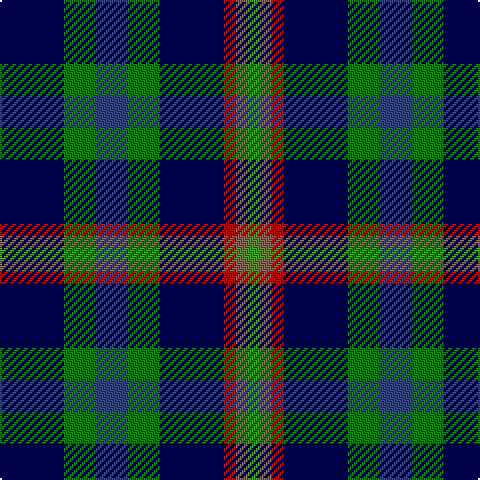

In pattern [BGBGBRRG](/stripes/bgbgbrrg/).

This was sourced from weddslist.  It is a [8 stripe tartan](/stripes/stripes8/).

Original link http://www.weddslist.com/cgi-bin/tartans/pg.pl?source=sts

## Thread count
DB/32 Ga16 B16 Ga16 DB32 R6 LT6 G/6

## Palette
Each colour and the base-6 reference it is a variant of.

| Colour | Shade | Base |
|---|---|---|
| B | <code style="background-color:#304080;">#304080</code> `oklch(39.4% 0.109 270.2)` <small>#304080</small> | B <code style="background-color:#2A418A;">#2A418A</code> |
| DB | <code style="background-color:#000050;">#000050</code> `oklch(19.5% 0.135 264.1)` <small>#000050</small> | B <code style="background-color:#2A418A;">#2A418A</code> |
| G | <code style="background-color:#30A010;">#30A010</code> `oklch(61.9% 0.195 140.5)` <small>#30A010</small> | G <code style="background-color:#006100;">#006100</code> |
| Ga | <code style="background-color:#008000;">#008000</code> `oklch(52.0% 0.177 142.5)` <small>#008000</small> | G <code style="background-color:#006100;">#006100</code> |
| LT | <code style="background-color:#806050;">#806050</code> `oklch(51.7% 0.049 47.8)` <small>#806050</small> | R <code style="background-color:#CC0000;">#CC0000</code> |
| R | <code style="background-color:#C00000;">#C00000</code> `oklch(50.7% 0.208 29.2)` <small>#C00000</small> | R <code style="background-color:#CC0000;">#CC0000</code> |

# Sample pattern

## Nearest tartans

The nearest existing variants by ΔTartan distance.

1. [Mounth, The](/setts/s9/dg2y13db12w3db10w3db12g13dp2~x2/) — ΔT 0.89
1. [Quinn (Personal)](/setts/s9/r1b8k4g1dg4g1k4b8ly1~x6/) — ΔT 1.15
1. [Nance (1998)](/setts/s10/db2lo1db6r1db2r2k2g6t1g2~x4/) — ΔT 1.27
1. [United Services, Planning Association](/setts/s8/db4dg2w2dg4db10r2db12ly3~x2/) — ΔT 1.29
1. [Nairn (Edinburgh Woollen Mill)](/setts/s11/r2g10db10k5b2k5g10k10b2k10lo2~x2/) — ΔT 1.31
1. [BlackRock (Symmetrical)](/setts/s8/k10dg3k6dg20k8r4w4dg10~x2/) — ΔT 1.39
1. [Coulthard (Personal)](/setts/s7/r3g9y15db10k2db18w3~x2/) — ΔT 1.40
1. [Quinn](/setts/s9/r1n8k4g1g4g1k4n8ly1~x6/) — ΔT 1.42
1. [MacLean, Donald Personal Tartan Tartan Number: 3440. Earliest known date: pre 2002 From Pendleton Woolen Mills of Oregon, owners of the only copy of Clans Originaux. EBW 8.11.02. This is the same as MacTaggart #408 and #409!!! See products available Copyright © Blair Urquhart, Comrie, 2015](/setts/s7/g16lb3g3k10db12r2k3~x2/) — ΔT 1.46
1. [Midlothian](/setts/s6/db31b4db5k19g20lo4~x2/) — ΔT 1.51

## Neighbour map

Every grey dot is one of 14299 variants placed by the first two principal components of the ΔTartan feature space (44% of its variance). Red is this tartan; blue dots are its nearest — click one to open its page.

<svg viewBox="0 0 640 380" role="img" style="max-width:100%;height:auto;border:1px solid #e0e0e0;border-radius:4px;display:block" xmlns="http://www.w3.org/2000/svg"><image href="/nn/cloud.v1.png" width="640" height="380"/><a href="/setts/s9/dg2y13db12w3db10w3db12g13dp2~x2/"><circle cx="132.5" cy="194.2" r="4" fill="#3465a4"><title>Mounth, The</title></circle></a><a href="/setts/s9/r1b8k4g1dg4g1k4b8ly1~x6/"><circle cx="200.1" cy="190.7" r="4" fill="#3465a4"><title>Quinn (Personal)</title></circle></a><a href="/setts/s10/db2lo1db6r1db2r2k2g6t1g2~x4/"><circle cx="134.5" cy="195.4" r="4" fill="#3465a4"><title>Nance (1998)</title></circle></a><a href="/setts/s8/db4dg2w2dg4db10r2db12ly3~x2/"><circle cx="197.2" cy="194.4" r="4" fill="#3465a4"><title>United Services, Planning Association</title></circle></a><a href="/setts/s11/r2g10db10k5b2k5g10k10b2k10lo2~x2/"><circle cx="141.2" cy="220.0" r="4" fill="#3465a4"><title>Nairn (Edinburgh Woollen Mill)</title></circle></a><a href="/setts/s8/k10dg3k6dg20k8r4w4dg10~x2/"><circle cx="203.0" cy="231.2" r="4" fill="#3465a4"><title>BlackRock (Symmetrical)</title></circle></a><a href="/setts/s7/r3g9y15db10k2db18w3~x2/"><circle cx="186.4" cy="201.0" r="4" fill="#3465a4"><title>Coulthard (Personal)</title></circle></a><a href="/setts/s9/r1n8k4g1g4g1k4n8ly1~x6/"><circle cx="180.5" cy="173.7" r="4" fill="#3465a4"><title>Quinn</title></circle></a><a href="/setts/s7/g16lb3g3k10db12r2k3~x2/"><circle cx="129.8" cy="196.3" r="4" fill="#3465a4"><title>MacLean, Donald Personal Tartan Tartan Number: 3440. Earliest known date: pre 2002 From Pendleton Woolen Mills of Oregon, owners of the only copy of Clans Originaux. EBW 8.11.02. This is the same as MacTaggart #408 and #409!!! See products available Copyright © Blair Urquhart, Comrie, 2015</title></circle></a><a href="/setts/s6/db31b4db5k19g20lo4~x2/"><circle cx="191.1" cy="226.6" r="4" fill="#3465a4"><title>Midlothian</title></circle></a><circle cx="155.1" cy="219.7" r="5" fill="#c00000"/></svg>

ID: /setts/s8/db16g8db8g8db16r3o3g3~x2/
