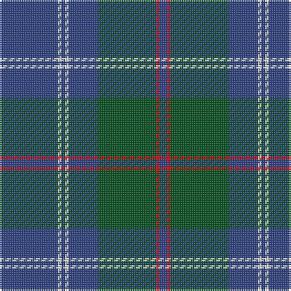

This page is one **sett** — a single exact thread-count. It belongs to the [tartan](/tartans/db16w1db1w1db8dg16r1db2/)
(the same proportion at any scale), whose colour order is pattern [BRGBWBWB](/stripes/brgbwbwb/).

Sourced from register-of-tartans.  It is a [8 stripe tartan](/stripes/stripes8/).

Original link https://www.tartanregister.gov.uk/tartanDetails.aspx?ref=3582

## Register references

External register numbers recorded for this tartan.

- Scottish Register of Tartans: [3582](https://www.tartanregister.gov.uk/tartanDetails.aspx?ref=3582)
- Scottish Tartans World Register: 500

## Thread count
B/32 LN2 B2 LN2 B16 G32 R2 B/4

## Palette

Palette: <strong>Tartan Register</strong>
<table><thead><tr><th>Colour</th><th>Threads</th><th>Shade</th><th>Base</th><th>OKLCh</th></tr></thead><tbody><tr><td>B/</td><td style="text-align:right;font-variant-numeric:tabular-nums">32</td><td><code style="background-color:#2C4084;">#2C4084</code> <small style="color:#888">#2C4084</small></td><td>B <code style="background-color:#2A418A;">#2A418A</code></td><td><small style="color:#888">oklch(39.4% 0.117 268.3)</small></td></tr><tr><td>LN</td><td style="text-align:right;font-variant-numeric:tabular-nums">2</td><td><code style="background-color:#E0E0E0;">#E0E0E0</code> <small style="color:#888">#E0E0E0</small></td><td>W <code style="background-color:#F7F7F7;">#F7F7F7</code></td><td><small style="color:#888">oklch(90.7% 0.000 89.9)</small></td></tr><tr><td>B</td><td style="text-align:right;font-variant-numeric:tabular-nums">2</td><td><code style="background-color:#2C4084;">#2C4084</code> <small style="color:#888">#2C4084</small></td><td>B <code style="background-color:#2A418A;">#2A418A</code></td><td><small style="color:#888">oklch(39.4% 0.117 268.3)</small></td></tr><tr><td>LN</td><td style="text-align:right;font-variant-numeric:tabular-nums">2</td><td><code style="background-color:#E0E0E0;">#E0E0E0</code> <small style="color:#888">#E0E0E0</small></td><td>W <code style="background-color:#F7F7F7;">#F7F7F7</code></td><td><small style="color:#888">oklch(90.7% 0.000 89.9)</small></td></tr><tr><td>B</td><td style="text-align:right;font-variant-numeric:tabular-nums">16</td><td><code style="background-color:#2C4084;">#2C4084</code> <small style="color:#888">#2C4084</small></td><td>B <code style="background-color:#2A418A;">#2A418A</code></td><td><small style="color:#888">oklch(39.4% 0.117 268.3)</small></td></tr><tr><td>G</td><td style="text-align:right;font-variant-numeric:tabular-nums">32</td><td><code style="background-color:#005020;">#005020</code> <small style="color:#888">#005020</small></td><td>G <code style="background-color:#006100;">#006100</code></td><td><small style="color:#888">oklch(37.7% 0.105 149.6)</small></td></tr><tr><td>R</td><td style="text-align:right;font-variant-numeric:tabular-nums">2</td><td><code style="background-color:#DC0000;">#DC0000</code> <small style="color:#888">#DC0000</small></td><td>R <code style="background-color:#CC0000;">#CC0000</code></td><td><small style="color:#888">oklch(56.2% 0.230 29.2)</small></td></tr><tr><td>B/</td><td style="text-align:right;font-variant-numeric:tabular-nums">4</td><td><code style="background-color:#2C4084;">#2C4084</code> <small style="color:#888">#2C4084</small></td><td>B <code style="background-color:#2A418A;">#2A418A</code></td><td><small style="color:#888">oklch(39.4% 0.117 268.3)</small></td></tr></tbody></table>

# Sample pattern

## Nearest tartans

The nearest existing variants by ΔTartan distance, with this tartan at the top so the swatches line up against it.

ΔTartan

Tartan

Sett

—

<a href="/ttd/edit/#slug=db16w1db1w1db8dg16r1db2~x2">Roxburgh</a> <a class="nn-out" href="/setts/s8/db16w1db1w1db8dg16r1db2~x2/" title="open its dictionary page">↗</a>

0.95

<a href="/ttd/edit/#slug=k4r1k4r1dg14n1dg1~x4">Pinehurst Resort</a> <a class="nn-out" href="/setts/s7/k4r1k4r1dg14n1dg1~x4/" title="open its dictionary page">↗</a>

1.03

<a href="/ttd/edit/#slug=dr2db4g12db3dr6t2db24dr2db2g2~x2">Wicklow</a> <a class="nn-out" href="/setts/s10/dr2db4g12db3dr6t2db24dr2db2g2~x2/" title="open its dictionary page">↗</a>

1.11

<a href="/ttd/edit/#slug=db12ly1g16db1g1db14g3db14r2~x4">Orlando, City of (District)</a> <a class="nn-out" href="/setts/s9/db12ly1g16db1g1db14g3db14r2~x4/" title="open its dictionary page">↗</a>

1.16

<a href="/ttd/edit/#slug=r4dt4k2dt31k10ly3dt5k11dt6k3~x2">MacArthur Fox Green (Personal)</a> <a class="nn-out" href="/setts/s10/r4dt4k2dt31k10ly3dt5k11dt6k3~x2/" title="open its dictionary page">↗</a>

1.16

<a href="/ttd/edit/#slug=t9db2t39dt33lo2dt5~x2">Port Authority of NY &amp; NJ</a> <a class="nn-out" href="/setts/s6/t9db2t39dt33lo2dt5~x2/" title="open its dictionary page">↗</a>

1.18

<a href="/ttd/edit/#slug=db3r3g18db16w2db26r3g3~x2">MacHardy</a> <a class="nn-out" href="/setts/s8/db3r3g18db16w2db26r3g3~x2/" title="open its dictionary page">↗</a>

1.23

<a href="/ttd/edit/#slug=db16w1db1w1db8g16r1db2~x2">Roxburgh</a> <a class="nn-out" href="/setts/s8/db16w1db1w1db8g16r1db2~x2/" title="open its dictionary page">↗</a>

1.26

<a href="/ttd/edit/#slug=g23db3k8db4g4db56ly8">Tern House</a> <a class="nn-out" href="/setts/s7/g23db3k8db4g4db56ly8/" title="open its dictionary page">↗</a>

1.26

<a href="/ttd/edit/#slug=g8db3g2db4dt2db5g7db4g4db37lo6">Jenkins (Welsh Name)</a> <a class="nn-out" href="/setts/s11/g8db3g2db4dt2db5g7db4g4db37lo6/" title="open its dictionary page">↗</a>

1.27

<a href="/ttd/edit/#slug=r2g5db27g11o2~x2">Hector James</a> <a class="nn-out" href="/setts/s5/r2g5db27g11o2~x2/" title="open its dictionary page">↗</a>

## Neighbour map

Every grey dot is one of 14359 variants placed by the first two principal components of the ΔTartan feature space (44% of its variance). Red is this tartan; blue dots are its nearest — click one to open its page.

<svg viewBox="0 0 640 380" role="img" style="max-width:100%;height:auto;border:1px solid #e0e0e0;border-radius:4px;display:block" xmlns="http://www.w3.org/2000/svg"><image href="/nn/cloud.v1.png" width="640" height="380"/><a href="/setts/s7/k4r1k4r1dg14n1dg1~x4/"><circle cx="393.1" cy="207.8" r="4" fill="#3465a4"><title>Pinehurst Resort</title></circle></a><a href="/setts/s10/dr2db4g12db3dr6t2db24dr2db2g2~x2/"><circle cx="348.2" cy="189.8" r="4" fill="#3465a4"><title>Wicklow</title></circle></a><a href="/setts/s9/db12ly1g16db1g1db14g3db14r2~x4/"><circle cx="404.5" cy="203.6" r="4" fill="#3465a4"><title>Orlando, City of (District)</title></circle></a><a href="/setts/s10/r4dt4k2dt31k10ly3dt5k11dt6k3~x2/"><circle cx="375.6" cy="190.5" r="4" fill="#3465a4"><title>MacArthur Fox Green (Personal)</title></circle></a><a href="/setts/s6/t9db2t39dt33lo2dt5~x2/"><circle cx="381.2" cy="203.3" r="4" fill="#3465a4"><title>Port Authority of NY &amp; NJ</title></circle></a><a href="/setts/s8/db3r3g18db16w2db26r3g3~x2/"><circle cx="360.0" cy="198.8" r="4" fill="#3465a4"><title>MacHardy</title></circle></a><a href="/setts/s8/db16w1db1w1db8g16r1db2~x2/"><circle cx="368.9" cy="181.2" r="4" fill="#3465a4"><title>Roxburgh</title></circle></a><a href="/setts/s7/g23db3k8db4g4db56ly8/"><circle cx="370.8" cy="175.5" r="4" fill="#3465a4"><title>Tern House</title></circle></a><a href="/setts/s11/g8db3g2db4dt2db5g7db4g4db37lo6/"><circle cx="423.2" cy="163.1" r="4" fill="#3465a4"><title>Jenkins (Welsh Name)</title></circle></a><a href="/setts/s5/r2g5db27g11o2~x2/"><circle cx="378.7" cy="224.5" r="4" fill="#3465a4"><title>Hector James</title></circle></a><circle cx="398.7" cy="198.0" r="5" fill="#c00000"/></svg>

ID: /setts/s8/db16w1db1w1db8dg16r1db2~x2/
