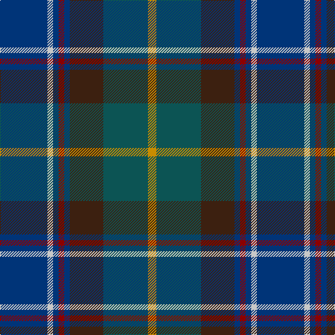

In pattern [BWBRBBGY](/stripes/bwbrbbgy/).

This was sourced from tartans-authority.  It is a [8 stripe tartan](/stripes/stripes8/).

Original link http://www.tartansauthority.com/tartan-ferret/display/2221/

## Also known as

This cloth is also recorded under:

- Blairmore House

## Attestations

This cloth appears in 2 source records; the oldest owns this page.

- pre 2002 — Blairmore House (Corporate) (tartans-authority, [record](http://www.tartansauthority.com/tartan-ferret/display/2221/))
- undated — Blairmore Corporate School Tartan Tartan Number: 2221. Earliest known date: 2002 Designed by John B Gillespie (Johnsons of Elgin) and Monique Baumann for Blairmore School at Glass in Aberdeenshire. See products available Copyright © Blair Urquhart, Comrie, 2015 (house-of-tartan, [record](http://www.house-of-tartan.scotland.net/house/TartanViewjs.asp?colr=Def&tnam=2221))

## Thread count
DB/68 N8 DB8 DR8 DB8 K48 G64 DY/12

## Palette
Each colour and the base-6 reference it is a variant of.

| Colour | Shade | Base |
|---|---|---|
| DB | <code style="background-color:#003478;">#003478</code> `oklch(34.1% 0.127 258.1)` <small>#003478</small> | B <code style="background-color:#2A418A;">#2A418A</code> |
| DR | <code style="background-color:#8C0000;">#8C0000</code> `oklch(40.2% 0.165 29.2)` <small>#8C0000</small> | R <code style="background-color:#CC0000;">#CC0000</code> |
| DY | <code style="background-color:#C88C00;">#C88C00</code> `oklch(68.2% 0.142 78.2)` <small>#C88C00</small> | Y <code style="background-color:#F2BF00;">#F2BF00</code> |
| G | <code style="background-color:#0C5454;">#0C5454</code> `oklch(40.6% 0.065 194.9)` <small>#0C5454</small> | G <code style="background-color:#006100;">#006100</code> |
| K | <code style="background-color:#3C2010;">#3C2010</code> `oklch(27.7% 0.051 49.3)` <small>#3C2010</small> | B <code style="background-color:#2A418A;">#2A418A</code> |
| N | <code style="background-color:#C8C8C8;">#C8C8C8</code> `oklch(83.3% 0.000 89.9)` <small>#C8C8C8</small> | W <code style="background-color:#F7F7F7;">#F7F7F7</code> |

# Sample pattern

## Nearest tartans

The nearest existing variants by ΔTartan distance, with this tartan at the top so the swatches line up against it.

ΔTartan

Tartan

Sett

—

<a href="/ttd/edit/#slug=db17lb2db2r2db2do12dg16lo3~x4">Blairmore House (Corporate)</a> <a class="nn-out" href="/setts/s8/db17lb2db2r2db2do12dg16lo3~x4/" title="open its dictionary page">↗</a>

0.58

<a href="/ttd/edit/#slug=db17w2db2r2db2do12dg16lo3~x4">Blairmore House</a> <a class="nn-out" href="/setts/s8/db17w2db2r2db2do12dg16lo3~x4/" title="open its dictionary page">↗</a>

0.68

<a href="/ttd/edit/#slug=dg5g2db2db15r2lg2dg5r2~x4">Remember the Somme 1916</a> <a class="nn-out" href="/setts/s8/dg5g2db2db15r2lg2dg5r2~x4/" title="open its dictionary page">↗</a>

0.89

<a href="/ttd/edit/#slug=dg15y3dr2y3dg8b12db20r2db4~x2">Westbrook (2013)</a> <a class="nn-out" href="/setts/s9/dg15y3dr2y3dg8b12db20r2db4~x2/" title="open its dictionary page">↗</a>

1.03

<a href="/ttd/edit/#slug=g37dp5g5dp12b10db5b5db40dy4db4lo4~x2">State Seal of North Dakota (Fashion)</a> <a class="nn-out" href="/setts/s11/g37dp5g5dp12b10db5b5db40dy4db4lo4~x2/" title="open its dictionary page">↗</a>

1.08

<a href="/ttd/edit/#slug=r3dt24k7db11g11ly2~x2">Cowie</a> <a class="nn-out" href="/setts/s6/r3dt24k7db11g11ly2~x2/" title="open its dictionary page">↗</a>

1.08

<a href="/ttd/edit/#slug=dg3lo2o10dg10db20dg12r3db10w2~x2">Patel Name Tartan Tartan Number: 10924. Earliest known date: 2013 Designed for the Patel family using colours associated with the Gujarat, a state in the North-West coast of India known locally as Jewel of the West. See products available Copyright © Blair Urquhart, Comrie, 2015</a> <a class="nn-out" href="/setts/s9/dg3lo2o10dg10db20dg12r3db10w2~x2/" title="open its dictionary page">↗</a>

1.14

<a href="/ttd/edit/#slug=dg2g8dt1g1dt1g1dt8db10w1~x4">Cowal Gathering</a> <a class="nn-out" href="/setts/s9/dg2g8dt1g1dt1g1dt8db10w1~x4/" title="open its dictionary page">↗</a>

1.15

<a href="/ttd/edit/#slug=db11k1db1k1db1k7dg8r1t7~x4">Damm, Alexander (Personal)</a> <a class="nn-out" href="/setts/s9/db11k1db1k1db1k7dg8r1t7~x4/" title="open its dictionary page">↗</a>

1.19

<a href="/ttd/edit/#slug=db10dg5g5k1ly2k1db10~x2">Lenaghan (Personal)</a> <a class="nn-out" href="/setts/s7/db10dg5g5k1ly2k1db10~x2/" title="open its dictionary page">↗</a>

1.20

<a href="/ttd/edit/#slug=dt5b43dt18lb4b6r5dy25lo5~x2">State Seal of Iowa (Fashion)</a> <a class="nn-out" href="/setts/s8/dt5b43dt18lb4b6r5dy25lo5~x2/" title="open its dictionary page">↗</a>

## Neighbour map

Every grey dot is one of 14299 variants placed by the first two principal components of the ΔTartan feature space (44% of its variance). Red is this tartan; blue dots are its nearest — click one to open its page.

<svg viewBox="0 0 640 380" role="img" style="max-width:100%;height:auto;border:1px solid #e0e0e0;border-radius:4px;display:block" xmlns="http://www.w3.org/2000/svg"><image href="/nn/cloud.v1.png" width="640" height="380"/><a href="/setts/s8/db17w2db2r2db2do12dg16lo3~x4/"><circle cx="176.9" cy="189.6" r="4" fill="#3465a4"><title>Blairmore House</title></circle></a><a href="/setts/s8/dg5g2db2db15r2lg2dg5r2~x4/"><circle cx="222.5" cy="202.0" r="4" fill="#3465a4"><title>Remember the Somme 1916</title></circle></a><a href="/setts/s9/dg15y3dr2y3dg8b12db20r2db4~x2/"><circle cx="175.9" cy="195.7" r="4" fill="#3465a4"><title>Westbrook (2013)</title></circle></a><a href="/setts/s11/g37dp5g5dp12b10db5b5db40dy4db4lo4~x2/"><circle cx="194.7" cy="162.0" r="4" fill="#3465a4"><title>State Seal of North Dakota (Fashion)</title></circle></a><a href="/setts/s6/r3dt24k7db11g11ly2~x2/"><circle cx="197.1" cy="207.8" r="4" fill="#3465a4"><title>Cowie</title></circle></a><a href="/setts/s9/dg3lo2o10dg10db20dg12r3db10w2~x2/"><circle cx="220.0" cy="210.1" r="4" fill="#3465a4"><title>Patel Name Tartan Tartan Number: 10924. Earliest known date: 2013 Designed for the Patel family using colours associated with the Gujarat, a state in the North-West coast of India known locally as Jewel of the West. See products available Copyright © Blair Urquhart, Comrie, 2015</title></circle></a><a href="/setts/s9/dg2g8dt1g1dt1g1dt8db10w1~x4/"><circle cx="195.9" cy="198.5" r="4" fill="#3465a4"><title>Cowal Gathering</title></circle></a><a href="/setts/s9/db11k1db1k1db1k7dg8r1t7~x4/"><circle cx="197.2" cy="200.1" r="4" fill="#3465a4"><title>Damm, Alexander (Personal)</title></circle></a><a href="/setts/s7/db10dg5g5k1ly2k1db10~x2/"><circle cx="131.6" cy="207.7" r="4" fill="#3465a4"><title>Lenaghan (Personal)</title></circle></a><a href="/setts/s8/dt5b43dt18lb4b6r5dy25lo5~x2/"><circle cx="219.6" cy="176.1" r="4" fill="#3465a4"><title>State Seal of Iowa (Fashion)</title></circle></a><circle cx="193.6" cy="198.5" r="5" fill="#c00000"/></svg>

ID: /setts/s8/db17lb2db2r2db2do12dg16lo3~x4/
