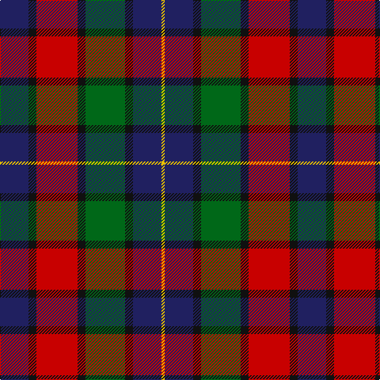

This page is one **sett** — a single exact thread-count. It belongs to the [tartan](/tartans/db18k5r26k5g25k5db18y2/)
(the same proportion at any scale), whose colour order is pattern [BKRKGKBY](/stripes/bkrkgkby/).

Sourced from tartans-authority.  It is a [8 stripe tartan](/stripes/stripes8/).

Original link http://www.tartansauthority.com/tartan-ferret/display/6742/

2 attestations — the source records this cloth was collapsed from (oldest owns this page)

<ul>
<li>pre 2004 — St. Clement of Rome (Corporate) (tartans-authority, <a href="http://www.tartansauthority.com/tartan-ferret/display/6742/">record</a>)</li>
<li>undated — St. Clement of Rome School (register-of-tartans, <a href="https://www.tartanregister.gov.uk/tartanDetails.aspx?ref=5439">record</a>)</li>
</ul>

## Register references

External register numbers recorded for this tartan.

- Scottish Register of Tartans: [5439](https://www.tartanregister.gov.uk/tartanDetails.aspx?ref=5439)
- Scottish Tartans Authority (ITI): 6742
- Scottish Tartans World Register: 3008

## Thread count
DB/36 K10 R52 K10 G50 K10 DB36 Y/4

## Palette
Each colour and the base-6 reference it is a variant of.

| Colour | Shade | Base |
|---|---|---|
| DB | <code style="background-color:#202060;">#202060</code> `oklch(28.9% 0.111 276.9)` <small>#202060</small> | B <code style="background-color:#2A418A;">#2A418A</code> |
| G | <code style="background-color:#006818;">#006818</code> `oklch(45.0% 0.142 145.0)` <small>#006818</small> | G <code style="background-color:#006100;">#006100</code> |
| K | <code style="background-color:#101010;">#101010</code> `oklch(17.3% 0.000 89.9)` <small>#101010</small> | K <code style="background-color:#000000;">#000000</code> |
| R | <code style="background-color:#C80000;">#C80000</code> `oklch(52.3% 0.215 29.2)` <small>#C80000</small> | R <code style="background-color:#CC0000;">#CC0000</code> |
| Y | <code style="background-color:#E8C000;">#E8C000</code> `oklch(81.9% 0.168 93.7)` <small>#E8C000</small> | Y <code style="background-color:#F2BF00;">#F2BF00</code> |

# Sample pattern

## Nearest tartans

The nearest existing variants by ΔTartan distance, with this tartan at the top so the swatches line up against it.

ΔTartan

Tartan

Sett

—

<a href="/ttd/edit/#slug=db18k5r26k5g25k5db18ly2~x2">St. Clement of Rome (Corporate)</a> <a class="nn-out" href="/setts/s8/db18k5r26k5g25k5db18ly2~x2/" title="open its dictionary page">↗</a>

0.66

<a href="/ttd/edit/#slug=db6k3r14k3g14k3db6ly1~x4">Kilgour (Asymmetrical)</a> <a class="nn-out" href="/setts/s8/db6k3r14k3g14k3db6ly1~x4/" title="open its dictionary page">↗</a>

0.66

<a href="/ttd/edit/#slug=db6ly1db6k3r14k3g14k3~x4">Kilgour (Cant)</a> <a class="nn-out" href="/setts/s8/db6ly1db6k3r14k3g14k3~x4/" title="open its dictionary page">↗</a>

0.66

<a href="/ttd/edit/#slug=db6k3g14k3r14k3db6ly1~x4">Kilgour (Symmetrical)</a> <a class="nn-out" href="/setts/s8/db6k3g14k3r14k3db6ly1~x4/" title="open its dictionary page">↗</a>

0.70

<a href="/ttd/edit/#slug=dg3db12w1dg12r12dg2~x2">Patterson, John (Personal)</a> <a class="nn-out" href="/setts/s6/dg3db12w1dg12r12dg2~x2/" title="open its dictionary page">↗</a>

0.70

<a href="/ttd/edit/#slug=g3db12w1dg12r12dg2~x2">Patterson, John (Personal)</a> <a class="nn-out" href="/setts/s6/g3db12w1dg12r12dg2~x2/" title="open its dictionary page">↗</a>

0.76

<a href="/ttd/edit/#slug=db12w1dg12r12dg2r12dg12w1db12g3~x2">Patterson (Red) Clan Tartan Tartan Number: 2191. Earliest known date: 1993 A personal tartan designed by Marge Warren for a John Patterson. No other details known. See products available Copyright © Blair Urquhart, Comrie, 2015</a> <a class="nn-out" href="/setts/s10/db12w1dg12r12dg2r12dg12w1db12g3~x2/" title="open its dictionary page">↗</a>

0.91

<a href="/ttd/edit/#slug=db9r24dg24k24db24ly2db9">Dundas</a> <a class="nn-out" href="/setts/s7/db9r24dg24k24db24ly2db9/" title="open its dictionary page">↗</a>

0.92

<a href="/ttd/edit/#slug=dp9k7dg5r4dg7k1ly1~x2">MacLaren #2</a> <a class="nn-out" href="/setts/s7/dp9k7dg5r4dg7k1ly1~x2/" title="open its dictionary page">↗</a>

0.94

<a href="/ttd/edit/#slug=dp18k7g5r4g7k1ly2~x2">Regent</a> <a class="nn-out" href="/setts/s7/dp18k7g5r4g7k1ly2~x2/" title="open its dictionary page">↗</a>

0.97

<a href="/ttd/edit/#slug=dg1r11dg3k4dg4r1k2db11w1~x2">Manson (Name)</a> <a class="nn-out" href="/setts/s9/dg1r11dg3k4dg4r1k2db11w1~x2/" title="open its dictionary page">↗</a>

## Neighbour map

Every grey dot is one of 14299 variants placed by the first two principal components of the ΔTartan feature space (44% of its variance). Red is this tartan; blue dots are its nearest — click one to open its page.

<svg viewBox="0 0 640 380" role="img" style="max-width:100%;height:auto;border:1px solid #e0e0e0;border-radius:4px;display:block" xmlns="http://www.w3.org/2000/svg"><image href="/nn/cloud.v1.png" width="640" height="380"/><a href="/setts/s8/db6k3r14k3g14k3db6ly1~x4/"><circle cx="137.0" cy="174.1" r="4" fill="#3465a4"><title>Kilgour (Asymmetrical)</title></circle></a><a href="/setts/s8/db6ly1db6k3r14k3g14k3~x4/"><circle cx="137.0" cy="174.1" r="4" fill="#3465a4"><title>Kilgour (Cant)</title></circle></a><a href="/setts/s8/db6k3g14k3r14k3db6ly1~x4/"><circle cx="137.0" cy="174.1" r="4" fill="#3465a4"><title>Kilgour (Symmetrical)</title></circle></a><a href="/setts/s6/dg3db12w1dg12r12dg2~x2/"><circle cx="163.3" cy="195.6" r="4" fill="#3465a4"><title>Patterson, John (Personal)</title></circle></a><a href="/setts/s6/g3db12w1dg12r12dg2~x2/"><circle cx="169.2" cy="199.7" r="4" fill="#3465a4"><title>Patterson, John (Personal)</title></circle></a><a href="/setts/s10/db12w1dg12r12dg2r12dg12w1db12g3~x2/"><circle cx="154.6" cy="185.2" r="4" fill="#3465a4"><title>Patterson (Red) Clan Tartan Tartan Number: 2191. Earliest known date: 1993 A personal tartan designed by Marge Warren for a John Patterson. No other details known. See products available Copyright © Blair Urquhart, Comrie, 2015</title></circle></a><a href="/setts/s7/db9r24dg24k24db24ly2db9/"><circle cx="148.2" cy="215.0" r="4" fill="#3465a4"><title>Dundas</title></circle></a><a href="/setts/s7/dp9k7dg5r4dg7k1ly1~x2/"><circle cx="143.7" cy="220.9" r="4" fill="#3465a4"><title>MacLaren #2</title></circle></a><a href="/setts/s7/dp18k7g5r4g7k1ly2~x2/"><circle cx="215.4" cy="169.8" r="4" fill="#3465a4"><title>Regent</title></circle></a><a href="/setts/s9/dg1r11dg3k4dg4r1k2db11w1~x2/"><circle cx="154.0" cy="164.7" r="4" fill="#3465a4"><title>Manson (Name)</title></circle></a><circle cx="158.9" cy="185.2" r="5" fill="#c00000"/></svg>

ID: /setts/s8/db18k5r26k5g25k5db18ly2~x2/
