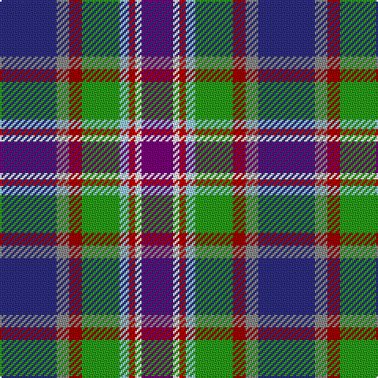

In pattern [BRRGWRWB](/stripes/brrgwrwb/).

This was sourced from tartans-authority.  It is a [8 stripe tartan](/stripes/stripes8/).

Original link http://www.tartansauthority.com/tartan-ferret/display/11233/

## Thread count
DB/36 N8 DR8 G24 LB6 R4 W4 P/20

## Palette
Each colour and its ΔE from the base-6 reference it is a variant of.

| Colour | Shade | Base | ΔE (OKLab) |
|---|---|---|---|
| DB | <code style="background-color:#2C2C80;">#2C2C80</code> `#2C2C80` | B <code style="background-color:#2A418A;">#2A418A</code> | 0.06 |
| DR | <code style="background-color:#A00000;">#A00000</code> `#A00000` | R <code style="background-color:#CC0000;">#CC0000</code> | 0.09 |
| G | <code style="background-color:#289C18;">#289C18</code> `#289C18` | G <code style="background-color:#006100;">#006100</code> | 0.19 |
| LB | <code style="background-color:#98C8E8;">#98C8E8</code> `#98C8E8` | W <code style="background-color:#F7F7F7;">#F7F7F7</code> | 0.18 |
| N | <code style="background-color:#888888;">#888888</code> `#888888` | R <code style="background-color:#CC0000;">#CC0000</code> | 0.24 |
| P | <code style="background-color:#780078;">#780078</code> `#780078` | B <code style="background-color:#2A418A;">#2A418A</code> | 0.17 |
| R | <code style="background-color:#C80000;">#C80000</code> `#C80000` | R <code style="background-color:#CC0000;">#CC0000</code> | 0.01 |
| W | <code style="background-color:#FCFCFC;">#FCFCFC</code> `#FCFCFC` | W <code style="background-color:#F7F7F7;">#F7F7F7</code> | 0.01 |

# Sample pattern

## Nearest tartans

The nearest existing variants by ΔTartan distance.

1. [Serco Caledonian Sleeper](/setts/s8/db18lr4r4g12t3r2w2dp10~x2/) — ΔT 0.45
1. [Silversea](/setts/s7/r3dt20dt20g2lr4lr17w3~x2/) — ΔT 1.15
1. [Hatcher (Personal)](/setts/s7/lp33r7db9dp7g12r3k29~x2/) — ΔT 1.25
1. [Isle of Jura](/setts/s8/lb12lg12db7w1do5o5lo2ly2~x2/) — ΔT 1.37
1. [Coats (New Zealand)](/setts/s9/k9ly6db9lr2o3lr2dg17db17lb5~x2/) — ΔT 1.38
1. [Oregon American District Tartan Tartan Number: 5743. Earliest known date: 2002 The State of Oregon tartan was adopted at the 72nd Oregon Legislative Assembly by Senate Joint Resolution 31 in a letter from State Governor Theodore R Kulongoski dated April 12th 2003. Blue is from the Oregon flag and its rivers and ocean. Gold from the flag and represents agriculture. White for the snow-capped mountains. Taupe (light brown) is for the high desert and grasslands. Azure for the streams, and the skies. Black, the obsidian buttes. See products available Copyright © Blair Urquhart, Comrie, 2015](/setts/s11/ly3db5dg2db2dg2w1dg4lo12r2t2k2~x4/) — ΔT 1.40
1. [Armagh County Crest (Fashion)](/setts/s9/w3db4dg8k5db20g3ly13g4w2~x2/) — ΔT 1.44
1. [Julien Pigeut Tartan Tartan Number: 6574. Earliest known date: 2004 For the wedding of Julien and Sylvia Piguet. Also worn by Roland Mathez best man of Julien. See products available Copyright © Blair Urquhart, Comrie, 2015](/setts/s8/k40n15o10ly3t5w5db10t20/) — ΔT 1.45
1. [Manx National](/setts/s7/p2g6r1y1db3b10w1~x2/) — ΔT 1.48
1. [Maryland](/setts/s8/dt8t1db1t1m12ly6k12w2~x4/) — ΔT 1.53

## Neighbour map

Every grey dot is one of 14299 variants placed by the first two principal components of the ΔTartan feature space (44% of its variance). Red is this tartan; blue dots are its nearest — click one to open its page.

<svg viewBox="0 0 640 380" role="img" style="max-width:100%;height:auto;border:1px solid #e0e0e0;border-radius:4px;display:block" xmlns="http://www.w3.org/2000/svg"><image href="/nn/cloud.v1.png" width="640" height="380"/><a href="/setts/s8/db18lr4r4g12t3r2w2dp10~x2/"><circle cx="67.5" cy="136.0" r="4" fill="#3465a4"><title>Serco Caledonian Sleeper</title></circle></a><a href="/setts/s7/r3dt20dt20g2lr4lr17w3~x2/"><circle cx="77.1" cy="151.1" r="4" fill="#3465a4"><title>Silversea</title></circle></a><a href="/setts/s7/lp33r7db9dp7g12r3k29~x2/"><circle cx="80.5" cy="141.6" r="4" fill="#3465a4"><title>Hatcher (Personal)</title></circle></a><a href="/setts/s8/lb12lg12db7w1do5o5lo2ly2~x2/"><circle cx="17.2" cy="122.1" r="4" fill="#3465a4"><title>Isle of Jura</title></circle></a><a href="/setts/s9/k9ly6db9lr2o3lr2dg17db17lb5~x2/"><circle cx="86.1" cy="161.8" r="4" fill="#3465a4"><title>Coats (New Zealand)</title></circle></a><a href="/setts/s11/ly3db5dg2db2dg2w1dg4lo12r2t2k2~x4/"><circle cx="64.2" cy="103.2" r="4" fill="#3465a4"><title>Oregon American District Tartan Tartan Number: 5743. Earliest known date: 2002 The State of Oregon tartan was adopted at the 72nd Oregon Legislative Assembly by Senate Joint Resolution 31 in a letter from State Governor Theodore R Kulongoski dated April 12th 2003. Blue is from the Oregon flag and its rivers and ocean. Gold from the flag and represents agriculture. White for the snow-capped mountains. Taupe (light brown) is for the high desert and grasslands. Azure for the streams, and the skies. Black, the obsidian buttes. See products available Copyright © Blair Urquhart, Comrie, 2015</title></circle></a><a href="/setts/s9/w3db4dg8k5db20g3ly13g4w2~x2/"><circle cx="50.3" cy="131.0" r="4" fill="#3465a4"><title>Armagh County Crest (Fashion)</title></circle></a><a href="/setts/s8/k40n15o10ly3t5w5db10t20/"><circle cx="108.5" cy="135.7" r="4" fill="#3465a4"><title>Julien Pigeut Tartan Tartan Number: 6574. Earliest known date: 2004 For the wedding of Julien and Sylvia Piguet. Also worn by Roland Mathez best man of Julien. See products available Copyright © Blair Urquhart, Comrie, 2015</title></circle></a><a href="/setts/s7/p2g6r1y1db3b10w1~x2/"><circle cx="138.3" cy="141.6" r="4" fill="#3465a4"><title>Manx National</title></circle></a><a href="/setts/s8/dt8t1db1t1m12ly6k12w2~x4/"><circle cx="68.6" cy="125.4" r="4" fill="#3465a4"><title>Maryland</title></circle></a><circle cx="55.5" cy="130.8" r="5" fill="#c00000"/></svg>

ID: /setts/s8/db18o4r4g12lb3r2w2dp10~x2/
