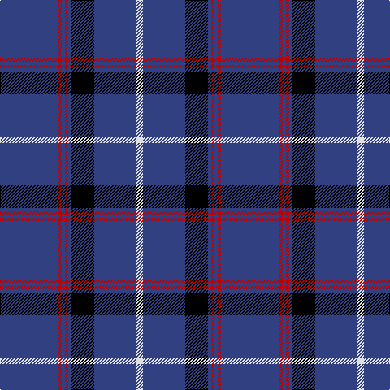

This page is one **sett** — a single exact thread-count. It belongs to the [tartan](/tartans/db18r1db1r1db1k7db13w2/)
(the same proportion at any scale), whose colour order is pattern [BRBRBKBW](/stripes/brbrbkbw/).

Sourced from weddslist.  It is a [8 stripe tartan](/stripes/stripes8/).

Original link http://www.weddslist.com/cgi-bin/tartans/pg.pl?source=sts

## Thread count
B/72 R4 B4 R4 B4 K28 B52 LN/8

## Palette

Palette: <strong>Tartan Register</strong> <small style="color:#888">(2 of 4 colours)</small>
<table><thead><tr><th>Colour</th><th>Threads</th><th>Shade</th><th>Base</th><th>OKLCh</th></tr></thead><tbody><tr><td>B/</td><td style="text-align:right;font-variant-numeric:tabular-nums">72</td><td><code style="background-color:#304080;">#304080</code> <small style="color:#888">#304080</small></td><td>B <code style="background-color:#2A418A;">#2A418A</code></td><td><small style="color:#888">oklch(39.4% 0.109 270.2)</small></td></tr><tr><td>R</td><td style="text-align:right;font-variant-numeric:tabular-nums">4</td><td><code style="background-color:#C00000;">#C00000</code> <small style="color:#888">#C00000</small></td><td>R <code style="background-color:#CC0000;">#CC0000</code></td><td><small style="color:#888">oklch(50.7% 0.208 29.2)</small></td></tr><tr><td>B</td><td style="text-align:right;font-variant-numeric:tabular-nums">4</td><td><code style="background-color:#304080;">#304080</code> <small style="color:#888">#304080</small></td><td>B <code style="background-color:#2A418A;">#2A418A</code></td><td><small style="color:#888">oklch(39.4% 0.109 270.2)</small></td></tr><tr><td>R</td><td style="text-align:right;font-variant-numeric:tabular-nums">4</td><td><code style="background-color:#C00000;">#C00000</code> <small style="color:#888">#C00000</small></td><td>R <code style="background-color:#CC0000;">#CC0000</code></td><td><small style="color:#888">oklch(50.7% 0.208 29.2)</small></td></tr><tr><td>B</td><td style="text-align:right;font-variant-numeric:tabular-nums">4</td><td><code style="background-color:#304080;">#304080</code> <small style="color:#888">#304080</small></td><td>B <code style="background-color:#2A418A;">#2A418A</code></td><td><small style="color:#888">oklch(39.4% 0.109 270.2)</small></td></tr><tr><td>K</td><td style="text-align:right;font-variant-numeric:tabular-nums">28</td><td><code style="background-color:#000000;">#000000</code> <small style="color:#888">#000000</small></td><td>K <code style="background-color:#000000;">#000000</code></td><td><small style="color:#888">oklch(0.0% 0.000 0.0)</small></td></tr><tr><td>B</td><td style="text-align:right;font-variant-numeric:tabular-nums">52</td><td><code style="background-color:#304080;">#304080</code> <small style="color:#888">#304080</small></td><td>B <code style="background-color:#2A418A;">#2A418A</code></td><td><small style="color:#888">oklch(39.4% 0.109 270.2)</small></td></tr><tr><td>LN/</td><td style="text-align:right;font-variant-numeric:tabular-nums">8</td><td><code style="background-color:#E0E0E0;">#E0E0E0</code> <small style="color:#888">#E0E0E0</small></td><td>W <code style="background-color:#F7F7F7;">#F7F7F7</code></td><td><small style="color:#888">oklch(90.7% 0.000 89.9)</small></td></tr></tbody></table>

# Sample pattern

## Nearest tartans

The nearest existing variants by ΔTartan distance, with this tartan at the top so the swatches line up against it.

ΔTartan

Tartan

Sett

—

<a href="/ttd/edit/#slug=db18r1db1r1db1k7db13w2~x4">Tokyo Bluebells</a> <a class="nn-out" href="/setts/s8/db18r1db1r1db1k7db13w2~x4/" title="open its dictionary page">↗</a>

0.87

<a href="/ttd/edit/#slug=r5db20r3db20k6db3lb2db1~x2">Masai Shuka 29 (Artefact)</a> <a class="nn-out" href="/setts/s8/r5db20r3db20k6db3lb2db1~x2/" title="open its dictionary page">↗</a>

0.98

<a href="/ttd/edit/#slug=w1db5ly1db1ly1k4db15w1db2ly1~x4">SPA Association (Corporate)</a> <a class="nn-out" href="/setts/s10/w1db5ly1db1ly1k4db15w1db2ly1~x4/" title="open its dictionary page">↗</a>

1.18

<a href="/ttd/edit/#slug=db6w4db3w6db8lo3db52lo3db8r4">Dundee F.C. Corporate Tartan Tartan Number: 2058. Earliest known date: 1990 The tartan of the Dundee Football Club launched on the 10th December, 1990. See products available Copyright © Blair Urquhart, Comrie, 2015</a> <a class="nn-out" href="/setts/s10/db6w4db3w6db8lo3db52lo3db8r4/" title="open its dictionary page">↗</a>

1.23

<a href="/ttd/edit/#slug=db16w4db1w2db24w1lo4~x2">Talisker</a> <a class="nn-out" href="/setts/s7/db16w4db1w2db24w1lo4~x2/" title="open its dictionary page">↗</a>

1.24

<a href="/ttd/edit/#slug=db36lo5db8lb3db8lb10db3~x2">Scottish Qualifications Auth. (Corp)</a> <a class="nn-out" href="/setts/s7/db36lo5db8lb3db8lb10db3~x2/" title="open its dictionary page">↗</a>

1.27

<a href="/ttd/edit/#slug=db35k10db4w2db3r2ly2~x2">Laidlaw's Highland Drovers (Corp)</a> <a class="nn-out" href="/setts/s7/db35k10db4w2db3r2ly2~x2/" title="open its dictionary page">↗</a>

1.33

<a href="/ttd/edit/#slug=r2db8ly1db16w1g12db27w1db1w1~x2">World Youth Congress (Corporate)</a> <a class="nn-out" href="/setts/s10/r2db8ly1db16w1g12db27w1db1w1~x2/" title="open its dictionary page">↗</a>

1.36

<a href="/ttd/edit/#slug=db40g7ly3g7db15r5~x2">Wheadon (Name)</a> <a class="nn-out" href="/setts/s6/db40g7ly3g7db15r5~x2/" title="open its dictionary page">↗</a>

1.36

<a href="/ttd/edit/#slug=db32ly4db12db2db4db2o16db67ly6">Calum's Cabin</a> <a class="nn-out" href="/setts/s9/db32ly4db12db2db4db2o16db67ly6/" title="open its dictionary page">↗</a>

1.38

<a href="/ttd/edit/#slug=k60r3k5r3lr18o3~x2">Ailsa, Navy (Fashion)</a> <a class="nn-out" href="/setts/s6/k60r3k5r3lr18o3~x2/" title="open its dictionary page">↗</a>

## Neighbour map

Every grey dot is one of 14299 variants placed by the first two principal components of the ΔTartan feature space (44% of its variance). Red is this tartan; blue dots are its nearest — click one to open its page.

<svg viewBox="0 0 640 380" role="img" style="max-width:100%;height:auto;border:1px solid #e0e0e0;border-radius:4px;display:block" xmlns="http://www.w3.org/2000/svg"><image href="/nn/cloud.v1.png" width="640" height="380"/><a href="/setts/s8/r5db20r3db20k6db3lb2db1~x2/"><circle cx="453.2" cy="175.9" r="4" fill="#3465a4"><title>Masai Shuka 29 (Artefact)</title></circle></a><a href="/setts/s10/w1db5ly1db1ly1k4db15w1db2ly1~x4/"><circle cx="420.7" cy="148.5" r="4" fill="#3465a4"><title>SPA Association (Corporate)</title></circle></a><a href="/setts/s10/db6w4db3w6db8lo3db52lo3db8r4/"><circle cx="497.4" cy="135.9" r="4" fill="#3465a4"><title>Dundee F.C. Corporate Tartan Tartan Number: 2058. Earliest known date: 1990 The tartan of the Dundee Football Club launched on the 10th December, 1990. See products available Copyright © Blair Urquhart, Comrie, 2015</title></circle></a><a href="/setts/s7/db16w4db1w2db24w1lo4~x2/"><circle cx="482.4" cy="155.1" r="4" fill="#3465a4"><title>Talisker</title></circle></a><a href="/setts/s7/db36lo5db8lb3db8lb10db3~x2/"><circle cx="454.1" cy="201.7" r="4" fill="#3465a4"><title>Scottish Qualifications Auth. (Corp)</title></circle></a><a href="/setts/s7/db35k10db4w2db3r2ly2~x2/"><circle cx="452.9" cy="153.5" r="4" fill="#3465a4"><title>Laidlaw's Highland Drovers (Corp)</title></circle></a><a href="/setts/s10/r2db8ly1db16w1g12db27w1db1w1~x2/"><circle cx="466.6" cy="133.6" r="4" fill="#3465a4"><title>World Youth Congress (Corporate)</title></circle></a><a href="/setts/s6/db40g7ly3g7db15r5~x2/"><circle cx="428.1" cy="201.7" r="4" fill="#3465a4"><title>Wheadon (Name)</title></circle></a><a href="/setts/s9/db32ly4db12db2db4db2o16db67ly6/"><circle cx="467.7" cy="140.5" r="4" fill="#3465a4"><title>Calum's Cabin</title></circle></a><a href="/setts/s6/k60r3k5r3lr18o3~x2/"><circle cx="436.6" cy="160.2" r="4" fill="#3465a4"><title>Ailsa, Navy (Fashion)</title></circle></a><circle cx="460.5" cy="168.5" r="5" fill="#c00000"/></svg>

ID: /setts/s8/db18r1db1r1db1k7db13w2~x4/
