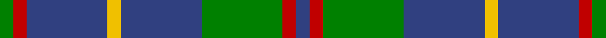
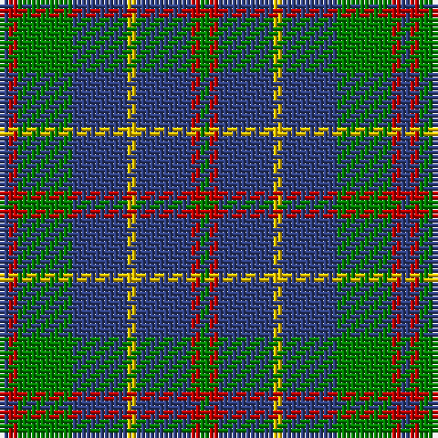

In pattern [BRGBYBRG](/stripes/brgbybrg/).

This was sourced from weddslist.  It is a [8 stripe tartan](/stripes/stripes8/).

Original link http://www.weddslist.com/cgi-bin/tartans/pg.pl?source=sts

## Thread count
G/2 R2 B12 Y2 B12 G12 R2 B/2

## Palette
Each colour and the base-6 reference it is a variant of.

| Colour | Shade | Base |
|---|---|---|
| B | <code style="background-color:#304080;">#304080</code> `oklch(39.4% 0.109 270.2)` <small>#304080</small> | B <code style="background-color:#2A418A;">#2A418A</code> |
| G | <code style="background-color:#008000;">#008000</code> `oklch(52.0% 0.177 142.5)` <small>#008000</small> | G <code style="background-color:#006100;">#006100</code> |
| R | <code style="background-color:#C00000;">#C00000</code> `oklch(50.7% 0.208 29.2)` <small>#C00000</small> | R <code style="background-color:#CC0000;">#CC0000</code> |
| Y | <code style="background-color:#F0C000;">#F0C000</code> `oklch(82.7% 0.169 90.5)` <small>#F0C000</small> | Y <code style="background-color:#F2BF00;">#F2BF00</code> |

# Sample pattern

## Nearest tartans

The nearest existing variants by ΔTartan distance.

1. [MacHardy](/setts/s8/dg1r1db6ly1db6dg6r1db1~x2/) — ΔT 0.86
1. [MacHardy, Blue](/setts/s8/db6r3g26db26w4db26r5g5~x2/) — ΔT 1.06
1. [Cameron of Lochiel (Hunting) Clan/Family Tartan Tartan Number: 5351. Earliest known date: 01/01/1940 Design close to Cameron Hunting which has two red lines shown in Vestiarium Scoticum. This design evolved in the 1940s by J G MacKay of Portree and was first put on show at the Cameron Gathering at Achnacarry in 1956. (original STA ref: 1535) See products available Copyright © Blair Urquhart, Comrie, 2015](/setts/s7/r5g20r5g20db24g6ly4/) — ΔT 1.09
1. [Cameron of Lochiel (Hunting)](/setts/s7/r3g10r3g14db16g3ly2~x2/) — ΔT 1.13
1. [Bruce (Personal)](/setts/s11/w1db8g2db2g6db1g6db2g2db8ly1~x4/) — ΔT 1.16
1. [Bruce of Crionaich (Personal)](/setts/s11/r1g8db2g2db6g1db6g2db2g8ly1~x4/) — ΔT 1.21
1. [Heritage Tartan, The](/setts/s6/db8r4db24g35lb4g8/) — ΔT 1.22
1. [Digital Equipment Corp.](/setts/s10/n8k5n16o9n3o3n3o3n10lb3~x2/) — ΔT 1.27
1. [Glen Esk](/setts/s8/dg10r1dg1r2dg8db10dg1ly1~x4/) — ΔT 1.28
1. [Smeaton #2 (Name)](/setts/s10/db12w2db7g15k2g4k2g15db2k7~x2/) — ΔT 1.29

## Neighbour map

Every grey dot is one of 14299 variants placed by the first two principal components of the ΔTartan feature space (44% of its variance). Red is this tartan; blue dots are its nearest — click one to open its page.

<svg viewBox="0 0 640 380" role="img" style="max-width:100%;height:auto;border:1px solid #e0e0e0;border-radius:4px;display:block" xmlns="http://www.w3.org/2000/svg"><image href="/nn/cloud.v1.png" width="640" height="380"/><a href="/setts/s8/dg1r1db6ly1db6dg6r1db1~x2/"><circle cx="310.0" cy="238.9" r="4" fill="#3465a4"><title>MacHardy</title></circle></a><a href="/setts/s8/db6r3g26db26w4db26r5g5~x2/"><circle cx="303.6" cy="215.0" r="4" fill="#3465a4"><title>MacHardy, Blue</title></circle></a><a href="/setts/s7/r5g20r5g20db24g6ly4/"><circle cx="264.1" cy="247.8" r="4" fill="#3465a4"><title>Cameron of Lochiel (Hunting) Clan/Family Tartan Tartan Number: 5351. Earliest known date: 01/01/1940 Design close to Cameron Hunting which has two red lines shown in Vestiarium Scoticum. This design evolved in the 1940s by J G MacKay of Portree and was first put on show at the Cameron Gathering at Achnacarry in 1956. (original STA ref: 1535) See products available Copyright © Blair Urquhart, Comrie, 2015</title></circle></a><a href="/setts/s7/r3g10r3g14db16g3ly2~x2/"><circle cx="260.0" cy="224.9" r="4" fill="#3465a4"><title>Cameron of Lochiel (Hunting)</title></circle></a><a href="/setts/s11/w1db8g2db2g6db1g6db2g2db8ly1~x4/"><circle cx="286.1" cy="214.5" r="4" fill="#3465a4"><title>Bruce (Personal)</title></circle></a><a href="/setts/s11/r1g8db2g2db6g1db6g2db2g8ly1~x4/"><circle cx="306.9" cy="225.6" r="4" fill="#3465a4"><title>Bruce of Crionaich (Personal)</title></circle></a><a href="/setts/s6/db8r4db24g35lb4g8/"><circle cx="284.9" cy="228.3" r="4" fill="#3465a4"><title>Heritage Tartan, The</title></circle></a><a href="/setts/s10/n8k5n16o9n3o3n3o3n10lb3~x2/"><circle cx="308.0" cy="244.3" r="4" fill="#3465a4"><title>Digital Equipment Corp.</title></circle></a><a href="/setts/s8/dg10r1dg1r2dg8db10dg1ly1~x4/"><circle cx="324.8" cy="207.8" r="4" fill="#3465a4"><title>Glen Esk</title></circle></a><a href="/setts/s10/db12w2db7g15k2g4k2g15db2k7~x2/"><circle cx="248.9" cy="226.2" r="4" fill="#3465a4"><title>Smeaton #2 (Name)</title></circle></a><circle cx="291.6" cy="228.7" r="5" fill="#c00000"/></svg>

ID: /setts/s8/db1r1g6db6ly1db6r1g1~x2/
