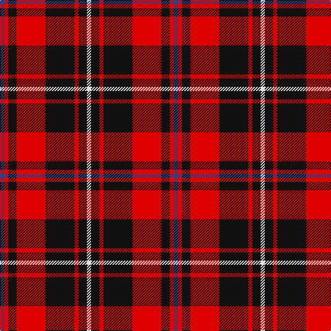

In pattern [BRKRKRKW](/stripes/brkrkrkw/).

This was sourced from register-of-tartans.  It is a [8 stripe tartan](/stripes/stripes8/).

Original link https://www.tartanregister.gov.uk/tartanDetails.aspx?ref=5997

## Register references

External register numbers recorded for this tartan.

- Scottish Register of Tartans: [5997](https://www.tartanregister.gov.uk/tartanDetails.aspx?ref=5997)
- Scottish Tartans Authority (ITI): 7742
- Scottish Tartans World Register: 3288

## Thread count
B/6 R6 K12 R42 K42 R6 K12 LN/6

## Palette
Each colour and the base-6 reference it is a variant of.

| Colour | Shade | Base |
|---|---|---|
| B | <code style="background-color:#2C4084;">#2C4084</code> `oklch(39.4% 0.117 268.3)` <small>#2C4084</small> | B <code style="background-color:#2A418A;">#2A418A</code> |
| K | <code style="background-color:#101010;">#101010</code> `oklch(17.3% 0.000 89.9)` <small>#101010</small> | K <code style="background-color:#000000;">#000000</code> |
| LN | <code style="background-color:#E0E0E0;">#E0E0E0</code> `oklch(90.7% 0.000 89.9)` <small>#E0E0E0</small> | W <code style="background-color:#F7F7F7;">#F7F7F7</code> |
| R | <code style="background-color:#DC0000;">#DC0000</code> `oklch(56.2% 0.230 29.2)` <small>#DC0000</small> | R <code style="background-color:#CC0000;">#CC0000</code> |

# Sample pattern

## Nearest tartans

The nearest existing variants by ΔTartan distance.

1. [Nakayama (Fashion)](/setts/s8/b1r1k2r7k7r1k2w1~x6/) — ΔT 0.24
1. [MacIver (Clan)](/setts/s9/w2r12k3r3k16r3k3r12ly2~x2/) — ΔT 0.85
1. [MacPherson Red Cluny](/setts/s7/r6k3r29k23w4k7ly3~x2/) — ΔT 0.86
1. [Alexander](/setts/s9/r12db2r4db4k15g4r4g2r12~x2/) — ΔT 0.93
1. [Scoepaig, fragment](/setts/s10/k10t1k1r10t1k1t1r10g6r2~x2/) — ΔT 1.03
1. [MacKinnon Black (Personal)](/setts/s12/dp3r4k5r12k24r3k10r26k12dp3r6w3~x2/) — ΔT 1.07
1. [Cameron of Locheil #2](/setts/s9/r6g3r6db1w1db1r2db8r4~x4/) — ΔT 1.09
1. [Cameron of Locheil #3](/setts/s9/r24db8r23k4w4k4r10k32r8/) — ΔT 1.12
1. [Cetoloni (Personal)](/setts/s6/db1r12k6ly1k6db1~x4/) — ΔT 1.16
1. [Haig & Haig Whisky](/setts/s8/r26k18r7k4ly4~x2/) — ΔT 1.20

## Neighbour map

Every grey dot is one of 14299 variants placed by the first two principal components of the ΔTartan feature space (44% of its variance). Red is this tartan; blue dots are its nearest — click one to open its page.

<svg viewBox="0 0 640 380" role="img" style="max-width:100%;height:auto;border:1px solid #e0e0e0;border-radius:4px;display:block" xmlns="http://www.w3.org/2000/svg"><image href="/nn/cloud.v1.png" width="640" height="380"/><a href="/setts/s8/b1r1k2r7k7r1k2w1~x6/"><circle cx="265.8" cy="192.3" r="4" fill="#3465a4"><title>Nakayama (Fashion)</title></circle></a><a href="/setts/s9/w2r12k3r3k16r3k3r12ly2~x2/"><circle cx="282.9" cy="182.1" r="4" fill="#3465a4"><title>MacIver (Clan)</title></circle></a><a href="/setts/s7/r6k3r29k23w4k7ly3~x2/"><circle cx="261.4" cy="174.4" r="4" fill="#3465a4"><title>MacPherson Red Cluny</title></circle></a><a href="/setts/s9/r12db2r4db4k15g4r4g2r12~x2/"><circle cx="243.1" cy="195.0" r="4" fill="#3465a4"><title>Alexander</title></circle></a><a href="/setts/s10/k10t1k1r10t1k1t1r10g6r2~x2/"><circle cx="248.1" cy="160.9" r="4" fill="#3465a4"><title>Scoepaig, fragment</title></circle></a><a href="/setts/s12/dp3r4k5r12k24r3k10r26k12dp3r6w3~x2/"><circle cx="258.6" cy="174.0" r="4" fill="#3465a4"><title>MacKinnon Black (Personal)</title></circle></a><a href="/setts/s9/r6g3r6db1w1db1r2db8r4~x4/"><circle cx="268.3" cy="195.5" r="4" fill="#3465a4"><title>Cameron of Locheil #2</title></circle></a><a href="/setts/s9/r24db8r23k4w4k4r10k32r8/"><circle cx="281.0" cy="186.0" r="4" fill="#3465a4"><title>Cameron of Locheil #3</title></circle></a><a href="/setts/s6/db1r12k6ly1k6db1~x4/"><circle cx="273.5" cy="187.5" r="4" fill="#3465a4"><title>Cetoloni (Personal)</title></circle></a><a href="/setts/s8/r26k18r7k4ly4~x2/"><circle cx="283.9" cy="227.4" r="4" fill="#3465a4"><title>Haig &amp; Haig Whisky</title></circle></a><circle cx="262.3" cy="188.8" r="5" fill="#c00000"/></svg>

ID: /setts/s8/db1r1k2r7k7r1k2w1~x6/
