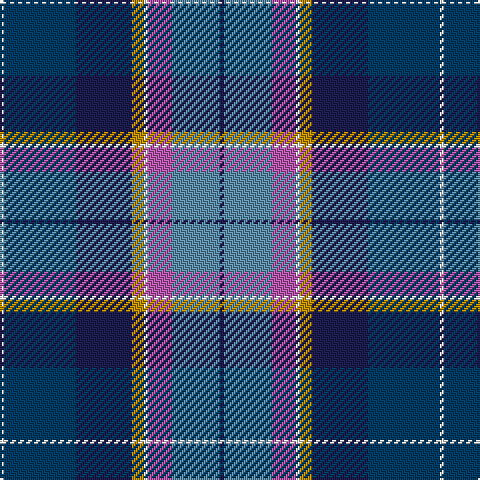

In pattern [BBRWYBBW](/stripes/bbrwybbw/).

This was sourced from register-of-tartans.  It is a [8 stripe tartan](/stripes/stripes8/).

Original link https://www.tartanregister.gov.uk/tartanDetails.aspx?ref=11029

## Register references

External register numbers recorded for this tartan.

- Scottish Register of Tartans: [11029](https://www.tartanregister.gov.uk/tartanDetails.aspx?ref=11029)

## Thread count
W/2 DB36 DBa28 DY6 W2 P12 B24 DBa/2

## Palette
Each colour and the base-6 reference it is a variant of.

| Colour | Shade | Base |
|---|---|---|
| B | <code style="background-color:#5C8CA8;">#5C8CA8</code> `oklch(61.7% 0.067 235.0)` <small>#5C8CA8</small> | B <code style="background-color:#2A418A;">#2A418A</code> |
| DB | <code style="background-color:#003C64;">#003C64</code> `oklch(34.5% 0.089 246.0)` <small>#003C64</small> | B <code style="background-color:#2A418A;">#2A418A</code> |
| DBa | <code style="background-color:#1C1C50;">#1C1C50</code> `oklch(26.2% 0.093 277.9)` <small>#1C1C50</small> | B <code style="background-color:#2A418A;">#2A418A</code> |
| DY | <code style="background-color:#BC8C00;">#BC8C00</code> `oklch(66.8% 0.137 84.1)` <small>#BC8C00</small> | Y <code style="background-color:#F2BF00;">#F2BF00</code> |
| P | <code style="background-color:#B458AC;">#B458AC</code> `oklch(60.2% 0.158 330.7)` <small>#B458AC</small> | R <code style="background-color:#CC0000;">#CC0000</code> |
| W | <code style="background-color:#FFFFFF;">#FFFFFF</code> `oklch(100.0% 0.000 89.9)` <small>#FFFFFF</small> | W <code style="background-color:#F7F7F7;">#F7F7F7</code> |

# Sample pattern

## Nearest tartans

The nearest existing variants by ΔTartan distance.

1. [Yule (Name)](/setts/s9/t1ly3g14w2db22w2dp14t3ly1~x2/) — ΔT 0.92
1. [Unidentified (Woven sample)](/setts/s8/k16w6k4b64m19k8g42ly6/) — ΔT 0.97
1. [George Heriot's School](/setts/s7/w3k1db24db10o24k1ly3~x2/) — ΔT 1.01
1. [Royal Air Force Regimental Tartan Tartan Number: 2123. Earliest known date: 1988 The Royal Air Force initially declined to approve this tartan for members of the Air Services. However the tartan was worn by Scottish ex-servicemen and those who have served in Scotland and became quite popular. In 2002 it was officially adopted by the RAF. See products available Copyright © Blair Urquhart, Comrie, 2015](/setts/s11/w4db8r3db25k13db4t29db3t8db2r3~x2/) — ΔT 1.06
1. [Bute Heather, Ancient](/setts/s11/db6w1t18k6t4k4p8lg1p8k2db5~x2/) — ΔT 1.13
1. [Alexander of Menstry](/setts/s8/g5m2g2m9k9lr9db30w5~x2/) — ΔT 1.13
1. [Moran (Coilessan) (Personal)](/setts/s8/t26db13k13w2g8k5r3t3~x2/) — ΔT 1.15
1. [Air Force](/setts/s11/w4db8m3db25k13g4t29db3t8db2m3~x2/) — ΔT 1.15
1. [Moran (Virgin Islands) (Personal)](/setts/s9/t3r3k5g8w2k13db13t26w3~x2/) — ΔT 1.17
1. [Accenture](/setts/s10/dp3o1db4g2r2g21o3dp21db25w3~x2/) — ΔT 1.18

## Neighbour map

Every grey dot is one of 14299 variants placed by the first two principal components of the ΔTartan feature space (44% of its variance). Red is this tartan; blue dots are its nearest — click one to open its page.

<svg viewBox="0 0 640 380" role="img" style="max-width:100%;height:auto;border:1px solid #e0e0e0;border-radius:4px;display:block" xmlns="http://www.w3.org/2000/svg"><image href="/nn/cloud.v1.png" width="640" height="380"/><a href="/setts/s9/t1ly3g14w2db22w2dp14t3ly1~x2/"><circle cx="166.4" cy="112.0" r="4" fill="#3465a4"><title>Yule (Name)</title></circle></a><a href="/setts/s8/k16w6k4b64m19k8g42ly6/"><circle cx="161.8" cy="135.5" r="4" fill="#3465a4"><title>Unidentified (Woven sample)</title></circle></a><a href="/setts/s7/w3k1db24db10o24k1ly3~x2/"><circle cx="196.6" cy="125.5" r="4" fill="#3465a4"><title>George Heriot's School</title></circle></a><a href="/setts/s11/w4db8r3db25k13db4t29db3t8db2r3~x2/"><circle cx="174.9" cy="135.1" r="4" fill="#3465a4"><title>Royal Air Force Regimental Tartan Tartan Number: 2123. Earliest known date: 1988 The Royal Air Force initially declined to approve this tartan for members of the Air Services. However the tartan was worn by Scottish ex-servicemen and those who have served in Scotland and became quite popular. In 2002 it was officially adopted by the RAF. See products available Copyright © Blair Urquhart, Comrie, 2015</title></circle></a><a href="/setts/s11/db6w1t18k6t4k4p8lg1p8k2db5~x2/"><circle cx="142.9" cy="136.4" r="4" fill="#3465a4"><title>Bute Heather, Ancient</title></circle></a><a href="/setts/s8/g5m2g2m9k9lr9db30w5~x2/"><circle cx="164.1" cy="135.0" r="4" fill="#3465a4"><title>Alexander of Menstry</title></circle></a><a href="/setts/s8/t26db13k13w2g8k5r3t3~x2/"><circle cx="150.9" cy="159.3" r="4" fill="#3465a4"><title>Moran (Coilessan) (Personal)</title></circle></a><a href="/setts/s11/w4db8m3db25k13g4t29db3t8db2m3~x2/"><circle cx="161.5" cy="130.0" r="4" fill="#3465a4"><title>Air Force</title></circle></a><a href="/setts/s9/t3r3k5g8w2k13db13t26w3~x2/"><circle cx="133.4" cy="145.1" r="4" fill="#3465a4"><title>Moran (Virgin Islands) (Personal)</title></circle></a><a href="/setts/s10/dp3o1db4g2r2g21o3dp21db25w3~x2/"><circle cx="204.5" cy="116.6" r="4" fill="#3465a4"><title>Accenture</title></circle></a><circle cx="148.2" cy="144.6" r="5" fill="#c00000"/></svg>

ID: /setts/s8/db1t12m6w1lo3db14dt18w1~x2/
