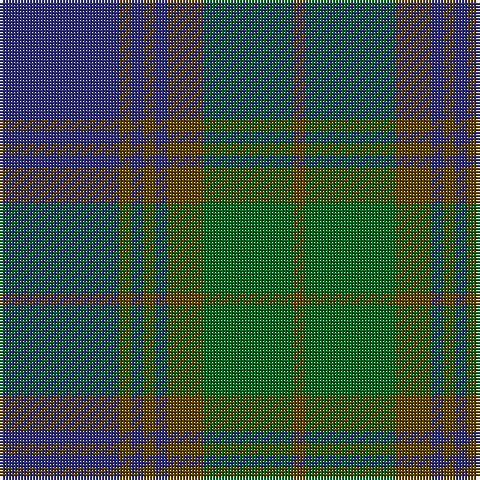

In pattern [BGBGBGGG](/stripes/bgbgbggg/).

This was sourced from register-of-tartans.  It is a [8 stripe tartan](/stripes/stripes8/).

Original link https://www.tartanregister.gov.uk/tartanDetails.aspx?ref=1313

## Attestations

This cloth appears in 2 source records; the oldest owns this page.

- 01/01/1989 — Gammell (Brown) (Personal) (register-of-tartans, [record](https://www.tartanregister.gov.uk/tartanDetails.aspx?ref=1313))
- 1989 — Gammell (Brown) (Personal) (tartans-authority, [record](http://www.tartansauthority.com/tartan-ferret/display/4959/))

## Register references

External register numbers recorded for this tartan.

- Scottish Register of Tartans: [1313](https://www.tartanregister.gov.uk/tartanDetails.aspx?ref=1313)
- Scottish Tartans Authority (ITI): 4959

## Thread count
DB/40 T4 DB4 T4 DB4 T12 G30 T/4

## Palette
Each colour and its ΔE from the base-6 reference it is a variant of.

| Colour | Shade | Base | ΔE (OKLab) |
|---|---|---|---|
| DB | <code style="background-color:#2C2C80;">#2C2C80</code> `#2C2C80` | B <code style="background-color:#2A418A;">#2A418A</code> | 0.06 |
| G | <code style="background-color:#006818;">#006818</code> `#006818` | G <code style="background-color:#006100;">#006100</code> | 0.02 |
| T | <code style="background-color:#604000;">#604000</code> `#604000` | G <code style="background-color:#006100;">#006100</code> | 0.14 |

# Sample pattern

## Nearest tartans

The nearest existing variants by ΔTartan distance.

1. [Scottish Monuments (Corporate)](/setts/s9/k3n6k2n8dt20o3dt2o2dt3~x2/) — ΔT 1.05
1. [Gammell Family Tartan Tartan Number: 597. Earliest known date: 1965 Designed (probably by David Thomas and Arthur Mackie of Strathmore Woollen Co) for the Hill family of Angus as a personal tartan. Tommy Gemmell (6.3.05) said "The tartan was designed using the largest Government sett by Mrs Hill's mother - a Mrs Gammell - who was a handweaver." See products available Copyright © Blair Urquhart, Comrie, 2015](/setts/s8/db32do3db3do3db3do10g24r3~x2/) — ΔT 1.05
1. [Stuart/Stewart of Appin #2](/setts/s10/dg11r4dg4r7dg41db11t4db41r4db8/) — ΔT 1.12
1. [Black Watch (Miniature) Regimental Tartan Tartan Number: 2200. Earliest known date: pre 2003 This is a miniture version of the regular Black Watch sett. See products available Copyright © Blair Urquhart, Comrie, 2015](/setts/s8/db12k1db1k1db1k3g6k1~x2/) — ΔT 1.14
1. [St. Andrews New Golf Club](/setts/s9/dp4dt18r2dt2r2dt9g20dt3g4~x2/) — ΔT 1.15
1. [Manx Centenary](/setts/s9/db22g3db3g3db3g9y28g3y6~x2/) — ΔT 1.15
1. [Stuart/Stewart of Appin](/setts/s10/dg8r3dg3r5dg26db7t3db28r3db6~x2/) — ΔT 1.18
1. [Herron from Ulster (Personal)](/setts/s9/dg12k11dg1k1dg1db10dg1k1dg1~x4/) — ΔT 1.19
1. [Wcwm 1527-2](/setts/s10/db2dp26dg26db2dg3db2dg3db14dp2db2~x2/) — ΔT 1.29
1. [Jones (Welsh Name)](/setts/s10/db6t3db3t15dg7db7dg5db17dg46dg4/) — ΔT 1.33

## Neighbour map

Every grey dot is one of 14299 variants placed by the first two principal components of the ΔTartan feature space (44% of its variance). Red is this tartan; blue dots are its nearest — click one to open its page.

<svg viewBox="0 0 640 380" role="img" style="max-width:100%;height:auto;border:1px solid #e0e0e0;border-radius:4px;display:block" xmlns="http://www.w3.org/2000/svg"><image href="/nn/cloud.v1.png" width="640" height="380"/><a href="/setts/s9/k3n6k2n8dt20o3dt2o2dt3~x2/"><circle cx="328.7" cy="219.3" r="4" fill="#3465a4"><title>Scottish Monuments (Corporate)</title></circle></a><a href="/setts/s8/db32do3db3do3db3do10g24r3~x2/"><circle cx="315.5" cy="216.8" r="4" fill="#3465a4"><title>Gammell Family Tartan Tartan Number: 597. Earliest known date: 1965 Designed (probably by David Thomas and Arthur Mackie of Strathmore Woollen Co) for the Hill family of Angus as a personal tartan. Tommy Gemmell (6.3.05) said &quot;The tartan was designed using the largest Government sett by Mrs Hill's mother - a Mrs Gammell - who was a handweaver.&quot; See products available Copyright © Blair Urquhart, Comrie, 2015</title></circle></a><a href="/setts/s10/dg11r4dg4r7dg41db11t4db41r4db8/"><circle cx="305.6" cy="206.3" r="4" fill="#3465a4"><title>Stuart/Stewart of Appin #2</title></circle></a><a href="/setts/s8/db12k1db1k1db1k3g6k1~x2/"><circle cx="385.9" cy="231.2" r="4" fill="#3465a4"><title>Black Watch (Miniature) Regimental Tartan Tartan Number: 2200. Earliest known date: pre 2003 This is a miniture version of the regular Black Watch sett. See products available Copyright © Blair Urquhart, Comrie, 2015</title></circle></a><a href="/setts/s9/dp4dt18r2dt2r2dt9g20dt3g4~x2/"><circle cx="341.2" cy="233.2" r="4" fill="#3465a4"><title>St. Andrews New Golf Club</title></circle></a><a href="/setts/s9/db22g3db3g3db3g9y28g3y6~x2/"><circle cx="303.7" cy="229.3" r="4" fill="#3465a4"><title>Manx Centenary</title></circle></a><a href="/setts/s10/dg8r3dg3r5dg26db7t3db28r3db6~x2/"><circle cx="294.0" cy="210.9" r="4" fill="#3465a4"><title>Stuart/Stewart of Appin</title></circle></a><a href="/setts/s9/dg12k11dg1k1dg1db10dg1k1dg1~x4/"><circle cx="319.8" cy="227.2" r="4" fill="#3465a4"><title>Herron from Ulster (Personal)</title></circle></a><a href="/setts/s10/db2dp26dg26db2dg3db2dg3db14dp2db2~x2/"><circle cx="315.2" cy="212.5" r="4" fill="#3465a4"><title>Wcwm 1527-2</title></circle></a><a href="/setts/s10/db6t3db3t15dg7db7dg5db17dg46dg4/"><circle cx="349.4" cy="198.1" r="4" fill="#3465a4"><title>Jones (Welsh Name)</title></circle></a><circle cx="340.6" cy="238.9" r="5" fill="#c00000"/></svg>

ID: /setts/s8/db20dy2db2dy2db2dy6g15dy2~x2/
