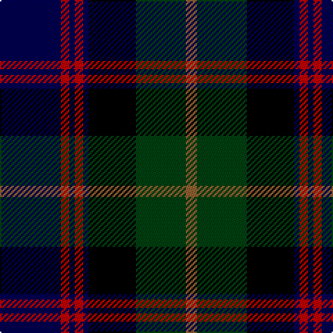

This page is one **sett** — a single exact thread-count. It belongs to the [tartan](/tartans/db22r3db2r3db2k17dg18o4/)
(the same proportion at any scale), whose colour order is pattern [BRBRBKGR](/stripes/brbrbkgr/).

Sourced from weddslist.  It is a [8 stripe tartan](/stripes/stripes8/).

Original link http://www.weddslist.com/cgi-bin/tartans/pg.pl?source=sts

## Thread count
DB/44 R6 DB4 R6 DB4 K34 DG36 LT/8

## Palette

Palette: <strong>Ingles Buchan</strong> <small style="color:#888">(1 of 5 colours)</small>
<table><thead><tr><th>Colour</th><th>Threads</th><th>Shade</th><th>Base</th><th>OKLCh</th></tr></thead><tbody><tr><td>DB/</td><td style="text-align:right;font-variant-numeric:tabular-nums">44</td><td><code style="background-color:#000050;">#000050</code> <small style="color:#888">#000050</small></td><td>B <code style="background-color:#2A418A;">#2A418A</code></td><td><small style="color:#888">oklch(19.5% 0.135 264.1)</small></td></tr><tr><td>R</td><td style="text-align:right;font-variant-numeric:tabular-nums">6</td><td><code style="background-color:#C00000;">#C00000</code> <small style="color:#888">#C00000</small></td><td>R <code style="background-color:#CC0000;">#CC0000</code></td><td><small style="color:#888">oklch(50.7% 0.208 29.2)</small></td></tr><tr><td>DB</td><td style="text-align:right;font-variant-numeric:tabular-nums">4</td><td><code style="background-color:#000050;">#000050</code> <small style="color:#888">#000050</small></td><td>B <code style="background-color:#2A418A;">#2A418A</code></td><td><small style="color:#888">oklch(19.5% 0.135 264.1)</small></td></tr><tr><td>R</td><td style="text-align:right;font-variant-numeric:tabular-nums">6</td><td><code style="background-color:#C00000;">#C00000</code> <small style="color:#888">#C00000</small></td><td>R <code style="background-color:#CC0000;">#CC0000</code></td><td><small style="color:#888">oklch(50.7% 0.208 29.2)</small></td></tr><tr><td>DB</td><td style="text-align:right;font-variant-numeric:tabular-nums">4</td><td><code style="background-color:#000050;">#000050</code> <small style="color:#888">#000050</small></td><td>B <code style="background-color:#2A418A;">#2A418A</code></td><td><small style="color:#888">oklch(19.5% 0.135 264.1)</small></td></tr><tr><td>K</td><td style="text-align:right;font-variant-numeric:tabular-nums">34</td><td><code style="background-color:#000000;">#000000</code> <small style="color:#888">#000000</small></td><td>K <code style="background-color:#000000;">#000000</code></td><td><small style="color:#888">oklch(0.0% 0.000 0.0)</small></td></tr><tr><td>DG</td><td style="text-align:right;font-variant-numeric:tabular-nums">36</td><td><code style="background-color:#004010;">#004010</code> <small style="color:#888">#004010</small></td><td>G <code style="background-color:#006100;">#006100</code></td><td><small style="color:#888">oklch(32.3% 0.098 146.3)</small></td></tr><tr><td>LT/</td><td style="text-align:right;font-variant-numeric:tabular-nums">8</td><td><code style="background-color:#906030;">#906030</code> <small style="color:#888">#906030</small></td><td>R <code style="background-color:#CC0000;">#CC0000</code></td><td><small style="color:#888">oklch(53.1% 0.089 63.7)</small></td></tr></tbody></table>

# Sample pattern

## Nearest tartans

The nearest existing variants by ΔTartan distance, with this tartan at the top so the swatches line up against it.

ΔTartan

Tartan

Sett

—

<a href="/ttd/edit/#slug=db22r3db2r3db2k17dg18o4~x2">Scotch House 2000, original</a> <a class="nn-out" href="/setts/s8/db22r3db2r3db2k17dg18o4~x2/" title="open its dictionary page">↗</a>

0.46

<a href="/ttd/edit/#slug=r3k2dg15k10db20k2ly2~x2">MacLeod</a> <a class="nn-out" href="/setts/s7/r3k2dg15k10db20k2ly2~x2/" title="open its dictionary page">↗</a>

0.46

<a href="/ttd/edit/#slug=r3k2dg15k10db20k2ly2">MacLeod</a> <a class="nn-out" href="/setts/s7/r3k2dg15k10db20k2ly2/" title="open its dictionary page">↗</a>

0.81

<a href="/ttd/edit/#slug=r2k1db8k8dg8k1b2~x2">Campbell of Cawdor</a> <a class="nn-out" href="/setts/s7/r2k1db8k8dg8k1b2~x2/" title="open its dictionary page">↗</a>

0.81

<a href="/ttd/edit/#slug=r2dg8lr1k8db8k1db1~x2">Colquhoun</a> <a class="nn-out" href="/setts/s7/r2dg8lr1k8db8k1db1~x2/" title="open its dictionary page">↗</a>

0.83

<a href="/ttd/edit/#slug=db8r4db12r1k12dg12r3dg2r1dg4lr1~x2">MacDonell of Glengarry</a> <a class="nn-out" href="/setts/s11/db8r4db12r1k12dg12r3dg2r1dg4lr1~x2/" title="open its dictionary page">↗</a>

0.94

<a href="/ttd/edit/#slug=k2dg12k12r1db12lr2~x2">Mitchell</a> <a class="nn-out" href="/setts/s6/k2dg12k12r1db12lr2~x2/" title="open its dictionary page">↗</a>

0.94

<a href="/ttd/edit/#slug=k2dg12k12r1db12lr2">Mitchell</a> <a class="nn-out" href="/setts/s6/k2dg12k12r1db12lr2/" title="open its dictionary page">↗</a>

0.95

<a href="/ttd/edit/#slug=db28r4k14r4dg33ly4~x2">Royal College of Physicians of Edinburgh</a> <a class="nn-out" href="/setts/s6/db28r4k14r4dg33ly4~x2/" title="open its dictionary page">↗</a>

0.97

<a href="/ttd/edit/#slug=dg8r1dg1r3dg16k16r1db16r3db8ly2~x2">Cameron of Erracht</a> <a class="nn-out" href="/setts/s11/dg8r1dg1r3dg16k16r1db16r3db8ly2~x2/" title="open its dictionary page">↗</a>

0.98

<a href="/ttd/edit/#slug=db20k3db3k3db3k16g3lo3g12r2~x2">Barnes Hunting (Personal)</a> <a class="nn-out" href="/setts/s10/db20k3db3k3db3k16g3lo3g12r2~x2/" title="open its dictionary page">↗</a>

## Neighbour map

Every grey dot is one of 14299 variants placed by the first two principal components of the ΔTartan feature space (44% of its variance). Red is this tartan; blue dots are its nearest — click one to open its page.

<svg viewBox="0 0 640 380" role="img" style="max-width:100%;height:auto;border:1px solid #e0e0e0;border-radius:4px;display:block" xmlns="http://www.w3.org/2000/svg"><image href="/nn/cloud.v1.png" width="640" height="380"/><a href="/setts/s7/r3k2dg15k10db20k2ly2~x2/"><circle cx="182.3" cy="200.6" r="4" fill="#3465a4"><title>MacLeod</title></circle></a><a href="/setts/s7/r3k2dg15k10db20k2ly2/"><circle cx="182.3" cy="200.6" r="4" fill="#3465a4"><title>MacLeod</title></circle></a><a href="/setts/s7/r2k1db8k8dg8k1b2~x2/"><circle cx="143.9" cy="219.1" r="4" fill="#3465a4"><title>Campbell of Cawdor</title></circle></a><a href="/setts/s7/r2dg8lr1k8db8k1db1~x2/"><circle cx="142.7" cy="212.7" r="4" fill="#3465a4"><title>Colquhoun</title></circle></a><a href="/setts/s11/db8r4db12r1k12dg12r3dg2r1dg4lr1~x2/"><circle cx="154.3" cy="176.2" r="4" fill="#3465a4"><title>MacDonell of Glengarry</title></circle></a><a href="/setts/s6/k2dg12k12r1db12lr2~x2/"><circle cx="170.4" cy="211.3" r="4" fill="#3465a4"><title>Mitchell</title></circle></a><a href="/setts/s6/k2dg12k12r1db12lr2/"><circle cx="170.4" cy="211.3" r="4" fill="#3465a4"><title>Mitchell</title></circle></a><a href="/setts/s6/db28r4k14r4dg33ly4~x2/"><circle cx="169.2" cy="213.2" r="4" fill="#3465a4"><title>Royal College of Physicians of Edinburgh</title></circle></a><a href="/setts/s11/dg8r1dg1r3dg16k16r1db16r3db8ly2~x2/"><circle cx="173.1" cy="161.5" r="4" fill="#3465a4"><title>Cameron of Erracht</title></circle></a><a href="/setts/s10/db20k3db3k3db3k16g3lo3g12r2~x2/"><circle cx="198.7" cy="185.3" r="4" fill="#3465a4"><title>Barnes Hunting (Personal)</title></circle></a><circle cx="178.9" cy="189.8" r="5" fill="#c00000"/></svg>

ID: /setts/s8/db22r3db2r3db2k17dg18o4~x2/
