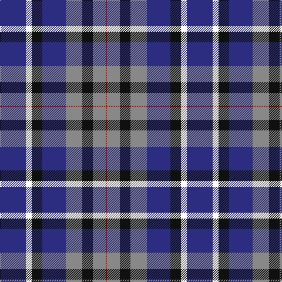

**Bands:** [RRKRBKWB](/stripes/rrkrbkwb/) · **Stripes:** [R O K O DB K W DB](/stripes/stripes8/) R O K O DB K W DB

This was sourced from tartans-authority.  It is a [8 band tartan](/bands/bands8/).

Original link http://www.tartansauthority.com/tartan-ferret/display/11136/

## Thread count
DB/44 W10 K18 DB40 N28 K18 N22 R/2

## Palette
Each colour and its ΔE from the base-6 reference it is a variant of.

| Colour | Shade | Base | ΔE (OKLab) |
|---|---|---|---|
| DB | <code style="background-color:#2C2C80;">#2C2C80</code> `#2C2C80` | B <code style="background-color:#2A418A;">#2A418A</code> | 0.06 |
| K | <code style="background-color:#101010;">#101010</code> `#101010` | K <code style="background-color:#000000;">#000000</code> | 0.17 |
| N | <code style="background-color:#888888;">#888888</code> `#888888` | R <code style="background-color:#CC0000;">#CC0000</code> | 0.24 |
| R | <code style="background-color:#C80000;">#C80000</code> `#C80000` | R <code style="background-color:#CC0000;">#CC0000</code> | 0.01 |
| W | <code style="background-color:#FCFCFC;">#FCFCFC</code> `#FCFCFC` | W <code style="background-color:#F7F7F7;">#F7F7F7</code> | 0.01 |

# Sample pattern

## Nearest tartans

The nearest existing variants by ΔTartan distance.

1. [Akintiev (2014)](/setts/s8/db22w5k9db20y14k9y11r1~x2/) — ΔT 0.11
1. [Soroptimist International](/setts/s10/b12lo2b12k6m10k1w2k1m10k6~x2/) — ΔT 1.47
1. [Steve Walls](/setts/s10/r3ly1db15g16db3r6db6g8db15w3~x2/) — ΔT 1.49
1. [Dutton, Stuart (Personal)](/setts/s11/db4k4db10k10ly2k10lr4db8lr12db2dp1~x2/) — ΔT 1.50
1. [Wellington (Wilson 122)](/setts/s8/g14dp11t3k2t3dp11g14ly1~x2/) — ΔT 1.50
1. [Dalmeny - 2002 (Fashion)](/setts/s10/db11w2db11k4g8r1~x2/) — ΔT 1.51
1. [Bute Heather, Ancient (Fashion)](/setts/s11/dp13w2t38k13t28k8dp17dg2dp17k4dt11/) — ΔT 1.55
1. [Pitt (Name)](/setts/s6/b23dt18w5dt2r14dt18~x2/) — ΔT 1.56
1. [Clunie (Personal)](/setts/s6/w12db48k13o22k3ly6/) — ΔT 1.57
1. [Highland Spring Dress (2004)](/setts/s8/r25g10db30w4db30g10r25w2~x2/) — ΔT 1.60

## Neighbour map

Every grey dot is one of 14299 variants placed by the first two principal components of the ΔTartan feature space (44% of its variance). Red is this tartan; blue dots are its nearest — click one to open its page.

<svg viewBox="0 0 640 380" role="img" style="max-width:100%;height:auto;border:1px solid #e0e0e0;border-radius:4px;display:block" xmlns="http://www.w3.org/2000/svg"><image href="/nn/cloud.v1.png" width="640" height="380"/><a href="/setts/s8/db22w5k9db20y14k9y11r1~x2/"><circle cx="212.4" cy="178.3" r="4" fill="#3465a4"><title>Akintiev (2014)</title></circle></a><a href="/setts/s10/b12lo2b12k6m10k1w2k1m10k6~x2/"><circle cx="173.2" cy="180.2" r="4" fill="#3465a4"><title>Soroptimist International</title></circle></a><a href="/setts/s10/r3ly1db15g16db3r6db6g8db15w3~x2/"><circle cx="246.7" cy="171.7" r="4" fill="#3465a4"><title>Steve Walls</title></circle></a><a href="/setts/s11/db4k4db10k10ly2k10lr4db8lr12db2dp1~x2/"><circle cx="137.2" cy="176.3" r="4" fill="#3465a4"><title>Dutton, Stuart (Personal)</title></circle></a><a href="/setts/s8/g14dp11t3k2t3dp11g14ly1~x2/"><circle cx="245.5" cy="189.3" r="4" fill="#3465a4"><title>Wellington (Wilson 122)</title></circle></a><a href="/setts/s10/db11w2db11k4g8r1~x2/"><circle cx="224.3" cy="196.8" r="4" fill="#3465a4"><title>Dalmeny - 2002 (Fashion)</title></circle></a><a href="/setts/s11/dp13w2t38k13t28k8dp17dg2dp17k4dt11/"><circle cx="196.1" cy="138.8" r="4" fill="#3465a4"><title>Bute Heather, Ancient (Fashion)</title></circle></a><a href="/setts/s6/b23dt18w5dt2r14dt18~x2/"><circle cx="223.8" cy="233.8" r="4" fill="#3465a4"><title>Pitt (Name)</title></circle></a><a href="/setts/s6/w12db48k13o22k3ly6/"><circle cx="197.6" cy="160.5" r="4" fill="#3465a4"><title>Clunie (Personal)</title></circle></a><a href="/setts/s8/r25g10db30w4db30g10r25w2~x2/"><circle cx="231.5" cy="197.0" r="4" fill="#3465a4"><title>Highland Spring Dress (2004)</title></circle></a><circle cx="209.6" cy="176.5" r="5" fill="#c00000"/></svg>

ID: /setts/s8/db22w5k9db20o14k9o11r1~x2/
