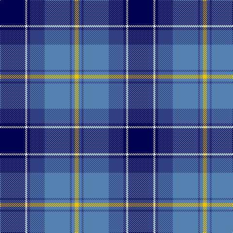

This page is one **sett** — a single exact thread-count. It belongs to the [tartan](/tartans/db26ln2db3b15ba26b2ba3y4/)
(the same proportion at any scale), whose colour order is pattern [BWBBBBBY](/stripes/bwbbbbby/).

Sourced from weddslist.  It is a [8 stripe tartan](/stripes/stripes8/).

Original link http://www.weddslist.com/cgi-bin/tartans/pg.pl?source=sts

## Also known as

This cloth is also recorded under:

- Banff, and Buchan

2 attestations — the source records this cloth was collapsed from (oldest owns this page)

<ul>
<li>undated — Banff, and Buchan (weddslist, <a href="http://www.weddslist.com/cgi-bin/tartans/pg.pl?source=sts">record</a>)</li>
<li>undated — Banff and Buchan District Tartan Tartan Number: 2150. Earliest known date: 1992 This tartan has been designed for the District of Banff and Buchan. It is based on the sett of the Ogilvy Tartan which originates from this district. The colours are taken from the surrounding landscape - the blues of the mountains and the sea, also of the sky, with touches of white. The yellow is reminiscent of the cornfields. (J.Roberts) The tartan is produced by Macnaughtons of Pitlochry. See products available Copyright © Blair Urquhart, Comrie, 2015 (house-of-tartan, <a href="http://www.house-of-tartan.scotland.net/house/TartanViewjs.asp?colr=Def&tnam=2150">record</a>)</li>
</ul>

## Thread count
DB/52 LN4 DB6 B30 Ba52 B4 Ba6 Y/8

## Palette
Each colour and the base-6 reference it is a variant of.

| Colour | Shade | Base |
|---|---|---|
| B | <code style="background-color:#304080;">#304080</code> `oklch(39.4% 0.109 270.2)` <small>#304080</small> | B <code style="background-color:#2A418A;">#2A418A</code> |
| Ba | <code style="background-color:#5480B0;">#5480B0</code> `oklch(58.8% 0.089 251.5)` <small>#5480B0</small> | B <code style="background-color:#2A418A;">#2A418A</code> |
| DB | <code style="background-color:#000050;">#000050</code> `oklch(19.5% 0.135 264.1)` <small>#000050</small> | B <code style="background-color:#2A418A;">#2A418A</code> |
| LN | <code style="background-color:#E0E0E0;">#E0E0E0</code> `oklch(90.7% 0.000 89.9)` <small>#E0E0E0</small> | W <code style="background-color:#F7F7F7;">#F7F7F7</code> |
| Y | <code style="background-color:#F0C000;">#F0C000</code> `oklch(82.7% 0.169 90.5)` <small>#F0C000</small> | Y <code style="background-color:#F2BF00;">#F2BF00</code> |

# Sample pattern

## Nearest tartans

The nearest existing variants by ΔTartan distance, with this tartan at the top so the swatches line up against it.

ΔTartan

Tartan

Sett

—

<a href="/ttd/edit/#slug=db26w2db3db15t26db2t3ly4~x2">Banff, and Buchan</a> <a class="nn-out" href="/setts/s8/db26w2db3db15t26db2t3ly4~x2/" title="open its dictionary page">↗</a>

0.87

<a href="/ttd/edit/#slug=w4db24ly2db24t5db4ly4~x2">Mina Perhonen Japanese Corporate Tartan Tartan Number: 5797. Earliest known date: pre 2003 Designed by Fiona Hall of Lochcarron as a corporate tartan for the Mina Company of Tokyo whose logo is a butterfly. The blues are from the company's colours and represent the sky, the yellow represents the butterfly and the white is for the clouds.'Perhonen' is Finnish for butterfly and chosen because the Japanese design world has a great affinity with some Scandinavian countries. See products available Copyright © Blair Urquhart, Comrie, 2015</a> <a class="nn-out" href="/setts/s7/w4db24ly2db24t5db4ly4~x2/" title="open its dictionary page">↗</a>

0.89

<a href="/ttd/edit/#slug=db3t24k11db20w2db5lo3~x2">Icelandair</a> <a class="nn-out" href="/setts/s7/db3t24k11db20w2db5lo3~x2/" title="open its dictionary page">↗</a>

1.01

<a href="/ttd/edit/#slug=db25k3db7k15b25k2b2w4~x2">Sabema</a> <a class="nn-out" href="/setts/s8/db25k3db7k15b25k2b2w4~x2/" title="open its dictionary page">↗</a>

1.03

<a href="/ttd/edit/#slug=b30db3b3db3b3db10k10g20k2w4~x2">St Kentigern College</a> <a class="nn-out" href="/setts/s10/b30db3b3db3b3db10k10g20k2w4~x2/" title="open its dictionary page">↗</a>

1.12

<a href="/ttd/edit/#slug=db35r2k16ly2t25w2t6~x2">US Forces (Thurso) Regimental Tartan Tartan Number: 549. Earliest known date: 1986 Originally listed as MacNeil, this sett was identified by Ken Dalgliesh, weaver in Selkirk, in 1999. See products available Copyright © Blair Urquhart, Comrie, 2015</a> <a class="nn-out" href="/setts/s7/db35r2k16ly2t25w2t6~x2/" title="open its dictionary page">↗</a>

1.14

<a href="/ttd/edit/#slug=w4k24ly2n24t5k4ly4~x2">Mina Perhonen</a> <a class="nn-out" href="/setts/s7/w4k24ly2n24t5k4ly4~x2/" title="open its dictionary page">↗</a>

1.14

<a href="/ttd/edit/#slug=n12k2n2k2n2k12db12b3w1~x2">de Franck, Matt (Personal)</a> <a class="nn-out" href="/setts/s9/n12k2n2k2n2k12db12b3w1~x2/" title="open its dictionary page">↗</a>

1.16

<a href="/ttd/edit/#slug=r2t2r2t21lg11k17lb2~x2">Loch Ness (Fashion)</a> <a class="nn-out" href="/setts/s7/r2t2r2t21lg11k17lb2~x2/" title="open its dictionary page">↗</a>

1.16

<a href="/ttd/edit/#slug=db44lo3k20r3db8lg34db3db2lg15~x2">US Air Force Reserve Pipe Band</a> <a class="nn-out" href="/setts/s9/db44lo3k20r3db8lg34db3db2lg15~x2/" title="open its dictionary page">↗</a>

1.16

<a href="/ttd/edit/#slug=g2db14lg6lr1g1lr6r1~x4">Loch Ness in Scotland</a> <a class="nn-out" href="/setts/s7/g2db14lg6lr1g1lr6r1~x4/" title="open its dictionary page">↗</a>

## Neighbour map

Every grey dot is one of 14299 variants placed by the first two principal components of the ΔTartan feature space (44% of its variance). Red is this tartan; blue dots are its nearest — click one to open its page.

<svg viewBox="0 0 640 380" role="img" style="max-width:100%;height:auto;border:1px solid #e0e0e0;border-radius:4px;display:block" xmlns="http://www.w3.org/2000/svg"><image href="/nn/cloud.v1.png" width="640" height="380"/><a href="/setts/s7/w4db24ly2db24t5db4ly4~x2/"><circle cx="212.8" cy="176.4" r="4" fill="#3465a4"><title>Mina Perhonen Japanese Corporate Tartan Tartan Number: 5797. Earliest known date: pre 2003 Designed by Fiona Hall of Lochcarron as a corporate tartan for the Mina Company of Tokyo whose logo is a butterfly. The blues are from the company's colours and represent the sky, the yellow represents the butterfly and the white is for the clouds.'Perhonen' is Finnish for butterfly and chosen because the Japanese design world has a great affinity with some Scandinavian countries. See products available Copyright © Blair Urquhart, Comrie, 2015</title></circle></a><a href="/setts/s7/db3t24k11db20w2db5lo3~x2/"><circle cx="206.9" cy="187.5" r="4" fill="#3465a4"><title>Icelandair</title></circle></a><a href="/setts/s8/db25k3db7k15b25k2b2w4~x2/"><circle cx="215.6" cy="194.5" r="4" fill="#3465a4"><title>Sabema</title></circle></a><a href="/setts/s10/b30db3b3db3b3db10k10g20k2w4~x2/"><circle cx="173.8" cy="142.1" r="4" fill="#3465a4"><title>St Kentigern College</title></circle></a><a href="/setts/s7/db35r2k16ly2t25w2t6~x2/"><circle cx="198.9" cy="146.7" r="4" fill="#3465a4"><title>US Forces (Thurso) Regimental Tartan Tartan Number: 549. Earliest known date: 1986 Originally listed as MacNeil, this sett was identified by Ken Dalgliesh, weaver in Selkirk, in 1999. See products available Copyright © Blair Urquhart, Comrie, 2015</title></circle></a><a href="/setts/s7/w4k24ly2n24t5k4ly4~x2/"><circle cx="187.5" cy="168.3" r="4" fill="#3465a4"><title>Mina Perhonen</title></circle></a><a href="/setts/s9/n12k2n2k2n2k12db12b3w1~x2/"><circle cx="179.5" cy="183.1" r="4" fill="#3465a4"><title>de Franck, Matt (Personal)</title></circle></a><a href="/setts/s7/r2t2r2t21lg11k17lb2~x2/"><circle cx="169.5" cy="170.4" r="4" fill="#3465a4"><title>Loch Ness (Fashion)</title></circle></a><a href="/setts/s9/db44lo3k20r3db8lg34db3db2lg15~x2/"><circle cx="231.2" cy="138.4" r="4" fill="#3465a4"><title>US Air Force Reserve Pipe Band</title></circle></a><a href="/setts/s7/g2db14lg6lr1g1lr6r1~x4/"><circle cx="200.2" cy="156.6" r="4" fill="#3465a4"><title>Loch Ness in Scotland</title></circle></a><circle cx="182.2" cy="164.4" r="5" fill="#c00000"/></svg>

ID: /setts/s8/db26w2db3db15t26db2t3ly4~x2/
