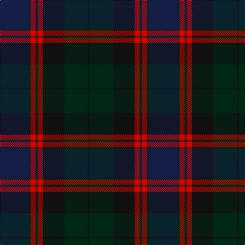

In pattern [BGRGRKGK](/stripes/bgrgrkgk/).

This was sourced from register-of-tartans.  It is a [8 stripe tartan](/stripes/stripes8/).

Original link https://www.tartanregister.gov.uk/tartanDetails.aspx?ref=250

## Register references

External register numbers recorded for this tartan.

- Scottish Register of Tartans: [250](https://www.tartanregister.gov.uk/tartanDetails.aspx?ref=250)
- Scottish Tartans World Register: 2717

## Thread count
DBa/56 DG4 R10 DG4 R10 K42 DG46 K/4

## Palette
Each colour and the base-6 reference it is a variant of.

| Colour | Shade | Base |
|---|---|---|
| DB | <code style="background-color:#202060;">#202060</code> `oklch(28.9% 0.111 276.9)` <small>#202060</small> | B <code style="background-color:#2A418A;">#2A418A</code> |
| DBa | <code style="background-color:#141E46;">#141E46</code> `oklch(25.2% 0.076 269.7)` <small>#141E46</small> | B <code style="background-color:#2A418A;">#2A418A</code> |
| DG | <code style="background-color:#002814;">#002814</code> `oklch(24.4% 0.059 156.5)` <small>#002814</small> | G <code style="background-color:#006100;">#006100</code> |
| DO | <code style="background-color:#B84C00;">#B84C00</code> `oklch(55.1% 0.156 45.5)` <small>#B84C00</small> | R <code style="background-color:#CC0000;">#CC0000</code> |
| G | <code style="background-color:#006818;">#006818</code> `oklch(45.0% 0.142 145.0)` <small>#006818</small> | G <code style="background-color:#006100;">#006100</code> |
| K | <code style="background-color:#101010;">#101010</code> `oklch(17.3% 0.000 89.9)` <small>#101010</small> | K <code style="background-color:#000000;">#000000</code> |
| R | <code style="background-color:#DC0000;">#DC0000</code> `oklch(56.2% 0.230 29.2)` <small>#DC0000</small> | R <code style="background-color:#CC0000;">#CC0000</code> |
| W | <code style="background-color:#FCFCFC;">#FCFCFC</code> `oklch(99.1% 0.000 89.9)` <small>#FCFCFC</small> | W <code style="background-color:#F7F7F7;">#F7F7F7</code> |

# Sample pattern

## Nearest tartans

The nearest existing variants by ΔTartan distance, with this tartan at the top so the swatches line up against it.

ΔTartan

Tartan

Sett

—

<a href="/ttd/edit/#slug=db28dg2r5dg2r5k21dg23k2~x2">Bentley</a> <a class="nn-out" href="/setts/s8/db28dg2r5dg2r5k21dg23k2~x2/" title="open its dictionary page">↗</a>

1.30

<a href="/ttd/edit/#slug=r7dg3r2dg33k31db31k3db3">Baird</a> <a class="nn-out" href="/setts/s8/r7dg3r2dg33k31db31k3db3/" title="open its dictionary page">↗</a>

1.35

<a href="/ttd/edit/#slug=k12g1k1g1k1r5k10g1k2~x4">Lindsay (Crimson version) (Clan?)</a> <a class="nn-out" href="/setts/s9/k12g1k1g1k1r5k10g1k2~x4/" title="open its dictionary page">↗</a>

1.36

<a href="/ttd/edit/#slug=y24r2y3db14dt24r2dt3db3~x2">Grampian (District)</a> <a class="nn-out" href="/setts/s8/y24r2y3db14dt24r2dt3db3~x2/" title="open its dictionary page">↗</a>

1.44

<a href="/ttd/edit/#slug=dt17o2dt2o2dt2k17db13k4~x2">Balmoral Hotel</a> <a class="nn-out" href="/setts/s8/dt17o2dt2o2dt2k17db13k4~x2/" title="open its dictionary page">↗</a>

1.46

<a href="/ttd/edit/#slug=dp8k1dg2k1do2k6dg8k1w2~x4">Coffield-Limesand (Personal)</a> <a class="nn-out" href="/setts/s9/dp8k1dg2k1do2k6dg8k1w2~x4/" title="open its dictionary page">↗</a>

1.48

<a href="/ttd/edit/#slug=do2dy12do12r1k12dy2~x6">Ferguson Britt (Corporate)</a> <a class="nn-out" href="/setts/s6/do2dy12do12r1k12dy2~x6/" title="open its dictionary page">↗</a>

1.51

<a href="/ttd/edit/#slug=do6o4n22r4k22do22k2r5k2do6~x2">Lochaber (Ingles Buchan)</a> <a class="nn-out" href="/setts/s10/do6o4n22r4k22do22k2r5k2do6~x2/" title="open its dictionary page">↗</a>

1.55

<a href="/ttd/edit/#slug=r1dy2k12dy8db16lo1~x2">Bobby Jones (Personal)</a> <a class="nn-out" href="/setts/s6/r1dy2k12dy8db16lo1~x2/" title="open its dictionary page">↗</a>

1.59

<a href="/ttd/edit/#slug=db16r2db2r2db2r6dg13lo2dg3~x2">Dewar, Christian (Personal)</a> <a class="nn-out" href="/setts/s9/db16r2db2r2db2r6dg13lo2dg3~x2/" title="open its dictionary page">↗</a>

1.59

<a href="/ttd/edit/#slug=r1dy2dt12dy8db16lo1~x2">Bobby Jones (Personal)</a> <a class="nn-out" href="/setts/s6/r1dy2dt12dy8db16lo1~x2/" title="open its dictionary page">↗</a>

## Neighbour map

Every grey dot is one of 14299 variants placed by the first two principal components of the ΔTartan feature space (44% of its variance). Red is this tartan; blue dots are its nearest — click one to open its page.

<svg viewBox="0 0 640 380" role="img" style="max-width:100%;height:auto;border:1px solid #e0e0e0;border-radius:4px;display:block" xmlns="http://www.w3.org/2000/svg"><image href="/nn/cloud.v1.png" width="640" height="380"/><a href="/setts/s8/r7dg3r2dg33k31db31k3db3/"><circle cx="256.0" cy="208.5" r="4" fill="#3465a4"><title>Baird</title></circle></a><a href="/setts/s9/k12g1k1g1k1r5k10g1k2~x4/"><circle cx="291.4" cy="206.2" r="4" fill="#3465a4"><title>Lindsay (Crimson version) (Clan?)</title></circle></a><a href="/setts/s8/y24r2y3db14dt24r2dt3db3~x2/"><circle cx="277.8" cy="220.4" r="4" fill="#3465a4"><title>Grampian (District)</title></circle></a><a href="/setts/s8/dt17o2dt2o2dt2k17db13k4~x2/"><circle cx="260.1" cy="248.1" r="4" fill="#3465a4"><title>Balmoral Hotel</title></circle></a><a href="/setts/s9/dp8k1dg2k1do2k6dg8k1w2~x4/"><circle cx="198.9" cy="228.8" r="4" fill="#3465a4"><title>Coffield-Limesand (Personal)</title></circle></a><a href="/setts/s6/do2dy12do12r1k12dy2~x6/"><circle cx="260.7" cy="246.6" r="4" fill="#3465a4"><title>Ferguson Britt (Corporate)</title></circle></a><a href="/setts/s10/do6o4n22r4k22do22k2r5k2do6~x2/"><circle cx="236.1" cy="206.2" r="4" fill="#3465a4"><title>Lochaber (Ingles Buchan)</title></circle></a><a href="/setts/s6/r1dy2k12dy8db16lo1~x2/"><circle cx="286.1" cy="218.1" r="4" fill="#3465a4"><title>Bobby Jones (Personal)</title></circle></a><a href="/setts/s9/db16r2db2r2db2r6dg13lo2dg3~x2/"><circle cx="282.2" cy="230.8" r="4" fill="#3465a4"><title>Dewar, Christian (Personal)</title></circle></a><a href="/setts/s6/r1dy2dt12dy8db16lo1~x2/"><circle cx="306.0" cy="229.1" r="4" fill="#3465a4"><title>Bobby Jones (Personal)</title></circle></a><circle cx="257.4" cy="225.1" r="5" fill="#c00000"/></svg>

ID: /setts/s8/db28dg2r5dg2r5k21dg23k2~x2/
