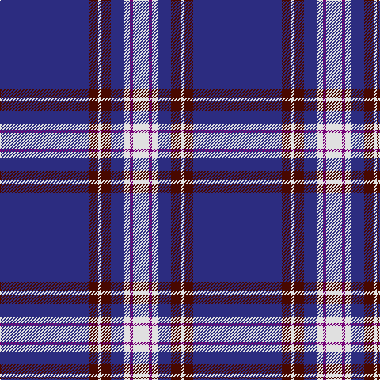

**Bands:** [BBWBBWBW](/stripes/bbwbbwbw/) · **Stripes:** [DB DR W DR DB W DP W](/stripes/stripes8/) DB DR W DR DB W DP W

This was sourced from house-of-tartan.  It is a [8 band tartan](/bands/bands8/).

Original link http://www.house-of-tartan.scotland.net/house/TartanViewjs.asp?colr=Def&tnam=613

## Thread count
DB/112 DR12 LN4 DR12 DB16 LN8 P4 LN/20

## Palette
Each colour and its ΔE from the base-6 reference it is a variant of.

| Colour | Shade | Base | ΔE (OKLab) |
|---|---|---|---|
| DB | <code style="background-color:#2C2C80;">#2C2C80</code> `#2C2C80` | B <code style="background-color:#2A418A;">#2A418A</code> | 0.06 |
| DR | <code style="background-color:#480800;">#480800</code> `#480800` | B <code style="background-color:#2A418A;">#2A418A</code> | 0.24 |
| LN | <code style="background-color:#E0E0E0;">#E0E0E0</code> `#E0E0E0` | W <code style="background-color:#F7F7F7;">#F7F7F7</code> | 0.07 |
| P | <code style="background-color:#780078;">#780078</code> `#780078` | B <code style="background-color:#2A418A;">#2A418A</code> | 0.17 |

# Sample pattern

## Nearest tartans

The nearest existing variants by ΔTartan distance.

1. [Baker](/setts/s8/db28o3w1o3db4w2p1w5~x4/) — ΔT 0.75
1. [Baker](/setts/s8/db28o3w1o3db4w2dp1w5~x4/) — ΔT 0.75
1. [Baker (Name)](/setts/s8/db28lo3w1lo3db4w2dp1w5~x4/) — ΔT 0.80
1. [Baker Dress Family Tartan Tartan Number: 2180. Earliest known date: 1999 STS notes 'Sample in trade specimens file.' See products available Copyright © Blair Urquhart, Comrie, 2015](/setts/s8/db28ly3w1ly3db4w2r1w5~x4/) — ΔT 0.87
1. [X Marks the Scot](/setts/s10/w6db32o3db3o1db3o2db4db1ly2~x2/) — ΔT 1.10
1. [Prince George's Police Pipe Band](/setts/s8/db42r2y16r2db6r2y8lo3~x2/) — ΔT 1.19
1. [George, Stuart (Personal)](/setts/s9/db62w2db4w5db6ly2r8ly3w4~x2/) — ΔT 1.22
1. [Antigonish](/setts/s8/t4db1t4db24w6db4w1db2~x4/) — ΔT 1.22
1. [Calum's Cabin](/setts/s9/db32ly4db12db2db4db2o16db67ly6/) — ΔT 1.25
1. [Damson](/setts/s12/db48g4db6y2db2lr2db2g10lr6db2lr3lr2~x2/) — ΔT 1.26

## Neighbour map

Every grey dot is one of 14299 variants placed by the first two principal components of the ΔTartan feature space (44% of its variance). Red is this tartan; blue dots are its nearest — click one to open its page.

<svg viewBox="0 0 640 380" role="img" style="max-width:100%;height:auto;border:1px solid #e0e0e0;border-radius:4px;display:block" xmlns="http://www.w3.org/2000/svg"><image href="/nn/cloud.v1.png" width="640" height="380"/><a href="/setts/s8/db28o3w1o3db4w2p1w5~x4/"><circle cx="435.7" cy="125.1" r="4" fill="#3465a4"><title>Baker</title></circle></a><a href="/setts/s8/db28o3w1o3db4w2dp1w5~x4/"><circle cx="414.7" cy="115.6" r="4" fill="#3465a4"><title>Baker</title></circle></a><a href="/setts/s8/db28lo3w1lo3db4w2dp1w5~x4/"><circle cx="413.6" cy="115.4" r="4" fill="#3465a4"><title>Baker (Name)</title></circle></a><a href="/setts/s8/db28ly3w1ly3db4w2r1w5~x4/"><circle cx="412.8" cy="112.5" r="4" fill="#3465a4"><title>Baker Dress Family Tartan Tartan Number: 2180. Earliest known date: 1999 STS notes 'Sample in trade specimens file.' See products available Copyright © Blair Urquhart, Comrie, 2015</title></circle></a><a href="/setts/s10/w6db32o3db3o1db3o2db4db1ly2~x2/"><circle cx="414.6" cy="91.6" r="4" fill="#3465a4"><title>X Marks the Scot</title></circle></a><a href="/setts/s8/db42r2y16r2db6r2y8lo3~x2/"><circle cx="365.8" cy="146.2" r="4" fill="#3465a4"><title>Prince George's Police Pipe Band</title></circle></a><a href="/setts/s9/db62w2db4w5db6ly2r8ly3w4~x2/"><circle cx="482.6" cy="100.9" r="4" fill="#3465a4"><title>George, Stuart (Personal)</title></circle></a><a href="/setts/s8/t4db1t4db24w6db4w1db2~x4/"><circle cx="416.7" cy="150.8" r="4" fill="#3465a4"><title>Antigonish</title></circle></a><a href="/setts/s9/db32ly4db12db2db4db2o16db67ly6/"><circle cx="467.7" cy="140.5" r="4" fill="#3465a4"><title>Calum's Cabin</title></circle></a><a href="/setts/s12/db48g4db6y2db2lr2db2g10lr6db2lr3lr2~x2/"><circle cx="422.8" cy="109.3" r="4" fill="#3465a4"><title>Damson</title></circle></a><circle cx="428.3" cy="122.3" r="5" fill="#c00000"/></svg>

ID: /setts/s8/db28dr3w1dr3db4w2dp1w5~x4/
