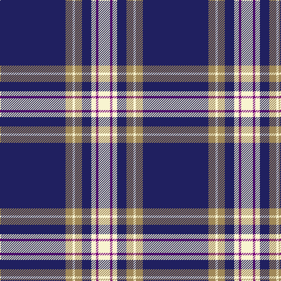

This page is one **sett** — a single exact thread-count. It belongs to the [tartan](/tartans/db28lo3w1lo3db4w2dp1w5/)
(the same proportion at any scale), whose colour order is pattern [BYWYBWBW](/stripes/bywybwbw/).

Sourced from tartans-authority.  It is a [8 stripe tartan](/stripes/stripes8/).

Original link http://www.tartansauthority.com/tartan-ferret/display/613/

## Thread count
DB/112 LT12 LY4 LT12 DB16 LY8 P4 LY/20

## Palette

Palette: <strong>Tartan Register</strong> <small style="color:#888">(3 of 4 colours)</small>
<table><thead><tr><th>Colour</th><th>Threads</th><th>Shade</th><th>Base</th><th>OKLCh</th></tr></thead><tbody><tr><td>DB/</td><td style="text-align:right;font-variant-numeric:tabular-nums">112</td><td><code style="background-color:#202060;">#202060</code> <small style="color:#888">#202060</small></td><td>B <code style="background-color:#2A418A;">#2A418A</code></td><td><small style="color:#888">oklch(28.9% 0.111 276.9)</small></td></tr><tr><td>LT</td><td style="text-align:right;font-variant-numeric:tabular-nums">12</td><td><code style="background-color:#A08858;">#A08858</code> <small style="color:#888">#A08858</small></td><td>Y <code style="background-color:#F2BF00;">#F2BF00</code></td><td><small style="color:#888">oklch(63.7% 0.071 84.0)</small></td></tr><tr><td>LY</td><td style="text-align:right;font-variant-numeric:tabular-nums">4</td><td><code style="background-color:#F8F4D0;">#F8F4D0</code> <small style="color:#888">#F8F4D0</small></td><td>W <code style="background-color:#F7F7F7;">#F7F7F7</code></td><td><small style="color:#888">oklch(96.1% 0.047 102.0)</small></td></tr><tr><td>LT</td><td style="text-align:right;font-variant-numeric:tabular-nums">12</td><td><code style="background-color:#A08858;">#A08858</code> <small style="color:#888">#A08858</small></td><td>Y <code style="background-color:#F2BF00;">#F2BF00</code></td><td><small style="color:#888">oklch(63.7% 0.071 84.0)</small></td></tr><tr><td>DB</td><td style="text-align:right;font-variant-numeric:tabular-nums">16</td><td><code style="background-color:#202060;">#202060</code> <small style="color:#888">#202060</small></td><td>B <code style="background-color:#2A418A;">#2A418A</code></td><td><small style="color:#888">oklch(28.9% 0.111 276.9)</small></td></tr><tr><td>LY</td><td style="text-align:right;font-variant-numeric:tabular-nums">8</td><td><code style="background-color:#F8F4D0;">#F8F4D0</code> <small style="color:#888">#F8F4D0</small></td><td>W <code style="background-color:#F7F7F7;">#F7F7F7</code></td><td><small style="color:#888">oklch(96.1% 0.047 102.0)</small></td></tr><tr><td>P</td><td style="text-align:right;font-variant-numeric:tabular-nums">4</td><td><code style="background-color:#780078;">#780078</code> <small style="color:#888">#780078</small></td><td>B <code style="background-color:#2A418A;">#2A418A</code></td><td><small style="color:#888">oklch(40.2% 0.185 328.4)</small></td></tr><tr><td>LY/</td><td style="text-align:right;font-variant-numeric:tabular-nums">20</td><td><code style="background-color:#F8F4D0;">#F8F4D0</code> <small style="color:#888">#F8F4D0</small></td><td>W <code style="background-color:#F7F7F7;">#F7F7F7</code></td><td><small style="color:#888">oklch(96.1% 0.047 102.0)</small></td></tr></tbody></table>

# Sample pattern

## Nearest tartans

The nearest existing variants by ΔTartan distance, with this tartan at the top so the swatches line up against it.

ΔTartan

Tartan

Sett

—

<a href="/ttd/edit/#slug=db28lo3w1lo3db4w2dp1w5~x4">Baker (Name)</a> <a class="nn-out" href="/setts/s8/db28lo3w1lo3db4w2dp1w5~x4/" title="open its dictionary page">↗</a>

0.07

<a href="/ttd/edit/#slug=db28o3w1o3db4w2dp1w5~x4">Baker</a> <a class="nn-out" href="/setts/s8/db28o3w1o3db4w2dp1w5~x4/" title="open its dictionary page">↗</a>

0.54

<a href="/ttd/edit/#slug=db28ly3w1ly3db4w2r1w5~x4">Baker Dress Family Tartan Tartan Number: 2180. Earliest known date: 1999 STS notes 'Sample in trade specimens file.' See products available Copyright © Blair Urquhart, Comrie, 2015</a> <a class="nn-out" href="/setts/s8/db28ly3w1ly3db4w2r1w5~x4/" title="open its dictionary page">↗</a>

0.80

<a href="/ttd/edit/#slug=db28dr3w1dr3db4w2dp1w5~x4">Baker Family Tartan Tartan Number: 613. Earliest known date: pre 2003 STS notes 'Sample in trade specimens file.' See products available Copyright © Blair Urquhart, Comrie, 2015</a> <a class="nn-out" href="/setts/s8/db28dr3w1dr3db4w2dp1w5~x4/" title="open its dictionary page">↗</a>

0.86

<a href="/ttd/edit/#slug=db28o3w1o3db4w2p1w5~x4">Baker</a> <a class="nn-out" href="/setts/s8/db28o3w1o3db4w2p1w5~x4/" title="open its dictionary page">↗</a>

0.89

<a href="/ttd/edit/#slug=w6db2w3db2g2db20r1~x2">Gonzaga University’s True Blue and White</a> <a class="nn-out" href="/setts/s7/w6db2w3db2g2db20r1~x2/" title="open its dictionary page">↗</a>

1.09

<a href="/ttd/edit/#slug=db96ly11db8ly11db16ly6w4ly16w8">University of North Carolina at Greensboro, The</a> <a class="nn-out" href="/setts/s9/db96ly11db8ly11db16ly6w4ly16w8/" title="open its dictionary page">↗</a>

1.14

<a href="/ttd/edit/#slug=db62w2db4w5db6ly2r8ly3w4~x2">George, Stuart (Personal)</a> <a class="nn-out" href="/setts/s9/db62w2db4w5db6ly2r8ly3w4~x2/" title="open its dictionary page">↗</a>

1.22

<a href="/ttd/edit/#slug=db62w2db4w5db6lo2r8lo3w4~x2">George, Stuart (Personal)</a> <a class="nn-out" href="/setts/s9/db62w2db4w5db6lo2r8lo3w4~x2/" title="open its dictionary page">↗</a>

1.25

<a href="/ttd/edit/#slug=w6db32o3db3o1db3o2db4db1ly2~x2">X Marks the Scot</a> <a class="nn-out" href="/setts/s10/w6db32o3db3o1db3o2db4db1ly2~x2/" title="open its dictionary page">↗</a>

1.28

<a href="/ttd/edit/#slug=w6ly3db3ly2db3ly4db48ly4">Morris Welsh Name Tartan Tartan Number: 5749. Earliest known date: 2002 The tartan for this Welsh surname and its variations, Meyrick, Meurig, is actually woven in Wales at the Cambrian Woollen Mill, weaving on the same site since 1830. This tartan differs from many traditional patterns in that the warp and weft differ, giving the finished worsted wool cloth more of a predominant stripe, vertically noticeable in the finished Kilt, or Cilt in Wales. See products available Copyright © Blair Urquhart, Comrie, 2015</a> <a class="nn-out" href="/setts/s8/w6ly3db3ly2db3ly4db48ly4/" title="open its dictionary page">↗</a>

## Neighbour map

Every grey dot is one of 14299 variants placed by the first two principal components of the ΔTartan feature space (44% of its variance). Red is this tartan; blue dots are its nearest — click one to open its page.

<svg viewBox="0 0 640 380" role="img" style="max-width:100%;height:auto;border:1px solid #e0e0e0;border-radius:4px;display:block" xmlns="http://www.w3.org/2000/svg"><image href="/nn/cloud.v1.png" width="640" height="380"/><a href="/setts/s8/db28o3w1o3db4w2dp1w5~x4/"><circle cx="414.7" cy="115.6" r="4" fill="#3465a4"><title>Baker</title></circle></a><a href="/setts/s8/db28ly3w1ly3db4w2r1w5~x4/"><circle cx="412.8" cy="112.5" r="4" fill="#3465a4"><title>Baker Dress Family Tartan Tartan Number: 2180. Earliest known date: 1999 STS notes 'Sample in trade specimens file.' See products available Copyright © Blair Urquhart, Comrie, 2015</title></circle></a><a href="/setts/s8/db28dr3w1dr3db4w2dp1w5~x4/"><circle cx="428.3" cy="122.3" r="4" fill="#3465a4"><title>Baker Family Tartan Tartan Number: 613. Earliest known date: pre 2003 STS notes 'Sample in trade specimens file.' See products available Copyright © Blair Urquhart, Comrie, 2015</title></circle></a><a href="/setts/s8/db28o3w1o3db4w2p1w5~x4/"><circle cx="435.7" cy="125.1" r="4" fill="#3465a4"><title>Baker</title></circle></a><a href="/setts/s7/w6db2w3db2g2db20r1~x2/"><circle cx="377.0" cy="138.7" r="4" fill="#3465a4"><title>Gonzaga University’s True Blue and White</title></circle></a><a href="/setts/s9/db96ly11db8ly11db16ly6w4ly16w8/"><circle cx="425.5" cy="129.7" r="4" fill="#3465a4"><title>University of North Carolina at Greensboro, The</title></circle></a><a href="/setts/s9/db62w2db4w5db6ly2r8ly3w4~x2/"><circle cx="482.6" cy="100.9" r="4" fill="#3465a4"><title>George, Stuart (Personal)</title></circle></a><a href="/setts/s9/db62w2db4w5db6lo2r8lo3w4~x2/"><circle cx="484.3" cy="102.4" r="4" fill="#3465a4"><title>George, Stuart (Personal)</title></circle></a><a href="/setts/s10/w6db32o3db3o1db3o2db4db1ly2~x2/"><circle cx="414.6" cy="91.6" r="4" fill="#3465a4"><title>X Marks the Scot</title></circle></a><a href="/setts/s8/w6ly3db3ly2db3ly4db48ly4/"><circle cx="480.5" cy="132.1" r="4" fill="#3465a4"><title>Morris Welsh Name Tartan Tartan Number: 5749. Earliest known date: 2002 The tartan for this Welsh surname and its variations, Meyrick, Meurig, is actually woven in Wales at the Cambrian Woollen Mill, weaving on the same site since 1830. This tartan differs from many traditional patterns in that the warp and weft differ, giving the finished worsted wool cloth more of a predominant stripe, vertically noticeable in the finished Kilt, or Cilt in Wales. See products available Copyright © Blair Urquhart, Comrie, 2015</title></circle></a><circle cx="413.6" cy="115.4" r="5" fill="#c00000"/></svg>

ID: /setts/s8/db28lo3w1lo3db4w2dp1w5~x4/
